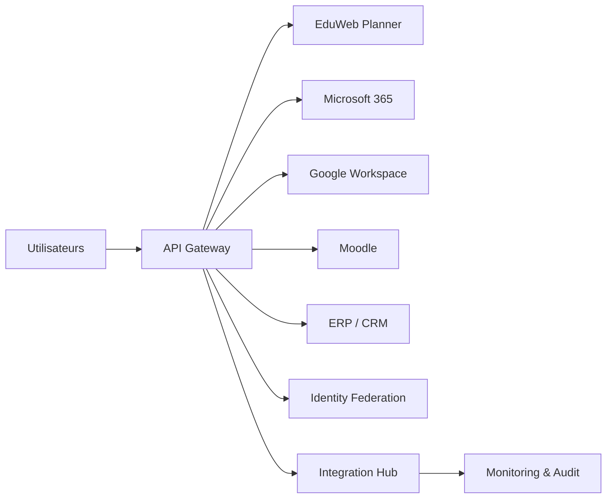

# INT-115 — Enterprise SaaS Integration

> Référentiel officiel de l'intégration des solutions **Software as a Service (SaaS)** pour **EduWeb Planner**.

## Sommaire

1. Vision
2. Objectifs
3. Définition
4. Principes
5. Architecture de référence
6. Composants
7. Cycle de vie d'une intégration SaaS
8. Gouvernance
9. Cas d'usage EduWeb
10. API conceptuelle
11. KPI
12. Bonnes pratiques
13. Anti-patterns
14. Règles d'architecture
15. Documents associés

---

## 1. Vision

Permettre une intégration fluide, sécurisée et gouvernée entre EduWeb Planner et les plateformes SaaS utilisées par les établissements scolaires, les administrations et les partenaires.

## 2. Objectifs

- Connecter rapidement des services SaaS.
- Réduire les développements spécifiques.
- Synchroniser les données et identités.
- Garantir la sécurité des échanges.
- Superviser les intégrations.

## 3. Définition

L'intégration SaaS regroupe les mécanismes permettant de connecter des applications cloud via des API, Webhooks, protocoles d'authentification et plateformes d'intégration afin d'automatiser les échanges de données et les processus métier.

## 4. Principes

- API First
- Cloud Native
- Zero Trust
- OAuth2 / OIDC
- Synchronisation bidirectionnelle
- Observabilité
- Gouvernance centralisée

## 5. Architecture de référence



## 6. Composants

- API Gateway
- Connecteurs SaaS
- Identity Federation
- SCIM
- OAuth2 / OIDC
- Webhooks
- Synchronisation
- Journalisation
- Monitoring
- Catalogue des connecteurs

## 7. Cycle de vie d'une intégration SaaS

1. Enregistrement du service.
2. Authentification.
3. Configuration des connecteurs.
4. Synchronisation initiale.
5. Synchronisation continue.
6. Supervision.
7. Audit.
8. Évolution des versions.

## 8. Gouvernance

- Enterprise Architect
- Integration Architect
- SaaS Administrator
- RSSI
- Data Steward
- Responsables métier

## 9. Cas d'usage EduWeb

- Synchronisation avec Microsoft 365.
- Authentification Google Workspace.
- Intégration Moodle.
- Connexion avec CRM et ERP.
- Gestion documentaire cloud.
- Automatisation des notifications.

## 10. API conceptuelle

```typescript
interface EnterpriseSaaSIntegration {
  connect(provider: string): Promise<void>;
  synchronize(resource: string): Promise<void>;
  authenticate(): Promise<string>;
  subscribeWebhook(event: string): Promise<void>;
  monitor(): Promise<void>;
}
```

## 11. KPI

| KPI | Objectif |
|------|----------|
| Disponibilité des connecteurs | ≥ 99,9 % |
| Synchronisations réussies | ≥ 99 % |
| Connecteurs supervisés | 100 % |
| Temps moyen de synchronisation | Conforme aux SLA |
| Incidents critiques | 0 |

## 12. Bonnes pratiques

- Utiliser des API officielles.
- Centraliser l'authentification.
- Versionner les connecteurs.
- Superviser les synchronisations.
- Tester chaque mise à jour SaaS.

## 13. Anti-patterns

- Développements spécifiques non documentés.
- Comptes techniques partagés.
- Synchronisations manuelles.
- API non sécurisées.
- Dépendance à un fournisseur unique.

## 14. Règles d'architecture

- RA-INT115-001 : Les intégrations utilisent les API officielles.
- RA-INT115-002 : Les accès reposent sur OAuth2/OIDC lorsque disponible.
- RA-INT115-003 : Les synchronisations sont journalisées.
- RA-INT115-004 : Les connecteurs sont supervisés.
- RA-INT115-005 : Les évolutions sont testées avant mise en production.

## 15. Documents associés

- INT-113 — Enterprise Identity Federation
- INT-114 — Enterprise B2B Integration
- INT-116 — Enterprise Mobile Integration
- AI-112 — Enterprise AI Workflows

# Fin du document
