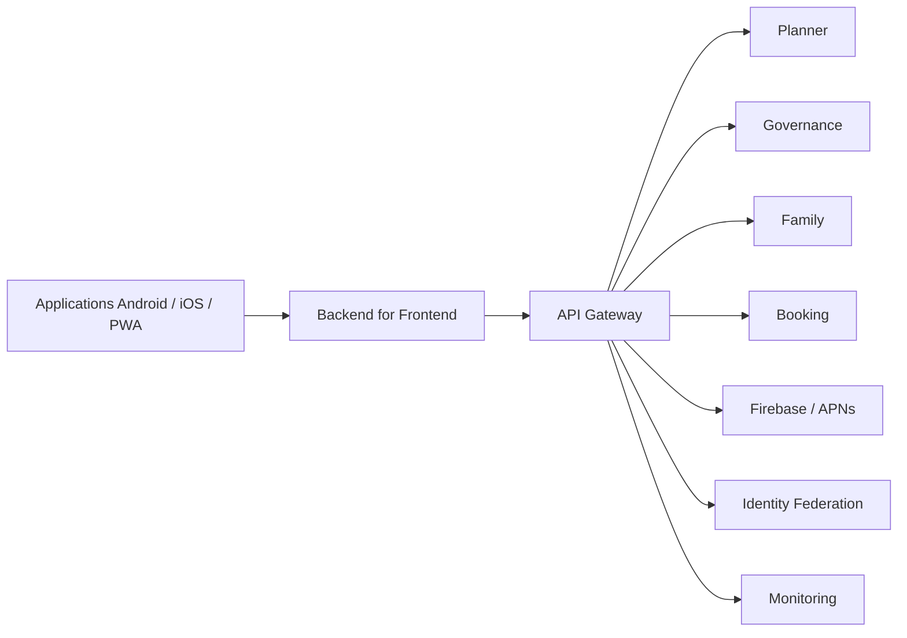

# INT-116 — Enterprise Mobile Integration

> Référentiel officiel de l'intégration des applications **mobiles** pour **EduWeb Planner**.

## Sommaire

1. Vision
2. Objectifs
3. Définition
4. Principes
5. Architecture de référence
6. Composants
7. Cycle de synchronisation mobile
8. Gouvernance
9. Cas d'usage EduWeb
10. API conceptuelle
11. KPI
12. Bonnes pratiques
13. Anti-patterns
14. Règles d'architecture
15. Documents associés

---

## 1. Vision

Fournir une architecture d'intégration mobile robuste permettant aux applications Android, iOS et PWA d'accéder aux services EduWeb Planner de manière sécurisée, performante et fiable, y compris en mode hors ligne.

## 2. Objectifs

- Assurer une expérience mobile fluide.
- Garantir un accès sécurisé aux services.
- Permettre le fonctionnement offline-first.
- Synchroniser automatiquement les données.
- Optimiser les performances sur les réseaux mobiles.

## 3. Définition

L'intégration mobile regroupe les mécanismes permettant aux applications mobiles de communiquer avec les services d'entreprise via des API, des Backend for Frontend (BFF), des notifications push et des services de synchronisation.

## 4. Principes

- Mobile First
- Offline First
- API First
- Zero Trust
- Synchronisation intelligente
- Sécurité by Design
- Observabilité

## 5. Architecture de référence



## 6. Composants

- Applications mobiles
- Backend for Frontend (BFF)
- API Gateway
- Synchronisation offline
- Cache local
- Notifications Push
- Identity Federation
- Journalisation
- Monitoring
- Gestion des appareils

## 7. Cycle de synchronisation mobile

1. Authentification.
2. Téléchargement des données.
3. Stockage local.
4. Utilisation hors ligne.
5. Détection des modifications.
6. Synchronisation.
7. Résolution des conflits.
8. Audit.

## 8. Gouvernance

- Enterprise Architect
- Mobile Architect
- Product Owner
- RSSI
- DevSecOps
- SRE

## 9. Cas d'usage EduWeb

- Consultation des emplois du temps hors ligne.
- Notifications aux enseignants et parents.
- Signature de présence.
- Gestion des absences.
- Validation d'activités pédagogiques.
- Synchronisation des données administratives.

## 10. API conceptuelle

```typescript
interface EnterpriseMobilePlatform {
  authenticate(): Promise<string>;
  synchronize(): Promise<void>;
  enableOfflineMode(): Promise<void>;
  sendPushNotification(message: object): Promise<void>;
  resolveConflicts(): Promise<void>;
}
```

## 11. KPI

| KPI | Objectif |
|------|----------|
| Disponibilité mobile | ≥ 99,9 % |
| Temps de synchronisation | < 5 s |
| Notifications délivrées | ≥ 99 % |
| Fonctionnement hors ligne | 100 % des fonctionnalités prévues |
| Incidents critiques | 0 |

## 12. Bonnes pratiques

- Concevoir des API adaptées aux mobiles.
- Minimiser le volume des échanges.
- Chiffrer les données locales.
- Tester les scénarios hors ligne.
- Superviser les performances réseau.

## 13. Anti-patterns

- Dépendance permanente au réseau.
- Synchronisations complètes inutiles.
- Données sensibles non chiffrées.
- Notifications excessives.
- Gestion manuelle des conflits.

## 14. Règles d'architecture

- RA-INT116-001 : Les applications mobiles utilisent un BFF.
- RA-INT116-002 : Les données sensibles sont chiffrées localement.
- RA-INT116-003 : Les synchronisations sont journalisées.
- RA-INT116-004 : Les notifications Push sont sécurisées.
- RA-INT116-005 : Les accès reposent sur une authentification fédérée.

## 15. Documents associés

- INT-103 — Enterprise API Gateway Architecture
- INT-113 — Enterprise Identity Federation
- INT-115 — Enterprise SaaS Integration
- INT-117 — Enterprise Cloud Integration
- ARCH-118 — Progressive Web Applications

# Fin du document
