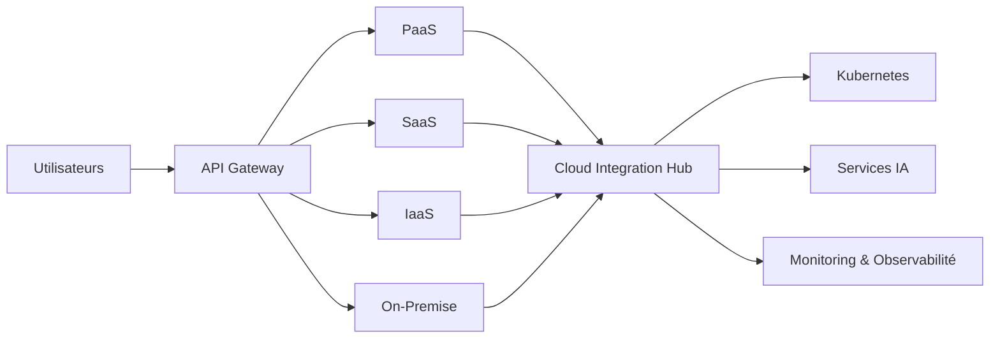

# INT-117 — Enterprise Cloud Integration

> Référentiel officiel de l'intégration **Cloud** pour **EduWeb Planner**.

## Sommaire

1. Vision
2. Objectifs
3. Définition
4. Principes
5. Architecture de référence
6. Composants
7. Cycle d'intégration Cloud
8. Gouvernance
9. Cas d'usage EduWeb
10. API conceptuelle
11. KPI
12. Bonnes pratiques
13. Anti-patterns
14. Règles d'architecture
15. Documents associés

---

## 1. Vision

Mettre en œuvre une architecture d'intégration Cloud unifiée permettant à EduWeb Planner d'exploiter efficacement des environnements **Cloud public**, **Cloud privé**, **Multi-Cloud** et **Hybride**, tout en garantissant sécurité, interopérabilité et haute disponibilité.

## 2. Objectifs

- Connecter les services Cloud et On-Premise.
- Garantir une intégration sécurisée.
- Faciliter la portabilité des applications.
- Optimiser les performances.
- Renforcer la résilience.

## 3. Définition

L'intégration Cloud désigne l'ensemble des mécanismes permettant de relier des applications, données, API et services répartis entre plusieurs environnements Cloud et infrastructures locales afin de fournir un système cohérent et gouverné.

## 4. Principes

- Cloud Native
- Hybrid by Design
- API First
- Zero Trust
- Infrastructure as Code
- Observabilité
- Automatisation

## 5. Architecture de référence



## 6. Composants

- API Gateway
- Integration Hub
- Connecteurs Cloud
- Kubernetes
- Service Mesh
- Identity Federation
- Gestion des secrets
- Monitoring
- Journalisation
- CI/CD

## 7. Cycle d'intégration Cloud

1. Découverte.
2. Authentification.
3. Connexion.
4. Synchronisation.
5. Supervision.
6. Résilience.
7. Audit.
8. Optimisation.

## 8. Gouvernance

- Enterprise Architect
- Cloud Architect
- Platform Engineer
- DevSecOps
- RSSI
- FinOps Manager

## 9. Cas d'usage EduWeb

- Déploiement multi-régions.
- Synchronisation entre Cloud et établissements.
- Sauvegarde et reprise.
- Hébergement des plateformes IA.
- Intégration Microsoft Azure, AWS et Google Cloud.
- Continuité d'activité.

## 10. API conceptuelle

```typescript
interface EnterpriseCloudIntegration {
  connect(provider: string): Promise<void>;
  deploy(workload: object): Promise<void>;
  synchronize(resource: string): Promise<void>;
  monitor(): Promise<void>;
  failover(): Promise<void>;
}
```

## 11. KPI

| KPI | Objectif |
|------|----------|
| Disponibilité | ≥ 99,9 % |
| Temps moyen de synchronisation | Conforme aux SLA |
| Déploiements automatisés | ≥ 95 % |
| Sauvegardes réussies | 100 % |
| Incidents critiques | 0 |

## 12. Bonnes pratiques

- Automatiser les déploiements.
- Chiffrer les communications.
- Utiliser Infrastructure as Code.
- Superviser tous les environnements.
- Tester régulièrement les plans de reprise.

## 13. Anti-patterns

- Déploiements manuels.
- Secrets stockés en clair.
- Dépendance à un seul fournisseur.
- Absence de supervision.
- Gouvernance Cloud insuffisante.

## 14. Règles d'architecture

- RA-INT117-001 : Les environnements Cloud sont supervisés.
- RA-INT117-002 : Les secrets sont centralisés.
- RA-INT117-003 : Les déploiements sont automatisés.
- RA-INT117-004 : Les échanges sont chiffrés.
- RA-INT117-005 : Les plans de reprise sont régulièrement testés.

## 15. Documents associés

- INT-108 — Enterprise Service Mesh
- INT-115 — Enterprise SaaS Integration
- INT-116 — Enterprise Mobile Integration
- INT-118 — Enterprise Hybrid Integration Platform
- ARCH-130 — Cloud Native Architecture

# Fin du document
