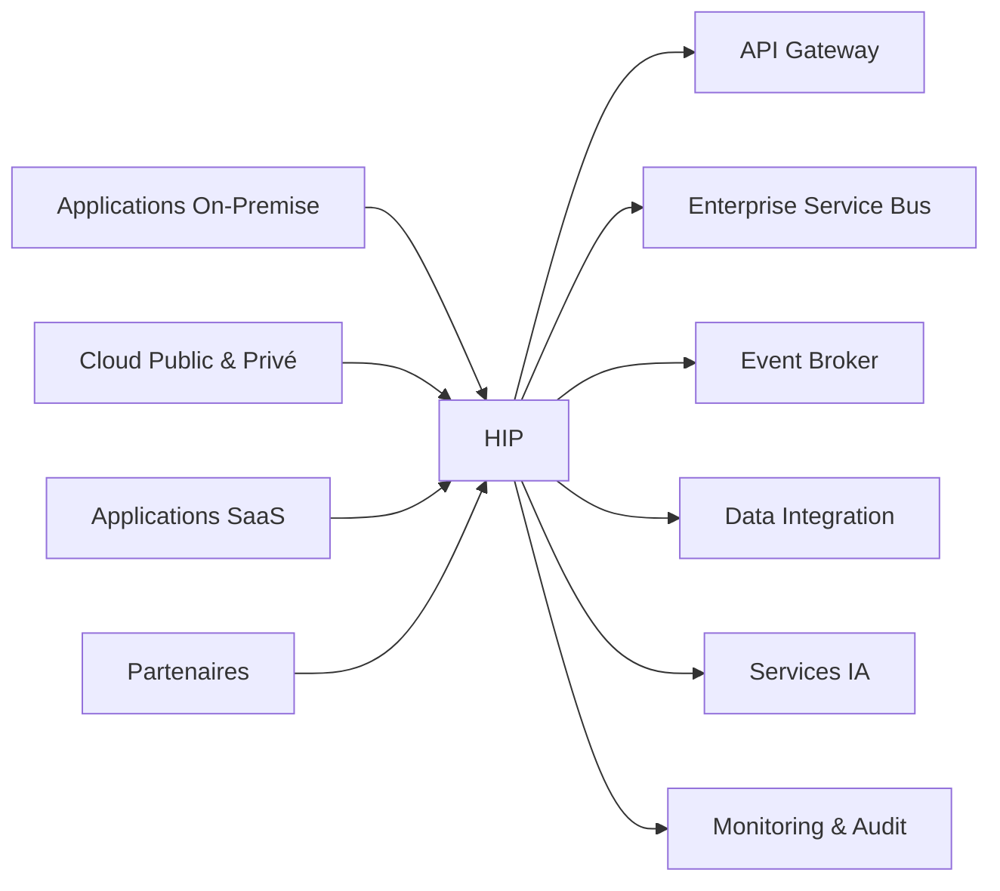

# INT-118 — Enterprise Hybrid Integration Platform (HIP)

> Référentiel officiel des plateformes d'intégration hybrides (**Hybrid Integration Platform / iPaaS**) pour **EduWeb Planner**.

## Sommaire

1. Vision
2. Objectifs
3. Définition
4. Principes
5. Architecture de référence
6. Composants
7. Cycle de vie d'un flux hybride
8. Gouvernance
9. Cas d'usage EduWeb
10. API conceptuelle
11. KPI
12. Bonnes pratiques
13. Anti-patterns
14. Règles d'architecture
15. Documents associés

---

## 1. Vision

Disposer d'une plateforme d'intégration hybride capable d'orchestrer de manière unifiée les échanges entre les systèmes **On-Premise**, **Cloud privé**, **Cloud public**, **SaaS**, partenaires institutionnels et services d'intelligence artificielle d'EduWeb Planner.

## 2. Objectifs

- Connecter des environnements hétérogènes.
- Centraliser les flux d'intégration.
- Faciliter les migrations vers le Cloud.
- Garantir sécurité, résilience et observabilité.
- Réduire la complexité des intégrations.

## 3. Définition

Une **Hybrid Integration Platform (HIP)** est une plateforme unifiée combinant API Management, ESB, Event Streaming, ETL/ELT, connecteurs, orchestration et gouvernance afin d'intégrer des applications réparties sur plusieurs environnements technologiques.

## 4. Principes

- Hybrid by Design
- API First
- Event-Driven
- Cloud Native
- Zero Trust
- Automation First
- Observability

## 5. Architecture de référence



## 6. Composants

- API Gateway
- Enterprise Service Bus
- Event Broker
- ETL / ELT
- Data Integration Hub
- Connecteurs
- Identity Federation
- Monitoring
- Catalogue des API
- Orchestrateur de workflows

## 7. Cycle de vie d'un flux hybride

1. Découverte des systèmes.
2. Authentification.
3. Orchestration.
4. Transformation.
5. Routage.
6. Supervision.
7. Audit.
8. Optimisation continue.

## 8. Gouvernance

- Enterprise Architect
- Integration Architect
- Cloud Architect
- Platform Engineer
- RSSI
- Data Steward

## 9. Cas d'usage EduWeb

- Interconnexion des établissements scolaires.
- Migration progressive vers le Cloud.
- Synchronisation des données nationales.
- Intégration avec les plateformes ministérielles.
- Orchestration des services IA.
- Continuité d'activité.

## 10. API conceptuelle

```typescript
interface EnterpriseHybridIntegrationPlatform {
  connect(endpoint: string): Promise<void>;
  orchestrate(flow: string): Promise<void>;
  transform(payload: object): Promise<object>;
  synchronize(domain: string): Promise<void>;
  monitor(): Promise<void>;
}
```

## 11. KPI

| KPI | Objectif |
|------|----------|
| Disponibilité | ≥ 99,9 % |
| Flux supervisés | 100 % |
| Intégrations automatisées | ≥ 95 % |
| Temps moyen de traitement | Conforme aux SLA |
| Incidents critiques | 0 |

## 12. Bonnes pratiques

- Standardiser les connecteurs.
- Automatiser les déploiements.
- Gouverner les API et événements.
- Centraliser les journaux.
- Tester régulièrement les scénarios de reprise.

## 13. Anti-patterns

- Multiplication des plateformes d'intégration.
- Flux non documentés.
- Connecteurs spécifiques non maintenus.
- Gouvernance distribuée.
- Surveillance insuffisante.

## 14. Règles d'architecture

- RA-INT118-001 : Tous les flux passent par la plateforme hybride.
- RA-INT118-002 : Les connecteurs sont versionnés.
- RA-INT118-003 : Les flux sont supervisés.
- RA-INT118-004 : Les échanges sont sécurisés.
- RA-INT118-005 : Les intégrations sont documentées.

## 15. Documents associés

- INT-104 — Enterprise Service Bus
- INT-110 — Enterprise Data Integration
- INT-117 — Enterprise Cloud Integration
- INT-119 — Enterprise Integration Governance
- AI-113 — Enterprise AI Orchestration

# Fin du document
