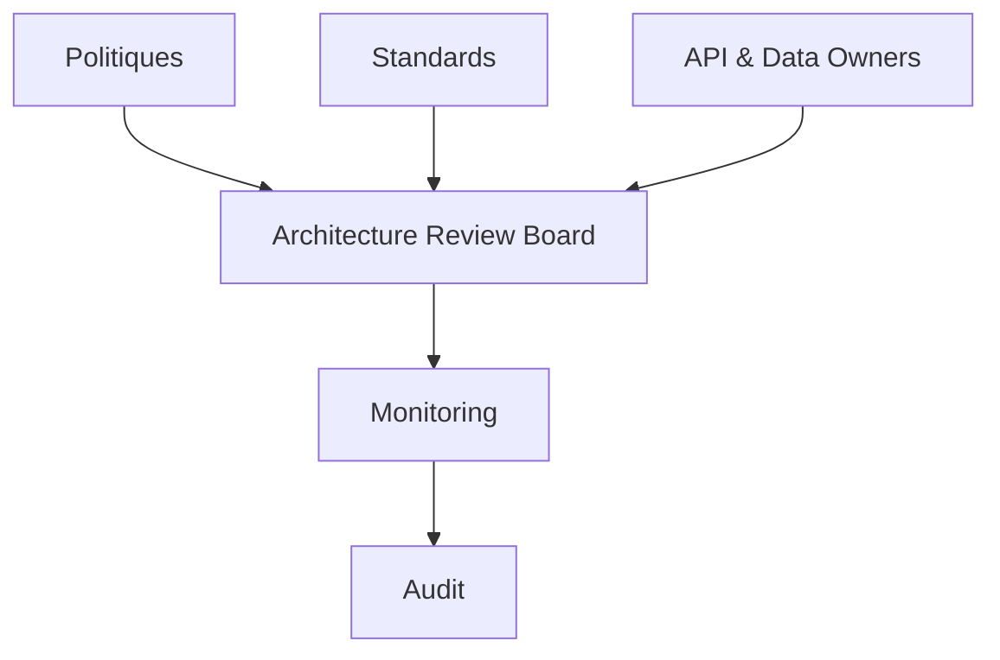

# INT-119 — Enterprise Integration Governance

> Référentiel de gouvernance des intégrations d'entreprise pour **EduWeb Planner**.

## Sommaire

1. Vision
2. Objectifs
3. Définition
4. Principes
5. Architecture de gouvernance
6. Rôles
7. Cycle de vie
8. Gouvernance opérationnelle
9. Cas d'usage EduWeb
10. API conceptuelle
11. KPI
12. Bonnes pratiques
13. Anti-patterns
14. Règles d'architecture
15. Documents associés

---

## 1. Vision

Mettre en place une gouvernance homogène garantissant des intégrations fiables, sécurisées, documentées et évolutives.

## 2. Objectifs

- Standardiser les intégrations.
- Définir les responsabilités.
- Assurer la conformité.
- Réduire les risques.
- Mesurer la performance.

## 3. Définition

La gouvernance des intégrations regroupe les politiques, processus, normes, contrôles et responsabilités permettant de piloter le cycle de vie des API, événements, flux, connecteurs et échanges de données.

## 4. Principes

- API First
- Security by Design
- Zero Trust
- Documentation systématique
- Versionnement
- Observabilité
- Amélioration continue

## 5. Architecture de gouvernance



## 6. Rôles

- Enterprise Architect
- Integration Architect
- API Owner
- Data Steward
- RSSI
- DevSecOps
- Product Owner
- Architecture Review Board

## 7. Cycle de vie

1. Conception
2. Validation
3. Développement
4. Tests
5. Déploiement
6. Exploitation
7. Audit
8. Retrait

## 8. Gouvernance opérationnelle

- Catalogue d'API
- Gestion des versions
- Gestion des contrats
- Revues d'architecture
- Gestion des risques
- Supervision continue

## 9. Cas d'usage EduWeb

- Validation des nouvelles API.
- Gouvernance des échanges ministériels.
- Contrôle des connecteurs SaaS.
- Pilotage des flux inter-plateformes.
- Conformité RGPD et réglementaire.

## 10. API conceptuelle

```typescript
interface IntegrationGovernance {
  approve(apiId:string): Promise<void>;
  publishStandard(name:string): Promise<void>;
  audit(flowId:string): Promise<void>;
  monitor(): Promise<void>;
  retire(assetId:string): Promise<void>;
}
```

## 11. KPI

| KPI | Objectif |
|------|----------|
| API documentées | 100 % |
| Flux supervisés | 100 % |
| Revues d'architecture | 100 % |
| Non-conformités critiques | 0 |
| Disponibilité des plateformes | ≥ 99,9 % |

## 12. Bonnes pratiques

- Centraliser les référentiels.
- Documenter chaque intégration.
- Réaliser des revues périodiques.
- Automatiser les contrôles.
- Mesurer les performances.

## 13. Anti-patterns

- API sans propriétaire.
- Flux non inventoriés.
- Standards incohérents.
- Absence d'audit.
- Dérogations permanentes.

## 14. Règles d'architecture

- RA-INT119-001 : Toute intégration possède un propriétaire.
- RA-INT119-002 : Les API sont versionnées.
- RA-INT119-003 : Les flux sont auditables.
- RA-INT119-004 : Les standards sont obligatoires.
- RA-INT119-005 : Les indicateurs sont suivis.

## 15. Documents associés

- INT-103 — Enterprise API Gateway Architecture
- INT-117 — Enterprise Cloud Integration
- INT-118 — Enterprise Hybrid Integration Platform
- INT-120 — Enterprise Intelligent Integration Platform

# Fin du document
