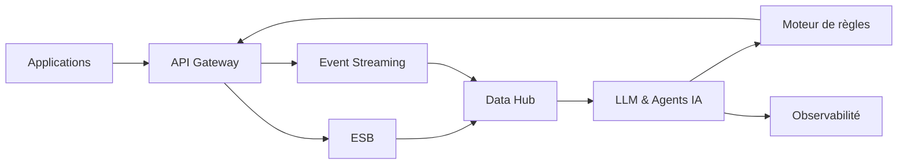

# INT-120 — Enterprise Intelligent Integration Platform (EIIP)

> Référentiel cible de la plateforme d'intégration intelligente de **l'écosystème EduWeb Planner**.

## Sommaire

1. Vision
2. Objectifs
3. Définition
4. Principes
5. Architecture de référence
6. Composants
7. Cycle intelligent d'intégration
8. Gouvernance
9. Cas d'usage EduWeb
10. API conceptuelle
11. KPI
12. Bonnes pratiques
13. Anti-patterns
14. Règles d'architecture
15. Documents associés

---

## 1. Vision

Construire une plateforme d'intégration pilotée par l'intelligence artificielle capable d'orchestrer automatiquement les API, événements, données et services afin d'améliorer les performances, la résilience et la qualité des échanges.

## 2. Objectifs

- Automatiser les décisions d'intégration.
- Optimiser le routage des flux.
- Détecter les anomalies en temps réel.
- Renforcer la sécurité.
- Accélérer les évolutions de l'écosystème.

## 3. Définition

Une Enterprise Intelligent Integration Platform combine API Management, ESB, Event Streaming, Data Integration, Hybrid Integration Platform, moteurs de règles, agents IA et modèles de langage (LLM) afin d'assurer une orchestration intelligente des échanges.

## 4. Principes

- AI-Augmented Integration
- API First
- Event-Driven
- Zero Trust
- Cloud Native
- Observabilité continue
- Human-in-the-Loop pour les décisions critiques

## 5. Architecture de référence



## 6. Composants

- API Gateway
- Enterprise Service Bus
- Event Broker
- Data Integration Hub
- Hybrid Integration Platform
- Agents IA
- LLM
- Moteur de règles
- Monitoring & Observabilité
- Catalogue de services

## 7. Cycle intelligent d'intégration

1. Détection d'un événement.
2. Analyse contextuelle.
3. Décision IA.
4. Orchestration du flux.
5. Exécution.
6. Supervision.
7. Apprentissage.
8. Optimisation continue.

## 8. Gouvernance

- Enterprise Architect
- Chief AI Officer
- Integration Architect
- Data Steward
- RSSI
- AI Governance Board

## 9. Cas d'usage EduWeb

- Optimisation des synchronisations nationales.
- Routage intelligent des API.
- Détection proactive des incidents.
- Assistance aux administrateurs.
- Automatisation des processus métiers.
- Pilotage des plateformes Planner, Governance, Family et Booking.

## 10. API conceptuelle

```typescript
interface EnterpriseIntelligentIntegrationPlatform {
  analyze(flow: object): Promise<object>;
  orchestrate(workflow: string): Promise<void>;
  detectAnomaly(event: object): Promise<boolean>;
  optimize(): Promise<void>;
  explain(decisionId: string): Promise<string>;
}
```

## 11. KPI

| KPI | Objectif |
|------|----------|
| Disponibilité | ≥ 99,95 % |
| Détection automatique d'anomalies | ≥ 95 % |
| Flux optimisés | ≥ 90 % |
| Temps moyen de décision IA | < 500 ms |
| Incidents critiques | 0 |

## 12. Bonnes pratiques

- Superviser les modèles IA.
- Conserver une traçabilité des décisions.
- Tester régulièrement les scénarios.
- Versionner les modèles et règles.
- Prévoir un contrôle humain sur les décisions sensibles.

## 13. Anti-patterns

- IA sans supervision.
- Décisions non explicables.
- Modèles non versionnés.
- Absence d'audit.
- Couplage fort entre IA et applications.

## 14. Règles d'architecture

- RA-INT120-001 : Toute décision IA est traçable.
- RA-INT120-002 : Les modèles sont versionnés.
- RA-INT120-003 : Les flux critiques disposent d'un contrôle humain.
- RA-INT120-004 : Les événements sont supervisés.
- RA-INT120-005 : Les performances sont mesurées en continu.

## 15. Documents associés

- INT-118 — Enterprise Hybrid Integration Platform
- INT-119 — Enterprise Integration Governance
- AI-120 — Enterprise AI Platform
- ARCH-150 — Enterprise Reference Architecture

# Fin du document
