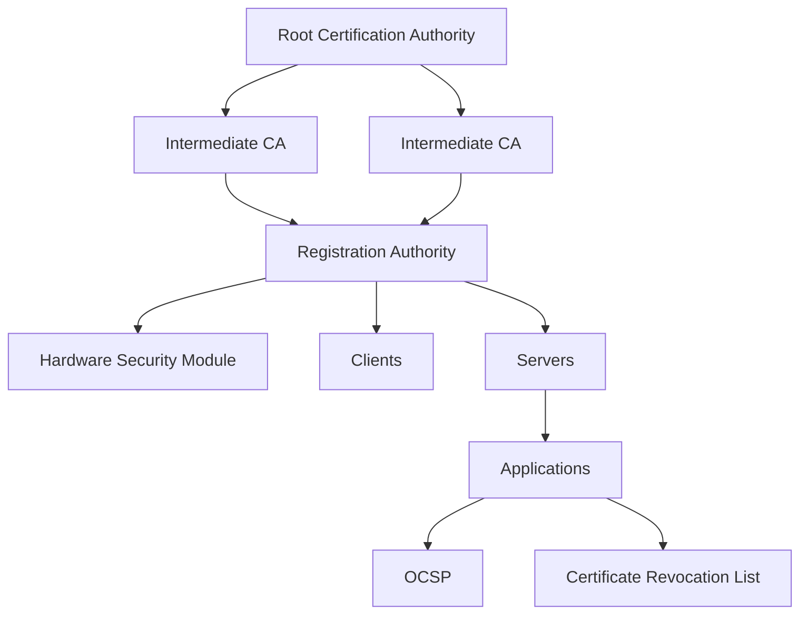

# SEC-103 — Enterprise Public Key Infrastructure (PKI)

> Référentiel d'architecture de l'infrastructure à clés publiques (PKI) de l'écosystème **EduWeb Planner**.

---

# Sommaire

1. Vision
2. Objectifs
3. Définition
4. Principes fondamentaux
5. Architecture de référence
6. Composants PKI
7. Cycle de vie d'un certificat
8. Gouvernance
9. Cas d'usage EduWeb
10. API conceptuelle
11. KPI
12. Bonnes pratiques
13. Anti-patterns
14. Règles d'architecture
15. Documents associés

---

# 1. Vision

Mettre en œuvre une Infrastructure à Clés Publiques (PKI) robuste garantissant :

- l'authentification forte ;
- la confidentialité ;
- l'intégrité ;
- la signature électronique ;
- la non-répudiation ;
- la confiance numérique.

La PKI constitue le socle cryptographique de toutes les plateformes EduWeb.

---

# 2. Objectifs

- délivrer des certificats numériques fiables ;
- sécuriser les communications TLS ;
- signer les documents électroniques ;
- authentifier les utilisateurs et les serveurs ;
- protéger les API ;
- gérer les clés cryptographiques.

---

# 3. Définition

Une PKI (Public Key Infrastructure) est un ensemble de composants techniques, organisationnels et cryptographiques permettant :

- de créer ;
- distribuer ;
- gérer ;
- renouveler ;
- suspendre ;
- révoquer des certificats numériques.

---

# 4. Principes fondamentaux

- Trust by Certificate
- Cryptographie asymétrique
- Défense en profondeur
- Rotation des certificats
- Gestion sécurisée des clés
- Haute disponibilité
- Audit permanent

---

# 5. Architecture de référence



---

# 6. Composants PKI

## Root Certification Authority

Autorité de certification racine.

---

## Intermediate CA

Autorités intermédiaires.

---

## Registration Authority (RA)

Validation des identités.

---

## HSM

Stockage sécurisé des clés privées.

---

## OCSP

Validation en temps réel des certificats.

---

## CRL

Liste des certificats révoqués.

---

## Repository

Publication des certificats.

---

## Certificate Management

Gestion automatique :

- émission
- renouvellement
- révocation
- archivage.

---

# 7. Cycle de vie d'un certificat

```text
Demande

↓

Validation

↓

Émission

↓

Publication

↓

Utilisation

↓

Renouvellement

↓

Révocation

↓

Archivage
```

---

# 8. Gouvernance

Acteurs :

- RSSI
- PKI Administrator
- Registration Authority Officer
- Security Architect
- Infrastructure Team
- Auditeurs SSI

---

# 9. Cas d'usage EduWeb

## Authentification TLS

Protection des plateformes :

- Planner
- Governance
- Booking
- Family

---

## Signature électronique

Décisions administratives.

Attestations.

Diplômes.

Bulletins.

---

## Signature des API

JWT Signatures

OAuth

OpenID Connect

---

## Signature des applications mobiles

Android

iOS

PWA

---

## Signature des sauvegardes

Protection des archives.

---

# 10. API TypeScript

```typescript
interface EnterprisePKI {

issueCertificate();

renewCertificate();

revokeCertificate();

verifyCertificate();

signDocument();

verifySignature();

encrypt();

decrypt();

}
```

---

# 11. KPI

| KPI | Objectif |
|------|----------|
| Certificats valides | 100 % |
| Rotation automatique | ≥95 % |
| Disponibilité PKI | ≥99,99 % |
| Révocations propagées | <5 minutes |
| Clés HSM | 100 % |

---

# 12. Bonnes pratiques

- utiliser des HSM certifiés ;
- protéger les clés privées ;
- automatiser le renouvellement ;
- séparer Root CA et Intermediate CA ;
- surveiller les expirations ;
- réaliser des audits cryptographiques.

---

# 13. Anti-patterns

- clé privée stockée sur disque ;
- Root CA connectée en permanence ;
- certificats auto-signés en production ;
- certificats expirés ;
- absence d'OCSP ;
- partage des clés privées.

---

# 14. Règles d'architecture

**RA-SEC103-001**

Toute communication externe utilise TLS avec certificat valide.

---

**RA-SEC103-002**

Les clés privées critiques sont stockées dans un HSM.

---

**RA-SEC103-003**

Les certificats sont renouvelés automatiquement avant expiration.

---

**RA-SEC103-004**

Toute révocation est publiée via OCSP et CRL.

---

**RA-SEC103-005**

La Root CA reste hors ligne sauf opération exceptionnelle.

---

# 15. Documents associés

- SEC-101 — Enterprise Security Foundation
- SEC-102 — Zero Trust Architecture
- SEC-104 — Enterprise Identity & Access Management
- SEC-108 — Enterprise Encryption
- SEC-109 — Enterprise Key Management System
- INT-114 — Enterprise B2B Integration
- ARCH-150 — Enterprise Reference Architecture

---

# Références

- ISO/IEC 27001
- ISO/IEC 27002
- NIST SP 800-57
- NIST SP 800-63
- RFC 5280 (X.509)
- RFC 6960 (OCSP)
- ETSI EN 319 411
- CAB Forum Baseline Requirements

---

# Fin du document
