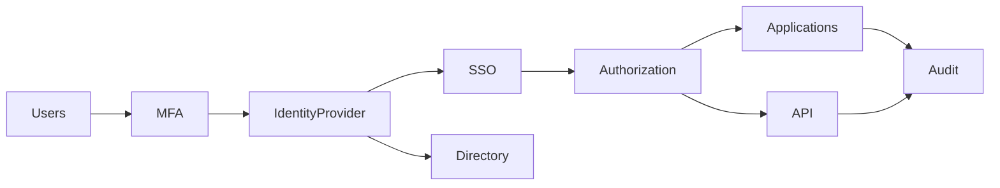

# SEC-104 — Enterprise Identity & Access Management (IAM)

> Référentiel officiel de gestion des identités et des accès de l'écosystème **EduWeb Planner**.

---

# Sommaire

1. Vision
2. Objectifs
3. Définitions
4. Principes fondamentaux
5. Architecture de référence
6. Composants IAM
7. Cycle de vie d'une identité
8. Gouvernance
9. Cas d'usage EduWeb
10. API conceptuelle
11. KPI
12. Bonnes pratiques
13. Anti-patterns
14. Règles d'architecture
15. Documents associés

---

# 1. Vision

Garantir que **chaque identité numérique** accède uniquement aux ressources auxquelles elle est autorisée, au moment opportun, selon son contexte et son niveau de confiance.

L'IAM constitue le cœur de la sécurité de l'ensemble des plateformes EduWeb.

---

# 2. Objectifs

- centraliser les identités ;
- authentifier tous les utilisateurs ;
- contrôler les autorisations ;
- simplifier le SSO ;
- automatiser le cycle de vie des comptes ;
- améliorer la traçabilité des accès.

---

# 3. Définitions

L'Identity & Access Management (IAM) désigne l'ensemble des processus, technologies et politiques permettant de :

- créer les identités ;
- gérer leurs droits ;
- contrôler leurs accès ;
- supprimer leurs privilèges lorsqu'ils deviennent inutiles.

---

# 4. Principes fondamentaux

- Identity First
- Least Privilege
- Zero Trust
- Need To Know
- Separation of Duties
- Authentication forte
- Audit permanent
- Identity Governance

---

# 5. Architecture de référence



---

# 6. Composants IAM

## Identity Provider (IdP)

Authentification centrale.

---

## Directory

Référentiel des identités.

LDAP

Active Directory

Azure AD

---

## Single Sign-On

Authentification unique.

---

## Multi-Factor Authentication

Renforcement de l'authentification.

---

## Authorization Engine

Gestion des droits.

---

## Identity Governance

Gestion des rôles.

Recertification.

Séparation des tâches.

---

## Audit

Journalisation complète.

---

# 7. Cycle de vie d'une identité

```text
Création

↓

Validation

↓

Attribution des rôles

↓

Authentification

↓

Autorisation

↓

Modification

↓

Recertification

↓

Suppression
```

---

# 8. Gouvernance

Responsabilités :

- RSSI
- IAM Administrator
- RH
- Enterprise Architect
- Data Owner
- Application Owner
- Security Operations Center

---

# 9. Cas d'usage EduWeb

## Enseignant

Connexion unique à :

- Planner
- Governance
- Family
- Booking

---

## Élève

Accès aux cours.

Consultation des emplois du temps.

---

## Parent

Suivi scolaire.

Paiements.

Notifications.

---

## Inspecteur

Accès régional.

Validation pédagogique.

---

## Administrateur

Administration sécurisée.

---

# 10. API TypeScript

```typescript
interface EnterpriseIAM {

createIdentity();

authenticate();

assignRole();

revokeRole();

authorize();

resetPassword();

disableAccount();

auditIdentity();

}
```

---

# 11. KPI

| KPI | Objectif |
|------|----------|
| Comptes actifs identifiés | 100 % |
| Comptes orphelins | 0 |
| MFA activé | 100 % |
| Comptes inactifs supprimés | <30 jours |
| SSO disponible | ≥99,95 % |

---

# 12. Bonnes pratiques

- MFA obligatoire
- SSO
- RBAC
- ABAC
- recertification trimestrielle
- suppression automatique des comptes inactifs
- revue des privilèges

---

# 13. Anti-patterns

- comptes partagés
- comptes administrateurs permanents
- droits excessifs
- mots de passe faibles
- identités dupliquées
- absence d'audit

---

# 14. Règles d'architecture

**RA-SEC104-001**

Toute identité possède un propriétaire.

---

**RA-SEC104-002**

Toute authentification utilise le MFA.

---

**RA-SEC104-003**

Les droits sont attribués selon le principe du moindre privilège.

---

**RA-SEC104-004**

Les accès sont journalisés.

---

**RA-SEC104-005**

Les comptes inactifs sont automatiquement désactivés.

---

# 15. Documents associés

- SEC-101 — Enterprise Security Foundation
- SEC-102 — Zero Trust Architecture
- SEC-103 — Enterprise PKI
- SEC-105 — Enterprise Privileged Access Management
- SEC-106 — Enterprise Multi-Factor Authentication
- INT-113 — Enterprise Identity Federation
- ARCH-150 — Enterprise Reference Architecture

---

# Références

- ISO/IEC 27001
- ISO/IEC 27002
- NIST SP 800-63
- NIST IAM Framework
- OpenID Connect
- OAuth 2.1
- SAML 2.0
- SCIM 2.0

---

# Fin du document
