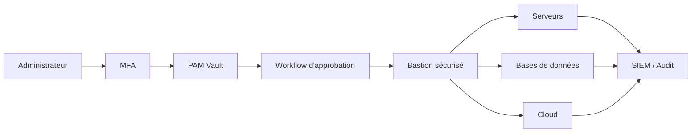

# SEC-105 — Enterprise Privileged Access Management (PAM)

> Référentiel officiel de gestion des accès privilégiés (PAM) de l'écosystème **EduWeb Planner**.

---

# Sommaire

1. Vision
2. Objectifs
3. Définitions
4. Principes fondamentaux
5. Architecture de référence
6. Composants PAM
7. Cycle de vie d'un accès privilégié
8. Gouvernance
9. Cas d'usage EduWeb
10. API conceptuelle
11. KPI
12. Bonnes pratiques
13. Anti-patterns
14. Règles d'architecture
15. Documents associés

---

# 1. Vision

Garantir que **tout accès privilégié** aux infrastructures, applications, bases de données, équipements réseau et plateformes Cloud d'EduWeb Planner soit :

- contrôlé ;
- temporaire ;
- traçable ;
- approuvé ;
- sécurisé ;
- enregistré.

Aucun administrateur ne doit disposer d'un privilège permanent non justifié.

---

# 2. Objectifs

- protéger les comptes administrateurs ;
- supprimer les mots de passe partagés ;
- contrôler toutes les sessions privilégiées ;
- sécuriser les secrets ;
- limiter les privilèges permanents ;
- renforcer la conformité.

---

# 3. Définitions

Le **Privileged Access Management (PAM)** désigne l'ensemble des processus et technologies permettant de contrôler l'utilisation des comptes à privilèges élevés.

Ces comptes comprennent notamment :

- administrateurs systèmes ;
- administrateurs bases de données ;
- administrateurs Cloud ;
- administrateurs Kubernetes ;
- comptes de services ;
- comptes d'urgence ("Break Glass").

---

# 4. Principes fondamentaux

- Least Privilege
- Zero Standing Privilege (ZSP)
- Just-In-Time Access (JIT)
- Just Enough Administration (JEA)
- Zero Trust
- Session Recording
- Continuous Monitoring

---

# 5. Architecture de référence



---

# 6. Composants PAM

## Vault

Coffre-fort des secrets.

Stockage sécurisé :

- mots de passe ;
- certificats ;
- clés SSH ;
- clés API ;
- tokens OAuth ;
- secrets Kubernetes.

---

## Bastion

Passerelle d'administration sécurisée.

---

## Session Manager

Gestion des sessions :

- ouverture ;
- surveillance ;
- enregistrement ;
- fermeture.

---

## Password Rotation

Rotation automatique des secrets.

---

## Approval Engine

Validation des demandes d'accès.

---

## Audit

Journalisation complète.

---

## Analytics

Détection d'activités anormales.

---

# 7. Cycle de vie

```text
Demande

↓

Validation

↓

Authentification MFA

↓

Attribution JIT

↓

Ouverture session

↓

Surveillance

↓

Révocation

↓

Archivage
```

---

# 8. Gouvernance

Responsabilités :

- RSSI
- PAM Administrator
- Infrastructure Manager
- Cloud Administrator
- Database Administrator
- Security Operations Center
- Auditeur SSI

---

# 9. Cas d'usage EduWeb

## Administration Planner

Maintenance sécurisée.

---

## Administration Governance

Publication réglementaire.

---

## Administration Booking

Gestion des ressources.

---

## Kubernetes

Administration des clusters.

---

## Base de données

Maintenance Oracle.

PostgreSQL.

MySQL.

SQL Server.

---

## Cloud

AWS

Azure

Google Cloud

---

## Comptes d'urgence

Activation limitée dans le temps.

---

# 10. API conceptuelle

```typescript
interface EnterprisePAM {

requestPrivilege();

approveRequest();

grantTemporaryAccess();

rotatePassword();

recordSession();

terminateSession();

revokeAccess();

audit();

}
```

---

# 11. KPI

| KPI | Objectif |
|------|----------|
| Comptes privilégiés inventoriés | 100 % |
| Rotation automatique | ≥95 % |
| Sessions enregistrées | 100 % |
| MFA sur comptes privilégiés | 100 % |
| Comptes permanents | 0 |

---

# 12. Bonnes pratiques

- MFA obligatoire ;
- rotation automatique des secrets ;
- approbation préalable ;
- accès temporaires (JIT) ;
- suppression des comptes administrateurs permanents ;
- enregistrement vidéo des sessions ;
- revue mensuelle des privilèges.

---

# 13. Anti-patterns

- comptes root utilisés quotidiennement ;
- mots de passe administrateurs partagés ;
- comptes de service sans rotation ;
- accès VPN permanent ;
- sessions non enregistrées ;
- privilèges permanents.

---

# 14. Règles d'architecture

**RA-SEC105-001**

Tout accès privilégié passe par la plateforme PAM.

---

**RA-SEC105-002**

Les secrets sont stockés uniquement dans le coffre-fort PAM.

---

**RA-SEC105-003**

Toute session privilégiée est enregistrée.

---

**RA-SEC105-004**

Les privilèges sont accordés temporairement (JIT).

---

**RA-SEC105-005**

Les mots de passe administrateurs sont automatiquement renouvelés.

---

# 15. Documents associés

- SEC-101 — Enterprise Security Foundation
- SEC-102 — Zero Trust Architecture
- SEC-103 — Enterprise PKI
- SEC-104 — Enterprise Identity & Access Management
- SEC-106 — Enterprise Multi-Factor Authentication
- SEC-107 — Enterprise Secrets Management
- SEC-109 — Enterprise Key Management System
- SEC-115 — Enterprise DevSecOps
- ARCH-150 — Enterprise Reference Architecture

---

# Références

- ISO/IEC 27001
- ISO/IEC 27002
- NIST SP 800-53
- NIST SP 800-63
- CIS Controls v8
- MITRE ATT&CK
- CyberArk PAM Reference Architecture
- BeyondTrust PAM Best Practices

---

# Fin du document
