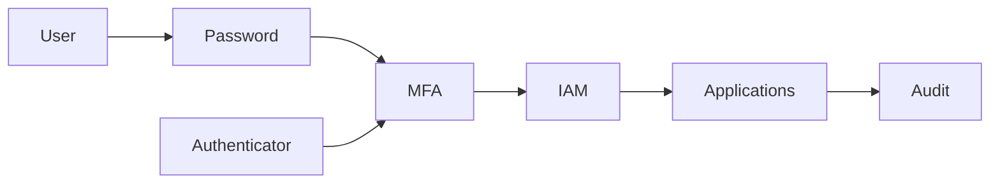

# SEC-106 — Enterprise Multi-Factor Authentication (MFA)

> Référentiel officiel de l'authentification multifacteur (MFA) pour l'écosystème **EduWeb Planner**.

---

# Sommaire

1. Vision
2. Objectifs
3. Définitions
4. Principes fondamentaux
5. Architecture de référence
6. Facteurs d'authentification
7. Cycle d'authentification
8. Gouvernance
9. Cas d'usage EduWeb
10. API conceptuelle
11. KPI
12. Bonnes pratiques
13. Anti-patterns
14. Règles d'architecture
15. Documents associés

---

# 1. Vision

Garantir qu'aucun accès aux ressources critiques ne puisse être obtenu à l'aide d'un seul facteur d'authentification.

La MFA constitue la première ligne de défense contre :

- le vol de mots de passe ;
- le phishing ;
- les attaques par force brute ;
- l'usurpation d'identité.

---

# 2. Objectifs

- renforcer l'authentification ;
- réduire les compromissions de comptes ;
- protéger les accès administratifs ;
- sécuriser les API sensibles ;
- satisfaire aux exigences réglementaires.

---

# 3. Définitions

La Multi-Factor Authentication consiste à combiner au moins deux catégories de facteurs parmi :

- ce que je connais ;
- ce que je possède ;
- ce que je suis.

---

# 4. Principes fondamentaux

- Zero Trust
- Adaptive Authentication
- Passwordless Ready
- Risk-Based Authentication
- Continuous Authentication
- Least Privilege

---

# 5. Architecture de référence



---

# 6. Facteurs

## Connaissance

- mot de passe
- PIN

## Possession

- téléphone
- token OTP
- carte à puce
- clé FIDO2

## Biométrie

- empreinte
- visage
- iris

---

# 7. Cycle MFA

Utilisateur

↓

Mot de passe

↓

Évaluation du risque

↓

Second facteur

↓

Autorisation

↓

Journalisation

---

# 8. Gouvernance

- RSSI
- IAM Administrator
- Help Desk
- Security Architect
- SOC

---

# 9. Cas EduWeb

- enseignants
- élèves
- parents
- inspecteurs
- administrateurs
- API sensibles
- paiements

---

# 10. API

```typescript
interface EnterpriseMFA{

authenticate();

challenge();

verifyOTP();

verifyBiometric();

revokeToken();

audit();

}
```

---

# 11. KPI

| KPI | Objectif |
|------|----------|
| Comptes MFA | 100 % |
| Comptes administrateurs | 100 % |
| OTP valides | ≥99 % |
| Temps MFA | <3 secondes |
| Attaques bloquées | ≥99 % |

---

# 12. Bonnes pratiques

- FIDO2
- TOTP
- MFA adaptative
- Passwordless
- rotation des secrets

---

# 13. Anti-patterns

- SMS uniquement
- OTP permanent
- MFA facultative
- codes imprimés
- partage de tokens

---

# 14. Règles

RA-SEC106-001

Toute identité privilégiée utilise la MFA.

RA-SEC106-002

Les API critiques utilisent une authentification forte.

RA-SEC106-003

Les facteurs biométriques sont protégés.

RA-SEC106-004

Les tentatives sont journalisées.

RA-SEC106-005

Les jetons expirent automatiquement.

---

# 15. Documents associés

SEC-101

SEC-104

SEC-105

SEC-107

SEC-115

ARCH-150

---

# Références

- NIST SP 800-63B
- FIDO Alliance
- ISO/IEC 27001
- OWASP ASVS

# Fin du document
