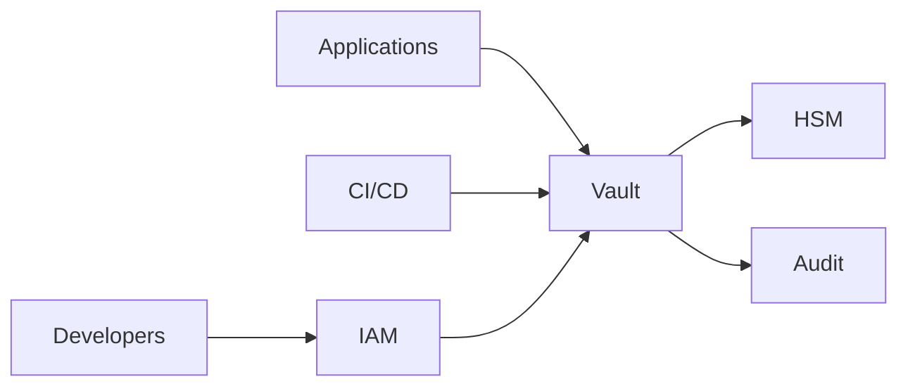

# SEC-107 — Enterprise Secrets Management

> Référentiel officiel de gestion des secrets de l'écosystème **EduWeb Planner**.

---

# Sommaire

1. Vision
2. Objectifs
3. Définitions
4. Principes fondamentaux
5. Architecture de référence
6. Types de secrets
7. Cycle de vie d'un secret
8. Gouvernance
9. Cas d'usage EduWeb
10. API conceptuelle
11. KPI
12. Bonnes pratiques
13. Anti-patterns
14. Règles d'architecture
15. Documents associés

---

# 1. Vision

Garantir que **tous les secrets numériques** utilisés dans l'écosystème EduWeb Planner soient protégés, centralisés, renouvelés automatiquement et accessibles uniquement aux entités autorisées.

Les secrets constituent l'un des actifs les plus sensibles de l'infrastructure. Leur exposition compromet directement la sécurité globale.

---

# 2. Objectifs

- éliminer les secrets codés en dur ;
- centraliser leur stockage ;
- automatiser leur rotation ;
- sécuriser leur distribution ;
- assurer leur traçabilité ;
- renforcer la conformité réglementaire.

---

# 3. Définitions

Un **secret** est toute information confidentielle permettant d'authentifier, d'autoriser ou de protéger une ressource.

Exemples :

- mots de passe ;
- clés API ;
- certificats ;
- clés privées ;
- tokens OAuth ;
- jetons JWT ;
- clés SSH ;
- chaînes de connexion ;
- secrets Kubernetes.

---

# 4. Principes fondamentaux

- Secret Zero
- Least Privilege
- Zero Trust
- Rotation automatique
- Chiffrement systématique
- Journalisation complète
- Haute disponibilité

---

# 5. Architecture de référence



---

# 6. Types de secrets

## Authentification

- mots de passe
- PIN
- OTP

---

## API

- API Keys
- OAuth Tokens
- JWT Signing Keys

---

## Infrastructure

- SSH Keys
- TLS Certificates
- Database Passwords

---

## Cloud

- AWS Secrets
- Azure Keys
- Google Cloud Secrets

---

## Kubernetes

- Secrets
- ConfigMaps sensibles

---

## DevSecOps

- Git Tokens
- Docker Registry
- CI/CD Credentials

---

# 7. Cycle de vie

```text
Création

↓

Validation

↓

Stockage sécurisé

↓

Distribution

↓

Utilisation

↓

Rotation

↓

Révocation

↓

Archivage
```

---

# 8. Gouvernance

Responsabilités :

- RSSI
- Security Architect
- DevSecOps
- Cloud Administrator
- PAM Administrator
- Auditeur SSI

---

# 9. Cas d'usage EduWeb

- connexion aux bases PostgreSQL ;
- accès aux API ministérielles ;
- authentification Microsoft 365 ;
- accès Google Workspace ;
- déploiement Kubernetes ;
- certificats TLS ;
- signatures électroniques.

---

# 10. API conceptuelle

```typescript
interface EnterpriseSecretsManager {

storeSecret();

retrieveSecret();

rotateSecret();

revokeSecret();

generateSecret();

auditSecret();

}
```

---

# 11. KPI

| KPI | Objectif |
|------|----------|
| Secrets centralisés | 100 % |
| Rotation automatique | ≥95 % |
| Secrets chiffrés | 100 % |
| Secrets exposés | 0 |
| Disponibilité du coffre-fort | ≥99,99 % |

---

# 12. Bonnes pratiques

- utiliser un coffre-fort centralisé ;
- rotation automatique ;
- chiffrement AES-256 ;
- contrôle d'accès RBAC/ABAC ;
- authentification MFA ;
- surveillance des accès.

---

# 13. Anti-patterns

- secrets dans Git ;
- mots de passe dans les scripts ;
- certificats sur disque non protégés ;
- rotation manuelle ;
- partage de secrets par e-mail ou messagerie.

---

# 14. Règles d'architecture

**RA-SEC107-001**

Aucun secret n'est stocké dans le code source.

---

**RA-SEC107-002**

Tous les secrets sont chiffrés.

---

**RA-SEC107-003**

La rotation est automatique.

---

**RA-SEC107-004**

Chaque accès est journalisé.

---

**RA-SEC107-005**

Les secrets expirés sont supprimés immédiatement.

---

# 15. Documents associés

- SEC-101 — Enterprise Security Foundation
- SEC-103 — Enterprise PKI
- SEC-105 — Enterprise Privileged Access Management
- SEC-108 — Enterprise Encryption
- SEC-109 — Enterprise Key Management System
- SEC-115 — Enterprise DevSecOps
- ARCH-150 — Enterprise Reference Architecture

---

# Références

- NIST SP 800-57
- NIST SP 800-63
- OWASP Secrets Management Cheat Sheet
- HashiCorp Vault Reference Architecture
- ISO/IEC 27001
- ISO/IEC 27002
- CIS Controls v8

---

# Fin du document
