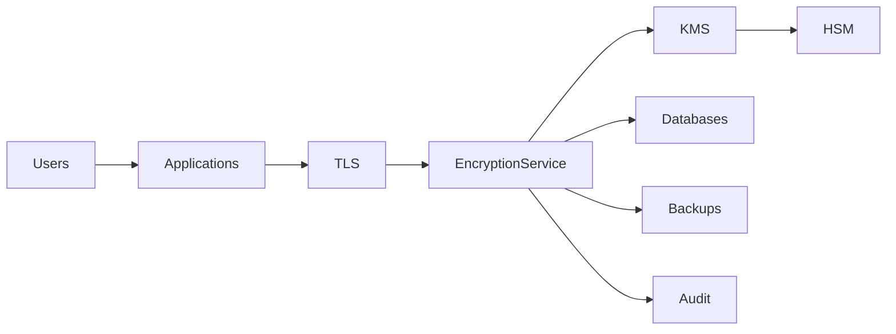

# SEC-108 — Enterprise Encryption

> Référentiel officiel de chiffrement des données de l'écosystème **EduWeb Planner**.

---

# Sommaire

1. Vision
2. Objectifs
3. Définitions
4. Principes fondamentaux
5. Architecture de référence
6. Types de chiffrement
7. Cycle de vie cryptographique
8. Gouvernance
9. Cas d'usage EduWeb
10. API conceptuelle
11. KPI
12. Bonnes pratiques
13. Anti-patterns
14. Règles d'architecture
15. Documents associés

---

# 1. Vision

Garantir que toutes les informations sensibles manipulées par les plateformes **EduWeb Planner**, **EduWeb Governance**, **EduWeb Family**, **EduWeb Booking** et les futurs services numériques soient protégées contre tout accès non autorisé, qu'elles soient :

- en transit ;
- au repos ;
- en traitement lorsque cela est possible.

Le chiffrement constitue l'un des piliers majeurs de la stratégie de cybersécurité de l'entreprise.

---

# 2. Objectifs

- protéger la confidentialité des données ;
- garantir leur intégrité ;
- sécuriser les échanges réseau ;
- satisfaire aux exigences réglementaires ;
- réduire les risques liés aux fuites d'informations ;
- assurer la confiance numérique.

---

# 3. Définitions

Le chiffrement consiste à transformer une information lisible (texte en clair) en une information inintelligible (texte chiffré) à l'aide d'un algorithme cryptographique et d'une ou plusieurs clés.

Deux grandes familles existent :

- chiffrement symétrique ;
- chiffrement asymétrique.

---

# 4. Principes fondamentaux

- Encryption by Default
- Zero Trust
- Confidentialité
- Intégrité
- Authentification
- Non-répudiation
- Rotation des clés
- Cryptographie moderne

---

# 5. Architecture de référence



---

# 6. Types de chiffrement

## Chiffrement symétrique

Utilisé pour les volumes importants de données.

Exemples :

- AES-256
- ChaCha20

---

## Chiffrement asymétrique

Utilisé pour :

- TLS
- signatures électroniques
- échanges de clés

Exemples :

- RSA-4096
- ECC
- Ed25519

---

## Chiffrement des données en transit

Protocoles :

- TLS 1.3
- mTLS
- HTTPS
- SSH
- IPSec
- VPN

---

## Chiffrement des données au repos

Protection :

- bases de données ;
- sauvegardes ;
- serveurs de fichiers ;
- objets Cloud ;
- postes de travail.

---

## Chiffrement des bases de données

- Transparent Data Encryption (TDE)
- Column Encryption
- Row Encryption

---

## Chiffrement des sauvegardes

Toutes les sauvegardes sont chiffrées avant leur stockage ou leur transfert.

---

# 7. Cycle de vie cryptographique

```text
Création des clés

↓

Distribution

↓

Utilisation

↓

Rotation

↓

Archivage

↓

Destruction sécurisée
```

---

# 8. Gouvernance

Responsabilités :

- RSSI
- Security Architect
- KMS Administrator
- Infrastructure Team
- DevSecOps
- Auditeur SSI

---

# 9. Cas d'usage EduWeb

- chiffrement des bulletins scolaires ;
- protection des dossiers administratifs ;
- sécurisation des certificats de formation ;
- chiffrement des données RH ;
- sauvegardes des établissements ;
- paiements électroniques ;
- échanges API entre plateformes EduWeb ;
- stockage sécurisé des documents réglementaires.

---

# 10. API conceptuelle

```typescript
interface EnterpriseEncryption {

encrypt();

decrypt();

generateKey();

rotateKey();

sign();

verifySignature();

encryptDatabase();

encryptBackup();

}
```

---

# 11. KPI

| KPI | Objectif |
|------|----------|
| Données chiffrées au repos | 100 % |
| Communications TLS | 100 % |
| Sauvegardes chiffrées | 100 % |
| Rotation annuelle des clés | ≥99 % |
| Algorithmes obsolètes | 0 |

---

# 12. Bonnes pratiques

- utiliser AES-256 ou ChaCha20 ;
- privilégier TLS 1.3 ;
- stocker les clés dans un KMS ou un HSM ;
- renouveler régulièrement les clés ;
- séparer les clés des données ;
- journaliser les opérations cryptographiques ;
- supprimer progressivement les algorithmes obsolètes.

---

# 13. Anti-patterns

- stockage des clés avec les données ;
- utilisation de MD5 ou SHA-1 ;
- absence de rotation des clés ;
- certificats expirés ;
- données sensibles en clair ;
- chiffrement maison non éprouvé ;
- désactivation du TLS.

---

# 14. Règles d'architecture

**RA-SEC108-001**

Toutes les communications externes utilisent TLS 1.3 ou une version supérieure approuvée.

---

**RA-SEC108-002**

Les données sensibles sont chiffrées au repos avec des algorithmes reconnus.

---

**RA-SEC108-003**

Les clés cryptographiques sont stockées dans un KMS ou un HSM.

---

**RA-SEC108-004**

Les algorithmes cryptographiques obsolètes sont interdits.

---

**RA-SEC108-005**

Les opérations de chiffrement et de déchiffrement sont journalisées lorsqu'elles concernent des données critiques.

---

# 15. Documents associés

- SEC-101 — Enterprise Security Foundation
- SEC-102 — Zero Trust Architecture
- SEC-103 — Enterprise PKI
- SEC-107 — Enterprise Secrets Management
- SEC-109 — Enterprise Key Management System
- SEC-116 — Enterprise Cloud Security
- INT-117 — Enterprise Cloud Integration
- ARCH-150 — Enterprise Reference Architecture

---

# Références

- ISO/IEC 27001
- ISO/IEC 27002
- ISO/IEC 19790
- NIST SP 800-57
- NIST SP 800-175B
- RFC 8446 (TLS 1.3)
- FIPS 140-3
- OWASP Cryptographic Storage Cheat Sheet

---

# Fin du document
