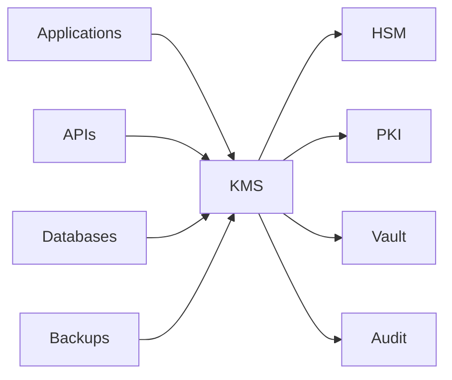

# SEC-109 — Enterprise Key Management System (KMS)

> Référentiel officiel de gestion des clés cryptographiques (KMS) de l'écosystème **EduWeb Planner**.

---

# Sommaire

1. Vision
2. Objectifs
3. Définitions
4. Principes fondamentaux
5. Architecture de référence
6. Composants du KMS
7. Cycle de vie d'une clé
8. Gouvernance
9. Cas d'usage EduWeb
10. API conceptuelle
11. KPI
12. Bonnes pratiques
13. Anti-patterns
14. Règles d'architecture
15. Documents associés

---

# 1. Vision

Garantir une gestion centralisée, sécurisée et automatisée de toutes les clés cryptographiques utilisées par les plateformes **EduWeb Planner**, **EduWeb Governance**, **EduWeb Family**, **EduWeb Booking** et les futurs services numériques.

Le KMS constitue le point de confiance de l'ensemble des opérations cryptographiques de l'entreprise.

---

# 2. Objectifs

- centraliser la gestion des clés cryptographiques ;
- automatiser leur génération et leur rotation ;
- protéger les clés maîtresses ;
- renforcer la traçabilité des opérations cryptographiques ;
- assurer la conformité réglementaire ;
- réduire les risques de compromission.

---

# 3. Définitions

Un **Key Management System (KMS)** est une plateforme permettant de :

- générer ;
- stocker ;
- distribuer ;
- renouveler ;
- révoquer ;
- archiver ;
- détruire de manière sécurisée les clés cryptographiques.

Le KMS s'intègre généralement avec un **Hardware Security Module (HSM)** afin d'assurer un niveau maximal de protection.

---

# 4. Principes fondamentaux

- Centralisation des clés
- Séparation des responsabilités
- Rotation automatique
- Chiffrement des clés
- Haute disponibilité
- Audit permanent
- Zero Trust
- Automation First

---

# 5. Architecture de référence



---

# 6. Composants du KMS

## Key Generator

Génération de clés cryptographiquement sécurisées.

---

## Key Repository

Stockage sécurisé des clés.

---

## HSM Integration

Protection matérielle des clés maîtresses.

---

## Key Rotation Engine

Rotation automatique des clés.

---

## Access Control

Contrôle des accès basé sur les rôles (RBAC) et les attributs (ABAC).

---

## Audit Manager

Traçabilité complète :

- création ;
- utilisation ;
- rotation ;
- révocation ;
- destruction.

---

## Backup Manager

Sauvegarde chiffrée des métadonnées critiques.

---

# 7. Cycle de vie d'une clé

```text
Création

↓

Validation

↓

Activation

↓

Distribution

↓

Utilisation

↓

Rotation

↓

Révocation

↓

Archivage

↓

Destruction sécurisée
```

---

# 8. Gouvernance

Responsabilités :

- RSSI ;
- KMS Administrator ;
- Security Architect ;
- DevSecOps ;
- Cloud Administrator ;
- Infrastructure Team ;
- Auditeur SSI.

---

# 9. Cas d'usage EduWeb

- chiffrement des bases PostgreSQL ;
- chiffrement des sauvegardes nationales ;
- signatures électroniques ;
- certificats TLS ;
- API sécurisées ;
- authentification des services ;
- protection des données RH ;
- sécurisation des documents réglementaires.

---

# 10. API conceptuelle

```typescript
interface EnterpriseKMS {

generateKey();

importKey();

exportKey();

rotateKey();

disableKey();

destroyKey();

encrypt();

decrypt();

audit();

}
```

---

# 11. KPI

| KPI | Objectif |
|------|----------|
| Clés centralisées | 100 % |
| Rotation automatique | ≥95 % |
| Clés protégées par HSM | 100 % |
| Disponibilité du KMS | ≥99,99 % |
| Clés expirées | 0 |

---

# 12. Bonnes pratiques

- utiliser des HSM certifiés ;
- automatiser la rotation des clés ;
- séparer les clés des données ;
- appliquer le principe du moindre privilège ;
- surveiller les accès aux clés ;
- conserver un historique complet des opérations ;
- tester régulièrement les procédures de restauration.

---

# 13. Anti-patterns

- clés stockées dans le code source ;
- clés partagées entre plusieurs applications ;
- absence de rotation ;
- export non contrôlé des clés ;
- sauvegardes non chiffrées ;
- suppression sans archivage des métadonnées.

---

# 14. Règles d'architecture

**RA-SEC109-001**

Toutes les clés cryptographiques critiques sont gérées par le KMS.

---

**RA-SEC109-002**

Les clés maîtresses sont protégées par un HSM.

---

**RA-SEC109-003**

La rotation des clés est automatisée conformément à la politique de sécurité.

---

**RA-SEC109-004**

Toute opération sur une clé est journalisée.

---

**RA-SEC109-005**

Les clés révoquées ou expirées ne peuvent plus être utilisées pour de nouvelles opérations cryptographiques.

---

# 15. Documents associés

- SEC-101 — Enterprise Security Foundation
- SEC-103 — Enterprise PKI
- SEC-105 — Enterprise Privileged Access Management
- SEC-107 — Enterprise Secrets Management
- SEC-108 — Enterprise Encryption
- SEC-110 — Enterprise Network Security
- SEC-116 — Enterprise Cloud Security
- ARCH-150 — Enterprise Reference Architecture

---

# Références

- ISO/IEC 27001
- ISO/IEC 27002
- ISO/IEC 11770
- NIST SP 800-57
- NIST SP 800-130
- FIPS 140-3
- OWASP Cryptographic Storage Cheat Sheet
- Cloud Native Computing Foundation – Key Management Best Practices

---

# Fin du document
