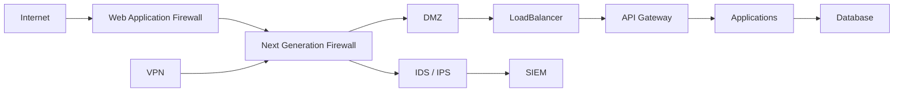

# SEC-110 — Enterprise Network Security

> Référentiel officiel de sécurité des réseaux de l'écosystème **EduWeb Planner**.

---

# Sommaire

1. Vision
2. Objectifs
3. Définitions
4. Principes fondamentaux
5. Architecture de référence
6. Composants de sécurité réseau
7. Cycle de sécurisation des flux
8. Gouvernance
9. Cas d'usage EduWeb
10. API conceptuelle
11. KPI
12. Bonnes pratiques
13. Anti-patterns
14. Règles d'architecture
15. Documents associés

---

# 1. Vision

Garantir que l'ensemble des communications réseau de l'écosystème **EduWeb** soient :

- authentifiées ;
- chiffrées ;
- segmentées ;
- surveillées ;
- résilientes ;
- conformes aux principes **Zero Trust**.

Chaque connexion est considérée comme potentiellement hostile jusqu'à preuve du contraire.

---

# 2. Objectifs

- protéger les infrastructures contre les attaques réseau ;
- segmenter les environnements critiques ;
- sécuriser les communications internes et externes ;
- contrôler les flux entre applications ;
- détecter rapidement les activités malveillantes ;
- assurer la continuité des services numériques.

---

# 3. Définitions

La **sécurité réseau** regroupe les politiques, technologies et mécanismes permettant de protéger les infrastructures de communication contre :

- les accès non autorisés ;
- les interceptions de données ;
- les attaques distribuées (DDoS) ;
- les mouvements latéraux ;
- les logiciels malveillants ;
- les compromissions d'infrastructure.

---

# 4. Principes fondamentaux

- Zero Trust Network
- Defense in Depth
- Network Segmentation
- Least Privilege
- Secure by Default
- Continuous Monitoring
- Encryption Everywhere
- High Availability

---

# 5. Architecture de référence



---

# 6. Composants de sécurité réseau

## Next Generation Firewall (NGFW)

- filtrage applicatif ;
- inspection profonde des paquets (DPI) ;
- prévention des intrusions ;
- contrôle des applications.

---

## Web Application Firewall (WAF)

Protection des applications Web contre :

- injections SQL ;
- Cross-Site Scripting (XSS) ;
- attaques de type CSRF ;
- exploitation de vulnérabilités applicatives.

---

## IDS / IPS

Détection et prévention :

- comportements anormaux ;
- scans réseau ;
- tentatives d'exploitation ;
- attaques connues.

---

## VPN

Accès sécurisé aux ressources internes :

- IPSec ;
- SSL VPN ;
- WireGuard.

---

## Network Access Control (NAC)

Contrôle des équipements autorisés à rejoindre le réseau.

---

## DNS Security

Protection contre :

- empoisonnement DNS ;
- détournement de domaine ;
- tunneling DNS.

---

## Segmentation réseau

Séparation logique des environnements :

- Production ;
- Préproduction ;
- Développement ;
- Administration ;
- Sauvegardes.

---

# 7. Cycle de sécurisation des flux

```text
Connexion

↓

Authentification

↓

Inspection

↓

Autorisation

↓

Chiffrement

↓

Surveillance

↓

Journalisation

↓

Archivage
```

---

# 8. Gouvernance

Responsabilités :

- RSSI ;
- Network Security Administrator ;
- Infrastructure Manager ;
- SOC ;
- DevSecOps ;
- Cloud Administrator ;
- Auditeur SSI.

---

# 9. Cas d'usage EduWeb

### Portail EduWeb Planner

Protection par :

- WAF ;
- NGFW ;
- TLS 1.3.

---

### Plateforme EduWeb Governance

Isolation des services administratifs.

---

### API inter-plateformes

Communication sécurisée via :

- API Gateway ;
- mTLS ;
- OAuth 2.1.

---

### Télétravail

Connexion sécurisée via VPN avec authentification multifacteur.

---

### Sauvegardes nationales

Transfert chiffré entre les centres de données.

---

### Administration système

Accès via bastion sécurisé et segmentation réseau.

---

# 10. API conceptuelle

```typescript
interface EnterpriseNetworkSecurity {

inspectTraffic();

authorizeConnection();

blockThreat();

openSecureTunnel();

monitorNetwork();

detectIntrusion();

logEvent();

generateAlert();

}
```

---

# 11. KPI

| KPI | Objectif |
|------|----------|
| Communications chiffrées | 100 % |
| Disponibilité réseau | ≥99,99 % |
| Incidents détectés automatiquement | ≥95 % |
| Temps moyen de détection (MTTD) | < 5 min |
| Temps moyen de réponse (MTTR) | < 30 min |

---

# 12. Bonnes pratiques

- segmenter les réseaux selon leur niveau de sensibilité ;
- déployer un WAF devant les applications Web ;
- utiliser des pare-feu de nouvelle génération ;
- chiffrer toutes les communications ;
- surveiller les journaux en temps réel ;
- appliquer une politique de moindre privilège réseau ;
- réaliser régulièrement des tests d'intrusion.

---

# 13. Anti-patterns

- réseau plat sans segmentation ;
- ports inutiles ouverts ;
- accès administratifs exposés à Internet ;
- protocoles non chiffrés (HTTP, Telnet, FTP) ;
- absence de journalisation ;
- règles de pare-feu trop permissives ;
- absence de supervision réseau.

---

# 14. Règles d'architecture

**RA-SEC110-001**

Toutes les communications externes passent par un pare-feu de nouvelle génération.

---

**RA-SEC110-002**

Les applications Web exposées sur Internet sont protégées par un WAF.

---

**RA-SEC110-003**

Les environnements de production, de test et de développement sont isolés.

---

**RA-SEC110-004**

Les accès distants utilisent un VPN sécurisé avec MFA.

---

**RA-SEC110-005**

Les événements de sécurité réseau sont centralisés dans le SIEM.

---

# 15. Documents associés

- SEC-101 — Enterprise Security Foundation
- SEC-102 — Zero Trust Architecture
- SEC-104 — Enterprise Identity & Access Management
- SEC-106 — Enterprise Multi-Factor Authentication
- SEC-108 — Enterprise Encryption
- SEC-109 — Enterprise Key Management System
- SEC-111 — Security Operations Center (SOC)
- SEC-112 — Security Information and Event Management (SIEM)
- SEC-116 — Enterprise Cloud Security
- INT-117 — Enterprise Cloud Integration
- ARCH-150 — Enterprise Reference Architecture

---

# Références

- ISO/IEC 27001
- ISO/IEC 27002
- NIST Cybersecurity Framework 2.0
- NIST SP 800-41 (Firewalls)
- NIST SP 800-125 (Virtualization Security)
- OWASP Top 10
- CIS Controls v8
- MITRE ATT&CK Framework

---

# Fin du document
