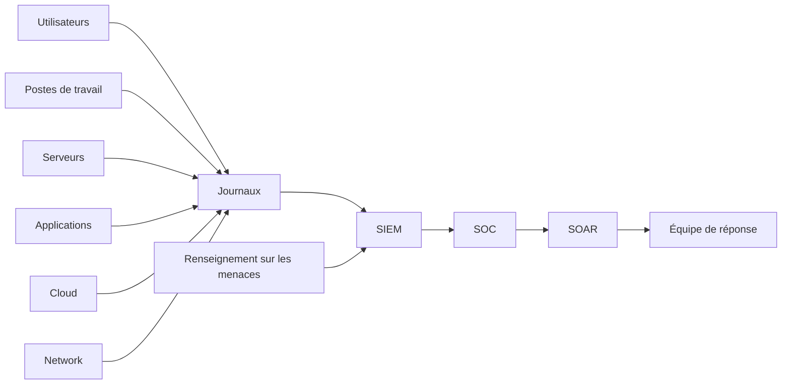

# SEC-111 — Enterprise Security Operations Center (SOC)

> Référentiel officiel du **Security Operations Center (SOC)** de l'écosystème **EduWeb Planner**.

---

# Sommaire

1. Vision
2. Objectifs
3. Définitions
4. Principes fondamentaux
5. Architecture de référence
6. Capacités du SOC
7. Cycle opérationnel
8. Gouvernance
9. Cas d'usage EduWeb
10. API conceptuelle
11. KPI
12. Bonnes pratiques
13. Anti-patterns
14. Règles d'architecture
15. Documents associés

---

# 1. Vision

Mettre en place un **Centre Opérationnel de Sécurité** capable de surveiller en permanence l'ensemble des actifs numériques d'EduWeb afin de :

- détecter rapidement les cybermenaces ;
- analyser les incidents ;
- coordonner les réponses ;
- limiter les impacts opérationnels ;
- améliorer continuellement le niveau de sécurité.

Le SOC constitue le centre nerveux de la cybersécurité de l'entreprise.

---

# 2. Objectifs

- assurer une surveillance 24h/24 et 7j/7 ;
- détecter les comportements anormaux ;
- coordonner la réponse aux incidents ;
- centraliser les journaux de sécurité ;
- produire des tableaux de bord de sécurité ;
- améliorer la posture de cybersécurité.

---

# 3. Définitions

Le **Security Operations Center (SOC)** est une structure humaine, organisationnelle et technologique chargée de :

- superviser les systèmes ;
- détecter les incidents de sécurité ;
- qualifier les alertes ;
- coordonner les investigations ;
- piloter les actions de remédiation.

---

# 4. Principes fondamentaux

- Continuous Monitoring
- Threat Intelligence
- Zero Trust
- Risk-Based Monitoring
- Defense in Depth
- Incident Response
- Continuous Improvement
- Automation First

---

# 5. Architecture de référence



---

# 6. Capacités du SOC

## Surveillance continue

Collecte des événements provenant de :

- serveurs ;
- applications ;
- bases de données ;
- équipements réseau ;
- services Cloud ;
- plateformes EduWeb.

---

## Détection

Détection :

- d'anomalies ;
- d'attaques connues ;
- de comportements suspects ;
- d'activités malveillantes.

---

## Investigation

Analyse :

- des journaux ;
- des indicateurs de compromission (IOC) ;
- des chaînes d'attaque ;
- des preuves numériques.

---

## Réponse

Coordination des actions :

- confinement ;
- éradication ;
- restauration ;
- communication.

---

## Veille

Suivi :

- des nouvelles vulnérabilités ;
- des campagnes d'attaque ;
- des alertes CERT ;
- des flux de Threat Intelligence.

---

# 7. Cycle opérationnel

```text
Collecte

↓

Détection

↓

Qualification

↓

Investigation

↓

Confinement

↓

Éradication

↓

Restauration

↓

Retour d'expérience
```

---

# 8. Gouvernance

Rôles :

- RSSI ;
- Responsable SOC ;
- Analyste SOC N1 ;
- Analyste SOC N2 ;
- Analyste SOC N3 ;
- Incident Manager ;
- Threat Hunter ;
- Expert Forensic ;
- DevSecOps ;
- Auditeur SSI.

---

# 9. Cas d'usage EduWeb

## Détection d'une attaque sur EduWeb Planner

Identification d'une tentative d'injection SQL ou d'exploitation applicative.

---

## Surveillance des API

Détection d'un volume anormal de requêtes ou d'un comportement automatisé.

---

## Protection des comptes administrateurs

Alerte sur une connexion inhabituelle ou une élévation de privilèges.

---

## Supervision des infrastructures Cloud

Surveillance des ressources AWS, Azure ou Google Cloud.

---

## Détection d'un rançongiciel

Identification d'activités de chiffrement massif ou de mouvements latéraux.

---

# 10. API conceptuelle

```typescript
interface EnterpriseSOC {

collectEvents();

detectThreat();

classifyIncident();

launchInvestigation();

notifyTeams();

containIncident();

generateReport();

closeIncident();

}
```

---

# 11. KPI

| KPI | Objectif |
|------|----------|
| Disponibilité du SOC | ≥99,99 % |
| Temps moyen de détection (MTTD) | < 5 min |
| Temps moyen de réponse (MTTR) | < 30 min |
| Incidents qualifiés | ≥98 % |
| Faux positifs | < 5 % |
| Incidents documentés | 100 % |

---

# 12. Bonnes pratiques

- superviser l'ensemble des actifs critiques ;
- intégrer des flux de Threat Intelligence ;
- automatiser les alertes récurrentes ;
- maintenir des procédures de réponse aux incidents ;
- réaliser des exercices de simulation (table-top) ;
- produire des rapports périodiques de sécurité ;
- assurer une amélioration continue des règles de détection.

---

# 13. Anti-patterns

- absence de supervision continue ;
- alertes non qualifiées ;
- journaux incomplets ;
- absence de procédures d'escalade ;
- manque de documentation des incidents ;
- absence de retour d'expérience (RETEX).

---

# 14. Règles d'architecture

**RA-SEC111-001**

Tous les systèmes critiques transmettent leurs journaux au SIEM.

---

**RA-SEC111-002**

Les alertes critiques sont traitées selon une procédure documentée.

---

**RA-SEC111-003**

Les incidents majeurs font l'objet d'une analyse post-incident.

---

**RA-SEC111-004**

Le SOC dispose d'une surveillance continue des infrastructures critiques.

---

**RA-SEC111-005**

Les indicateurs de performance du SOC sont revus périodiquement.

---

# 15. Documents associés

- SEC-101 — Enterprise Security Foundation
- SEC-110 — Enterprise Network Security
- SEC-112 — Security Information and Event Management (SIEM)
- SEC-113 — Extended Detection and Response (XDR)
- SEC-114 — Security Orchestration, Automation and Response (SOAR)
- SEC-115 — Enterprise DevSecOps
- SEC-119 — Enterprise Cybersecurity Governance
- ARCH-150 — Enterprise Reference Architecture

---

# Références

- ISO/IEC 27001
- ISO/IEC 27035 (Incident Management)
- NIST Cybersecurity Framework 2.0
- NIST SP 800-61 Rev. 2 (Computer Security Incident Handling Guide)
- MITRE ATT&CK Framework
- FIRST Incident Response Guidelines
- ENISA Good Practices for SOC

---

# Fin du document
