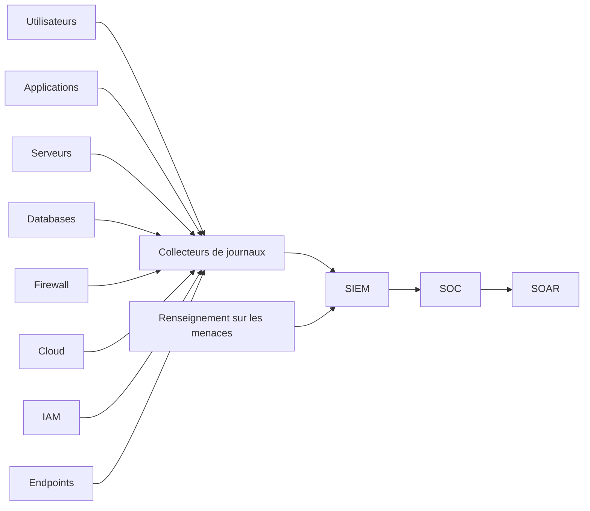

# SEC-112 — Enterprise Security Information and Event Management (SIEM)

> Référentiel officiel du **Security Information and Event Management (SIEM)** de l'écosystème **EduWeb Planner**.

---

# Sommaire

1. Vision
2. Objectifs
3. Définitions
4. Principes fondamentaux
5. Architecture de référence
6. Composants du SIEM
7. Cycle de traitement des événements
8. Gouvernance
9. Cas d'usage EduWeb
10. API conceptuelle
11. KPI
12. Bonnes pratiques
13. Anti-patterns
14. Règles d'architecture
15. Documents associés

---

# 1. Vision

Disposer d'une plateforme centralisée capable de :

- collecter les événements de sécurité ;
- corréler les informations provenant de multiples sources ;
- détecter les comportements anormaux ;
- générer des alertes en temps réel ;
- assister le SOC dans la réponse aux incidents.

Le SIEM constitue le moteur analytique du Security Operations Center.

---

# 2. Objectifs

- centraliser tous les journaux de sécurité ;
- corréler automatiquement les événements ;
- accélérer la détection des incidents ;
- faciliter les investigations ;
- satisfaire aux exigences d'audit et de conformité ;
- produire des tableaux de bord de cybersécurité.

---

# 3. Définitions

Le **Security Information and Event Management (SIEM)** est une plateforme permettant de :

- collecter ;
- normaliser ;
- enrichir ;
- corréler ;
- analyser ;
- conserver les journaux de sécurité provenant de l'ensemble du système d'information.

---

# 4. Principes fondamentaux

- Centralisation des journaux
- Corrélation intelligente
- Surveillance en temps réel
- Threat Intelligence
- Automatisation
- Traçabilité
- Haute disponibilité
- Conservation sécurisée

---

# 5. Architecture de référence



---

# 6. Composants du SIEM

## Collecteurs

Collecte des journaux issus :

- serveurs ;
- applications ;
- équipements réseau ;
- bases de données ;
- Cloud ;
- plateformes EduWeb.

---

## Normalisation

Transformation des événements dans un format commun afin de faciliter leur exploitation.

---

## Corrélation

Association de plusieurs événements afin d'identifier des scénarios d'attaque.

---

## Threat Intelligence

Enrichissement des événements grâce à :

- IOC ;
- listes noires ;
- CERT ;
- flux de renseignement.

---

## Détection

Application de règles permettant de détecter :

- comportements suspects ;
- attaques connues ;
- anomalies.

---

## Dashboards

Visualisation :

- incidents ;
- tendances ;
- indicateurs ;
- conformité.

---

## Archivage

Conservation des journaux selon la politique de rétention.

---

# 7. Cycle de traitement

```text
Collecte

↓

Normalisation

↓

Enrichissement

↓

Corrélation

↓

Détection

↓

Alerte

↓

Investigation

↓

Archivage
```

---

# 8. Gouvernance

Responsabilités :

- RSSI ;
- Responsable SOC ;
- Administrateur SIEM ;
- Analystes SOC N1/N2/N3 ;
- Threat Hunter ;
- DevSecOps ;
- Auditeur SSI.

---

# 9. Cas d'usage EduWeb

### Authentification suspecte

Détection de connexions multiples depuis des pays différents.

---

### API EduWeb

Détection d'un trafic anormal ou d'une tentative d'abus.

---

### Applications Cloud

Corrélation des événements provenant de Microsoft 365, Google Workspace ou d'un fournisseur Cloud.

---

### Base de données

Détection d'un accès massif ou inhabituel aux données sensibles.

---

### Infrastructure réseau

Analyse des journaux des pare-feu, VPN, WAF et IDS/IPS.

---

# 10. API conceptuelle

```typescript
interface EnterpriseSIEM {

collectLogs();

normalizeEvents();

correlateEvents();

detectThreat();

generateAlert();

enrichEvent();

createDashboard();

archiveLogs();

}
```

---

# 11. KPI

| KPI | Objectif |
|------|----------|
| Sources de journaux intégrées | 100 % |
| Corrélations automatiques | ≥95 % |
| Temps moyen de traitement | < 1 minute |
| Faux positifs | < 5 % |
| Disponibilité du SIEM | ≥99,99 % |
| Journaux archivés conformément à la politique | 100 % |

---

# 12. Bonnes pratiques

- centraliser tous les journaux critiques ;
- synchroniser les horloges (NTP) ;
- intégrer des flux de Threat Intelligence ;
- maintenir des règles de corrélation à jour ;
- superviser les performances du SIEM ;
- protéger les journaux contre toute modification ;
- tester régulièrement les scénarios de détection.

---

# 13. Anti-patterns

- journaux dispersés sur plusieurs systèmes ;
- absence de normalisation ;
- corrélations incomplètes ;
- règles de détection obsolètes ;
- rétention insuffisante ;
- absence de supervision des collecteurs.

---

# 14. Règles d'architecture

**RA-SEC112-001**

Tous les actifs critiques transmettent leurs journaux au SIEM.

---

**RA-SEC112-002**

Les horloges des systèmes sont synchronisées afin de garantir la cohérence des événements.

---

**RA-SEC112-003**

Les journaux sont protégés contre toute suppression ou modification non autorisée.

---

**RA-SEC112-004**

Les règles de corrélation sont revues périodiquement en fonction des nouvelles menaces.

---

**RA-SEC112-005**

Les alertes critiques sont automatiquement transmises au SOC et au moteur SOAR.

---

# 15. Documents associés

- SEC-101 — Enterprise Security Foundation
- SEC-110 — Enterprise Network Security
- SEC-111 — Enterprise Security Operations Center
- SEC-113 — Enterprise Extended Detection and Response (XDR)
- SEC-114 — Enterprise Security Orchestration, Automation and Response (SOAR)
- SEC-119 — Enterprise Cybersecurity Governance
- ARCH-150 — Enterprise Reference Architecture

---

# Références

- ISO/IEC 27001
- ISO/IEC 27002
- ISO/IEC 27035
- NIST Cybersecurity Framework 2.0
- NIST SP 800-92 (Guide to Computer Security Log Management)
- MITRE ATT&CK Framework
- ENISA Logging and Monitoring Guidelines
- OWASP Logging Cheat Sheet

---

# Fin du document
