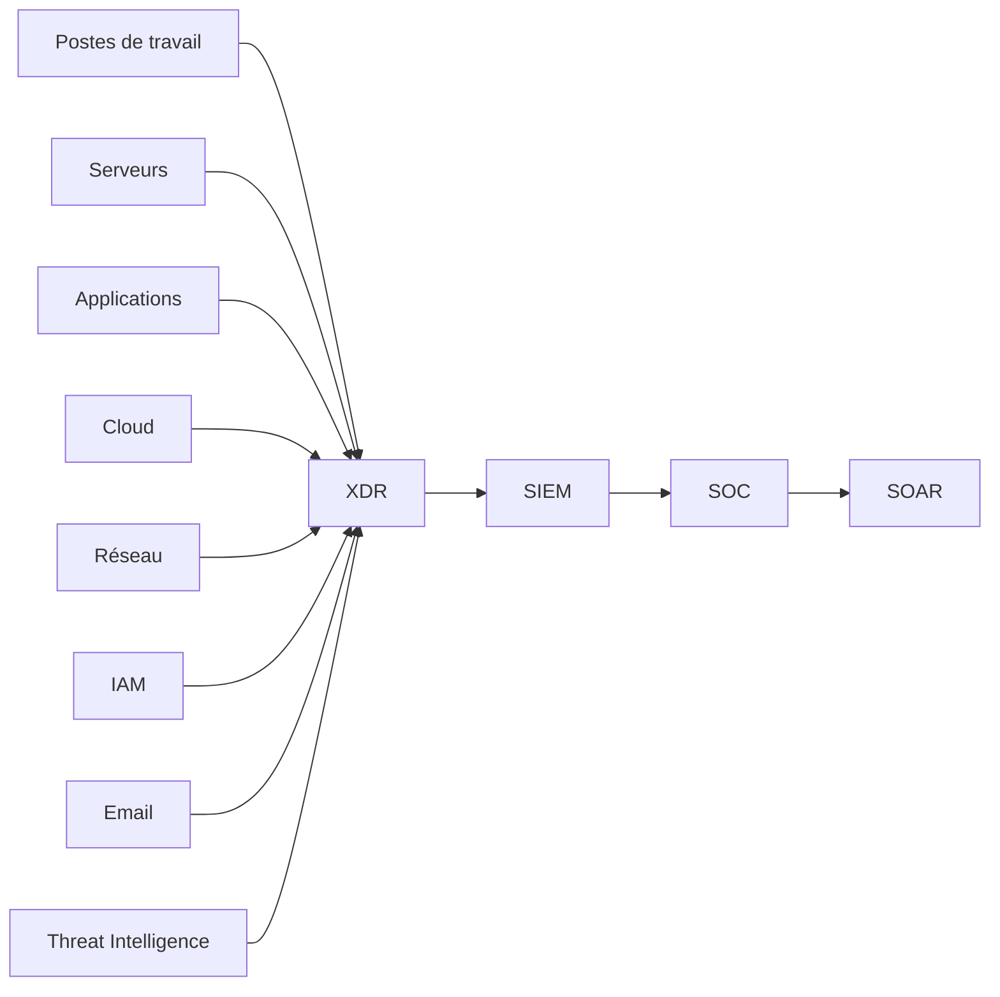

# SEC-113 — Enterprise Extended Detection and Response (XDR)

> Référentiel officiel de l'architecture **Extended Detection and Response (XDR)** de l'écosystème **EduWeb Planner**.

---

# Sommaire

1. Vision
2. Objectifs
3. Définitions
4. Principes fondamentaux
5. Architecture de référence
6. Composants XDR
7. Cycle opérationnel
8. Gouvernance
9. Cas d'usage EduWeb
10. API conceptuelle
11. KPI
12. Bonnes pratiques
13. Anti-patterns
14. Règles d'architecture
15. Documents associés

---

# 1. Vision

Déployer une plateforme **XDR** capable de détecter, corréler et répondre automatiquement aux cybermenaces affectant l'ensemble de l'écosystème **EduWeb**.

L'XDR fournit une visibilité unifiée sur :

- les postes de travail ;
- les serveurs ;
- les réseaux ;
- les applications ;
- les identités ;
- les environnements Cloud ;
- les plateformes EduWeb.

Il complète le SIEM et renforce les capacités du SOC grâce à une détection plus contextuelle et une réponse plus rapide.

---

# 2. Objectifs

- détecter les attaques complexes et multi-vecteurs ;
- corréler automatiquement les événements provenant de multiples sources ;
- accélérer l'investigation des incidents ;
- automatiser les actions de réponse ;
- réduire le temps moyen de détection (MTTD) ;
- réduire le temps moyen de réponse (MTTR).

---

# 3. Définitions

Le **Extended Detection and Response (XDR)** est une plateforme intégrée de cybersécurité qui :

- collecte les données issues de plusieurs couches de sécurité ;
- corrèle les événements ;
- détecte les comportements malveillants ;
- automatise les réponses aux incidents.

Contrairement à l'EDR (Endpoint Detection and Response), l'XDR couvre l'ensemble du système d'information.

---

# 4. Principes fondamentaux

- Zero Trust
- Unified Visibility
- Threat Intelligence
- Behavioral Analytics
- Continuous Monitoring
- Automated Response
- Risk-Based Detection
- Security by Design

---

# 5. Architecture de référence



---

# 6. Composants XDR

## Endpoint Sensors

Collecte des événements provenant des postes utilisateurs et des serveurs.

---

## Network Analytics

Analyse :

- trafic réseau ;
- communications latérales ;
- activités suspectes.

---

## Identity Analytics

Détection :

- compromission de comptes ;
- élévation de privilèges ;
- connexions inhabituelles.

---

## Cloud Security Analytics

Surveillance des environnements :

- AWS ;
- Azure ;
- Google Cloud.

---

## Threat Intelligence

Enrichissement automatique à partir de :

- IOC (Indicators of Compromise) ;
- listes noires ;
- CERT ;
- MITRE ATT&CK ;
- flux de renseignement.

---

## Automated Response

Actions automatiques :

- isolement d'un poste ;
- blocage d'une adresse IP ;
- désactivation d'un compte ;
- quarantaine d'un fichier ;
- ouverture d'un ticket d'incident.

---

# 7. Cycle opérationnel

```text
Collecte

↓

Corrélation

↓

Détection

↓

Qualification

↓

Investigation

↓

Réponse automatique

↓

Remédiation

↓

Retour d'expérience
```

---

# 8. Gouvernance

Responsabilités :

- RSSI ;
- Responsable SOC ;
- Analystes SOC ;
- Threat Hunter ;
- DevSecOps ;
- Administrateur XDR ;
- Cloud Security Engineer ;
- Auditeur SSI.

---

# 9. Cas d'usage EduWeb

### Compromission d'un compte enseignant

Détection d'une connexion inhabituelle suivie d'une élévation de privilèges.

---

### Attaque sur EduWeb Planner

Corrélation entre :

- trafic réseau ;
- journaux applicatifs ;
- authentification IAM ;
- activité de la base de données.

---

### Rançongiciel

Détection d'un chiffrement massif de fichiers et isolement automatique du poste concerné.

---

### API compromises

Blocage automatique d'une clé API utilisée de manière anormale.

---

### Infrastructure Cloud

Détection d'une modification non autorisée de ressources critiques.

---

# 10. API conceptuelle

```typescript
interface EnterpriseXDR {

collectTelemetry();

correlateEvents();

detectThreat();

isolateEndpoint();

blockIPAddress();

disableIdentity();

launchInvestigation();

generateIncidentReport();

}
```

---

# 11. KPI

| KPI | Objectif |
|------|----------|
| Actifs supervisés | 100 % |
| Temps moyen de détection (MTTD) | < 5 min |
| Temps moyen de réponse (MTTR) | < 30 min |
| Réponses automatisées | ≥80 % |
| Faux positifs | < 5 % |
| Disponibilité XDR | ≥99,99 % |

---

# 12. Bonnes pratiques

- intégrer l'ensemble des sources de télémétrie ;
- enrichir les détections avec la Threat Intelligence ;
- automatiser les réponses aux incidents récurrents ;
- cartographier les scénarios selon MITRE ATT&CK ;
- tester régulièrement les mécanismes de réponse ;
- surveiller la qualité des règles de détection.

---

# 13. Anti-patterns

- supervision limitée aux postes de travail ;
- absence de corrélation entre les événements ;
- réponses exclusivement manuelles ;
- absence de renseignement sur les menaces ;
- règles de détection obsolètes ;
- absence d'intégration avec le SIEM ou le SOC.

---

# 14. Règles d'architecture

**RA-SEC113-001**

Tous les actifs critiques transmettent leur télémétrie à la plateforme XDR.

---

**RA-SEC113-002**

Les incidents majeurs sont automatiquement transmis au SIEM et au SOC.

---

**RA-SEC113-003**

Les scénarios de détection sont alignés sur le référentiel MITRE ATT&CK.

---

**RA-SEC113-004**

Les réponses automatiques sont validées selon une politique de gouvernance documentée.

---

**RA-SEC113-005**

Les capacités XDR font l'objet de tests réguliers et d'une amélioration continue.

---

# 15. Documents associés

- SEC-101 — Enterprise Security Foundation
- SEC-110 — Enterprise Network Security
- SEC-111 — Enterprise Security Operations Center
- SEC-112 — Enterprise Security Information and Event Management
- SEC-114 — Enterprise Security Orchestration, Automation and Response
- SEC-115 — Enterprise DevSecOps
- SEC-119 — Enterprise Cybersecurity Governance
- ARCH-150 — Enterprise Reference Architecture

---

# Références

- ISO/IEC 27001
- ISO/IEC 27035
- NIST Cybersecurity Framework 2.0
- NIST SP 800-61 Rev. 2
- MITRE ATT&CK Framework
- ENISA Threat Landscape
- Gartner Market Guide for XDR
- CISA Cybersecurity Performance Goals

---

# Fin du document
