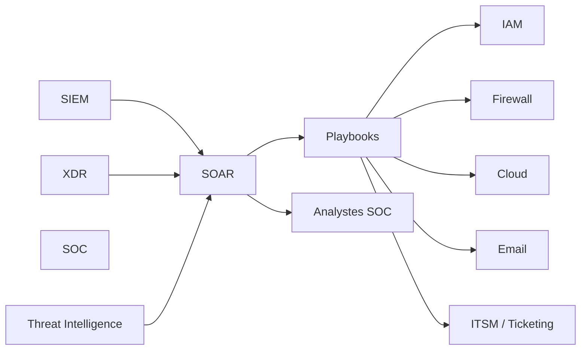

# SEC-114 — Enterprise Security Orchestration, Automation and Response (SOAR)

> Référentiel officiel de l'architecture **Security Orchestration, Automation and Response (SOAR)** de l'écosystème **EduWeb Planner**.

---

# Sommaire

1. Vision
2. Objectifs
3. Définitions
4. Principes fondamentaux
5. Architecture de référence
6. Composants SOAR
7. Cycle opérationnel
8. Gouvernance
9. Cas d'usage EduWeb
10. API conceptuelle
11. KPI
12. Bonnes pratiques
13. Anti-patterns
14. Règles d'architecture
15. Documents associés

---

# 1. Vision

Mettre en œuvre une plateforme **SOAR** capable d'orchestrer, d'automatiser et de coordonner les opérations de cybersécurité afin d'améliorer la rapidité, la cohérence et l'efficacité de la réponse aux incidents.

Le SOAR constitue le moteur d'automatisation du **Security Operations Center (SOC)**.

---

# 2. Objectifs

- automatiser les tâches répétitives ;
- accélérer la réponse aux incidents ;
- réduire les erreurs humaines ;
- standardiser les procédures de sécurité ;
- améliorer la collaboration entre équipes ;
- diminuer le temps moyen de réponse (MTTR).

---

# 3. Définitions

Le **Security Orchestration, Automation and Response (SOAR)** est une plateforme qui :

- orchestre plusieurs outils de sécurité ;
- automatise les processus opérationnels ;
- exécute des playbooks de réponse ;
- coordonne les équipes de cybersécurité.

Le SOAR complète les capacités du **SOC**, du **SIEM** et du **XDR**.

---

# 4. Principes fondamentaux

- Automation First
- Playbook Driven
- Zero Trust
- Continuous Improvement
- Standardisation
- Collaboration
- Auditabilité
- Human-in-the-Loop

---

# 5. Architecture de référence



---

# 6. Composants SOAR

## Orchestration Engine

Coordonne les différents outils de sécurité :

- SIEM ;
- XDR ;
- IAM ;
- pare-feu ;
- EDR ;
- plateformes Cloud.

---

## Playbook Engine

Exécute automatiquement des scénarios documentés de réponse aux incidents.

---

## Automation Engine

Automatise les actions :

- ouverture de ticket ;
- blocage d'une adresse IP ;
- désactivation d'un compte ;
- quarantaine d'un poste ;
- notification des équipes.

---

## Case Management

Gestion centralisée des incidents :

- suivi ;
- affectation ;
- documentation ;
- clôture.

---

## Collaboration

Communication avec :

- SOC ;
- RSSI ;
- équipes infrastructure ;
- équipes DevSecOps ;
- responsables métiers.

---

## Reporting

Production :

- tableaux de bord ;
- indicateurs ;
- rapports d'incident ;
- rapports réglementaires.

---

# 7. Cycle opérationnel

```text
Détection

↓

Qualification

↓

Choix du playbook

↓

Automatisation

↓

Validation humaine (si nécessaire)

↓

Remédiation

↓

Clôture

↓

Retour d'expérience
```

---

# 8. Gouvernance

Responsabilités :

- RSSI ;
- Responsable SOC ;
- Administrateur SOAR ;
- Analystes SOC ;
- DevSecOps ;
- Cloud Security Engineer ;
- Incident Manager ;
- Auditeur SSI.

---

# 9. Cas d'usage EduWeb

### Compromission d'un compte

Le SOAR :

- désactive automatiquement le compte ;
- notifie le SOC ;
- ouvre un ticket ;
- demande une réinitialisation MFA.

---

### Attaque DDoS

Le playbook :

- applique les règles WAF ;
- met à jour le pare-feu ;
- informe les équipes ;
- surveille l'évolution de l'attaque.

---

### Détection d'un rançongiciel

Le SOAR :

- isole le poste concerné ;
- suspend les accès réseau ;
- alerte le SOC ;
- déclenche les procédures de restauration.

---

### Vulnérabilité critique

À la réception d'une alerte CERT :

- création automatique des tickets ;
- notification des responsables ;
- planification des correctifs.

---

### Incident API

Blocage automatique d'une clé API compromise et génération d'un rapport d'incident.

---

# 10. API conceptuelle

```typescript
interface EnterpriseSOAR {

executePlaybook();

openIncident();

assignTask();

disableAccount();

blockIPAddress();

notifyStakeholders();

closeIncident();

generateReport();

}
```

---

# 11. KPI

| KPI | Objectif |
|------|----------|
| Playbooks automatisés | ≥80 % |
| Temps moyen de réponse (MTTR) | < 15 min |
| Incidents automatisés | ≥70 % |
| Disponibilité SOAR | ≥99,99 % |
| Taux de réussite des playbooks | ≥98 % |
| Incidents documentés | 100 % |

---

# 12. Bonnes pratiques

- documenter chaque playbook ;
- tester régulièrement les automatisations ;
- intégrer tous les outils critiques ;
- prévoir une validation humaine pour les actions sensibles ;
- maintenir les procédures à jour ;
- mesurer les performances des playbooks ;
- capitaliser sur les retours d'expérience.

---

# 13. Anti-patterns

- automatisation sans contrôle ;
- playbooks non documentés ;
- absence de tests ;
- intégrations partielles ;
- absence de journalisation ;
- procédures manuelles répétitives.

---

# 14. Règles d'architecture

**RA-SEC114-001**

Chaque type d'incident récurrent dispose d'un playbook documenté.

---

**RA-SEC114-002**

Les actions automatiques critiques peuvent nécessiter une validation humaine selon leur niveau de risque.

---

**RA-SEC114-003**

Toutes les actions exécutées par le SOAR sont journalisées.

---

**RA-SEC114-004**

Le SOAR est intégré au SIEM, au XDR et au système de gestion des incidents.

---

**RA-SEC114-005**

Les playbooks sont révisés régulièrement à partir des retours d'expérience et de l'évolution des menaces.

---

# 15. Documents associés

- SEC-101 — Enterprise Security Foundation
- SEC-111 — Enterprise Security Operations Center (SOC)
- SEC-112 — Enterprise Security Information and Event Management (SIEM)
- SEC-113 — Enterprise Extended Detection and Response (XDR)
- SEC-115 — Enterprise DevSecOps
- SEC-119 — Enterprise Cybersecurity Governance
- ARCH-150 — Enterprise Reference Architecture

---

# Références

- ISO/IEC 27001
- ISO/IEC 27035
- NIST Cybersecurity Framework 2.0
- NIST SP 800-61 Rev. 2
- MITRE ATT&CK Framework
- OASIS OpenC2
- ENISA Incident Response Guidelines
- Gartner Market Guide for SOAR

---

# Fin du document
