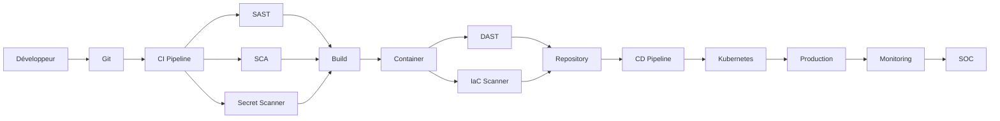

# SEC-115 — Enterprise DevSecOps

> Référentiel officiel de l'architecture **DevSecOps** de l'écosystème **EduWeb Planner**.

---

# Sommaire

1. Vision
2. Objectifs
3. Définitions
4. Principes fondamentaux
5. Architecture de référence
6. Composants DevSecOps
7. Cycle DevSecOps
8. Gouvernance
9. Cas d'usage EduWeb
10. API conceptuelle
11. KPI
12. Bonnes pratiques
13. Anti-patterns
14. Règles d'architecture
15. Documents associés

---

# 1. Vision

Intégrer la sécurité dans **chaque étape du cycle de développement logiciel**, depuis la conception jusqu'à l'exploitation en production.

Le DevSecOps transforme la sécurité en une responsabilité partagée entre :

- les développeurs ;
- les équipes DevOps ;
- les experts cybersécurité ;
- les administrateurs systèmes ;
- les responsables métiers.

Pour EduWeb, chaque nouvelle fonctionnalité doit être **sécurisée dès sa conception (Security by Design)** et **vérifiée automatiquement avant sa mise en production**.

---

# 2. Objectifs

- intégrer la sécurité dès la phase de conception ;
- automatiser les contrôles de sécurité ;
- détecter précocement les vulnérabilités ;
- sécuriser les pipelines CI/CD ;
- réduire les risques liés aux déploiements ;
- améliorer la conformité logicielle.

---

# 3. Définitions

Le **DevSecOps** est une approche organisationnelle et technique qui consiste à intégrer les pratiques de cybersécurité dans toutes les étapes du cycle de développement logiciel.

Il associe trois disciplines :

- **Development (Dev)** ;
- **Security (Sec)** ;
- **Operations (Ops)**.

Le DevSecOps remplace les contrôles de sécurité réalisés uniquement en fin de projet par des contrôles continus et automatisés.

---

# 4. Principes fondamentaux

- Security by Design
- Shift Left Security
- Shift Right Security
- Automation First
- Continuous Compliance
- Least Privilege
- Infrastructure as Code
- Immutable Infrastructure
- Continuous Monitoring

---

# 5. Architecture de référence



---

# 6. Composants DevSecOps

## Gestion du code source

- Git
- GitHub
- GitLab
- Azure DevOps

---

## CI/CD

Automatisation :

- compilation ;
- tests ;
- déploiements ;
- validation sécurité.

---

## SAST

Analyse statique du code source.

Détection :

- injections SQL ;
- XSS ;
- mauvaises pratiques ;
- vulnérabilités OWASP.

---

## DAST

Analyse dynamique des applications déployées.

---

## SCA (Software Composition Analysis)

Analyse :

- bibliothèques ;
- dépendances ;
- licences ;
- CVE connues.

---

## Secret Scanning

Recherche :

- mots de passe ;
- clés API ;
- certificats ;
- tokens ;
- secrets Git.

---

## Container Security

Analyse des images Docker.

Contrôle des vulnérabilités.

---

## Infrastructure as Code Security

Validation :

- Terraform ;
- Kubernetes ;
- Helm ;
- Ansible.

---

## Runtime Security

Surveillance des applications en production.

---

# 7. Cycle DevSecOps

```text
Conception

↓

Développement

↓

Analyse SAST

↓

Analyse des dépendances

↓

Détection des secrets

↓

Compilation

↓

Tests

↓

Analyse DAST

↓

Validation

↓

Déploiement

↓

Surveillance

↓

Amélioration continue
```

---

# 8. Gouvernance

Responsabilités :

- Directeur Technique ;
- RSSI ;
- Security Architect ;
- DevSecOps Engineer ;
- Développeurs ;
- Administrateurs Cloud ;
- Administrateurs Kubernetes ;
- Équipe SOC ;
- Auditeur SSI.

---

# 9. Cas d'usage EduWeb

### Développement de Planner

Chaque commit déclenche automatiquement :

- compilation ;
- SAST ;
- SCA ;
- Secret Scanning.

---

### Déploiement Kubernetes

Avant chaque mise en production :

- analyse des manifests ;
- validation des images ;
- contrôle des configurations.

---

### Publication d'une API

Validation :

- authentification ;
- autorisations ;
- sécurité OWASP API Top 10 ;
- documentation OpenAPI.

---

### Développement mobile

Analyse automatique :

- Android ;
- iOS ;
- Progressive Web Apps.

---

### Plateforme Governance

Validation des nouvelles fonctionnalités avant diffusion aux établissements.

---

# 10. API conceptuelle

```typescript
interface EnterpriseDevSecOps {

scanSourceCode();

scanDependencies();

scanSecrets();

scanContainers();

scanInfrastructure();

runSecurityTests();

approveRelease();

deploySecureApplication();

}
```

---

# 11. KPI

| KPI | Objectif |
|------|----------|
| Commits analysés automatiquement | 100 % |
| Images Docker analysées | 100 % |
| Secrets détectés avant production | 100 % |
| Vulnérabilités critiques corrigées avant déploiement | ≥99 % |
| Temps moyen du pipeline CI/CD | < 20 min |
| Déploiements sécurisés | 100 % |

---

# 12. Bonnes pratiques

- intégrer les contrôles de sécurité dans le pipeline CI/CD ;
- analyser toutes les dépendances logicielles ;
- utiliser des images de conteneurs minimales et signées ;
- appliquer le principe du moindre privilège ;
- stocker les secrets dans un coffre-fort sécurisé ;
- automatiser les contrôles de conformité ;
- réaliser des revues de code de sécurité.

---

# 13. Anti-patterns

- sécurité réalisée uniquement avant la mise en production ;
- secrets stockés dans le dépôt Git ;
- dépendances obsolètes non surveillées ;
- images Docker non analysées ;
- absence de tests de sécurité automatisés ;
- déploiement manuel des environnements de production.

---

# 14. Règles d'architecture

**RA-SEC115-001**

Chaque pipeline CI/CD exécute automatiquement les analyses de sécurité avant tout déploiement.

---

**RA-SEC115-002**

Aucun secret ne peut être stocké dans le code source ou les fichiers de configuration.

---

**RA-SEC115-003**

Les images de conteneurs sont analysées et signées avant leur publication.

---

**RA-SEC115-004**

Les vulnérabilités critiques bloquent automatiquement la mise en production.

---

**RA-SEC115-005**

Les infrastructures décrites en Infrastructure as Code sont soumises à une validation de sécurité avant déploiement.

---

# 15. Documents associés

- SEC-101 — Enterprise Security Foundation
- SEC-105 — Enterprise Privileged Access Management
- SEC-107 — Enterprise Secrets Management
- SEC-108 — Enterprise Encryption
- SEC-109 — Enterprise Key Management System
- SEC-111 — Enterprise Security Operations Center
- SEC-114 — Enterprise Security Orchestration, Automation and Response
- SEC-116 — Enterprise Cloud Security
- ARCH-150 — Enterprise Reference Architecture

---

# Références

- ISO/IEC 27001
- ISO/IEC 27034 (Application Security)
- NIST Secure Software Development Framework (SSDF) SP 800-218
- OWASP SAMM
- OWASP ASVS
- OWASP Top 10
- OWASP API Security Top 10
- CNCF Software Supply Chain Best Practices
- SLSA (Supply-chain Levels for Software Artifacts)

---

# Fin du document
