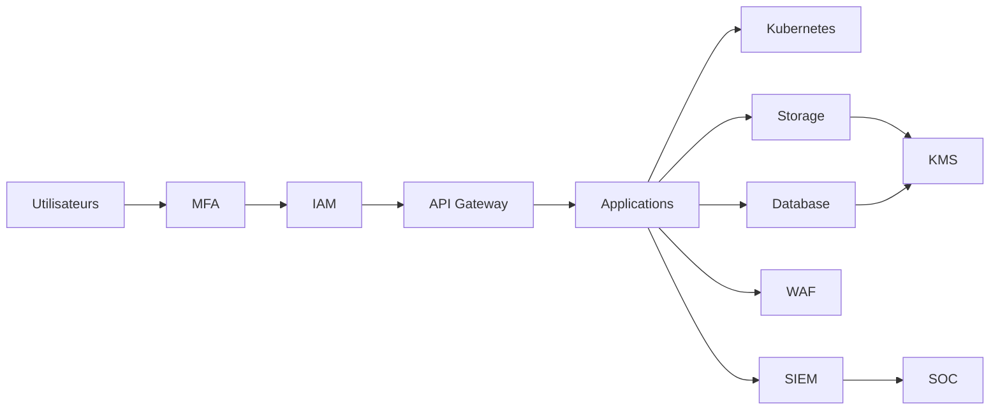

# SEC-116 — Enterprise Cloud Security

> Référentiel officiel de sécurité des environnements Cloud de l'écosystème **EduWeb Planner**.

---

# Sommaire

1. Vision
2. Objectifs
3. Définitions
4. Principes fondamentaux
5. Architecture de référence
6. Domaines de sécurité Cloud
7. Cycle de sécurisation
8. Gouvernance
9. Cas d'usage EduWeb
10. API conceptuelle
11. KPI
12. Bonnes pratiques
13. Anti-patterns
14. Règles d'architecture
15. Documents associés

---

# 1. Vision

Garantir un niveau de sécurité homogène pour l'ensemble des ressources Cloud utilisées par **EduWeb**, qu'elles soient déployées sur :

- Cloud public ;
- Cloud privé ;
- Cloud hybride ;
- Multi-Cloud.

La sécurité Cloud doit être intégrée dès la conception des architectures afin d'assurer la confidentialité, l'intégrité, la disponibilité et la résilience des services numériques.

---

# 2. Objectifs

- protéger les données hébergées dans le Cloud ;
- sécuriser les identités et les accès ;
- garantir la conformité réglementaire ;
- surveiller les ressources Cloud ;
- automatiser les contrôles de sécurité ;
- assurer la continuité des services.

---

# 3. Définitions

La **Cloud Security** regroupe les politiques, processus, technologies et contrôles permettant de protéger les ressources hébergées dans des infrastructures Cloud.

Elle couvre notamment :

- les identités ;
- les réseaux ;
- les applications ;
- les données ;
- les charges de travail ;
- les conteneurs ;
- les services managés.

---

# 4. Principes fondamentaux

- Zero Trust
- Shared Responsibility Model
- Least Privilege
- Security by Design
- Encryption Everywhere
- Continuous Compliance
- Automation First
- Defense in Depth
- Observability

---

# 5. Architecture de référence



---

# 6. Domaines de sécurité Cloud

## Identity Security

Gestion :

- IAM ;
- MFA ;
- rôles ;
- politiques d'accès.

---

## Network Security

Protection :

- VPC ;
- pare-feu ;
- VPN ;
- WAF ;
- segmentation réseau.

---

## Data Security

Protection :

- chiffrement ;
- classification ;
- sauvegardes ;
- rétention.

---

## Workload Security

Sécurisation :

- machines virtuelles ;
- conteneurs ;
- Kubernetes ;
- fonctions serverless.

---

## Application Security

Contrôles :

- authentification ;
- autorisation ;
- API sécurisées ;
- protection OWASP Top 10.

---

## Monitoring

Supervision continue :

- journaux ;
- métriques ;
- alertes ;
- événements.

---

## Compliance

Vérification continue des exigences :

- ISO 27001 ;
- RGPD ;
- politiques internes ;
- référentiels nationaux.

---

# 7. Cycle de sécurisation

```text
Conception

↓

Provisionnement

↓

Configuration

↓

Déploiement

↓

Surveillance

↓

Audit

↓

Correction

↓

Amélioration continue
```

---

# 8. Gouvernance

Responsabilités :

- RSSI ;
- Cloud Security Architect ;
- Cloud Administrator ;
- DevSecOps ;
- Infrastructure Team ;
- SOC ;
- Auditeur SSI.

---

# 9. Cas d'usage EduWeb

### Hébergement d'EduWeb Planner

Protection :

- IAM ;
- WAF ;
- chiffrement TLS 1.3 ;
- sauvegardes automatiques.

---

### Plateforme EduWeb Governance

Protection des données administratives sensibles.

---

### Kubernetes

Sécurisation :

- pods ;
- secrets ;
- réseaux ;
- images de conteneurs.

---

### Sauvegardes Cloud

Stockage chiffré avec réplication multi-zones.

---

### API Cloud

Authentification OAuth 2.1 et mTLS.

---

# 10. API conceptuelle

```typescript
interface EnterpriseCloudSecurity {

deploySecureResource();

encryptStorage();

scanConfiguration();

manageIdentity();

monitorResources();

auditCompliance();

backupResources();

generateSecurityReport();

}
```

---

# 11. KPI

| KPI | Objectif |
|------|----------|
| Ressources Cloud conformes | ≥99 % |
| Données chiffrées | 100 % |
| Comptes MFA | 100 % |
| Sauvegardes automatiques | 100 % |
| Détection des mauvaises configurations | < 15 min |
| Disponibilité des services Cloud | ≥99,99 % |

---

# 12. Bonnes pratiques

- appliquer le principe du moindre privilège ;
- activer la MFA pour tous les comptes ;
- chiffrer les données au repos et en transit ;
- automatiser les audits de configuration ;
- utiliser des réseaux privés lorsque cela est possible ;
- surveiller en continu les ressources Cloud ;
- intégrer les journaux au SIEM.

---

# 13. Anti-patterns

- stockage public non contrôlé ;
- comptes administrateurs permanents ;
- absence de journalisation ;
- ressources non chiffrées ;
- configurations par défaut conservées ;
- absence de surveillance des environnements Cloud.

---

# 14. Règles d'architecture

**RA-SEC116-001**

Toutes les ressources Cloud sont créées via des modèles validés (Infrastructure as Code).

---

**RA-SEC116-002**

Les données sensibles sont systématiquement chiffrées.

---

**RA-SEC116-003**

Les comptes privilégiés utilisent une authentification multifacteur.

---

**RA-SEC116-004**

Les événements de sécurité sont centralisés dans le SIEM.

---

**RA-SEC116-005**

Les configurations Cloud font l'objet d'audits automatisés et réguliers.

---

# 15. Documents associés

- SEC-101 — Enterprise Security Foundation
- SEC-104 — Enterprise Identity & Access Management
- SEC-108 — Enterprise Encryption
- SEC-109 — Enterprise Key Management System
- SEC-110 — Enterprise Network Security
- SEC-115 — Enterprise DevSecOps
- SEC-117 — Enterprise Data Loss Prevention
- INT-117 — Enterprise Cloud Integration
- ARCH-150 — Enterprise Reference Architecture

---

# Références

- ISO/IEC 27001
- ISO/IEC 27017 (Cloud Security)
- ISO/IEC 27018 (Protection des données personnelles dans le Cloud)
- NIST SP 800-144
- NIST Cybersecurity Framework 2.0
- CSA Cloud Controls Matrix (CCM)
- CIS Cloud Benchmarks
- OWASP Cloud Security Guidance

---

# Fin du document
