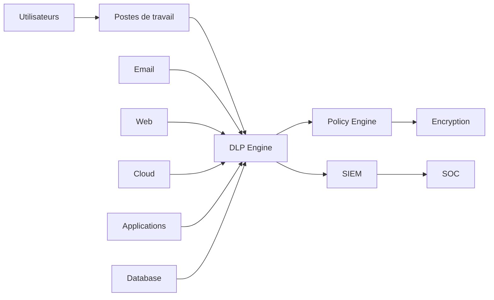

# SEC-117 — Enterprise Data Loss Prevention (DLP)

> Référentiel officiel de **prévention des pertes de données (Data Loss Prevention - DLP)** de l'écosystème **EduWeb Planner**.

---

# Sommaire

1. Vision
2. Objectifs
3. Définitions
4. Principes fondamentaux
5. Architecture de référence
6. Domaines de protection
7. Cycle de prévention des pertes de données
8. Gouvernance
9. Cas d'usage EduWeb
10. API conceptuelle
11. KPI
12. Bonnes pratiques
13. Anti-patterns
14. Règles d'architecture
15. Documents associés

---

# 1. Vision

Garantir que les données sensibles d'EduWeb soient protégées contre :

- la fuite accidentelle ;
- le vol ;
- la divulgation non autorisée ;
- la modification illicite ;
- l'exfiltration ;
- la destruction.

Le DLP protège les informations tout au long de leur cycle de vie, quel que soit leur emplacement.

---

# 2. Objectifs

- identifier les données sensibles ;
- classifier les informations ;
- empêcher leur fuite ;
- contrôler les échanges de données ;
- assurer la traçabilité des accès ;
- répondre aux exigences réglementaires.

---

# 3. Définitions

Le **Data Loss Prevention (DLP)** désigne l'ensemble des politiques, processus et technologies destinés à :

- détecter les données sensibles ;
- surveiller leur utilisation ;
- empêcher leur divulgation non autorisée ;
- appliquer automatiquement les politiques de protection.

---

# 4. Principes fondamentaux

- Data Classification First
- Zero Trust
- Least Privilege
- Need to Know
- Encryption by Default
- Continuous Monitoring
- Privacy by Design
- Compliance by Default

---

# 5. Architecture de référence



---

# 6. Domaines de protection

## Données au repos

Protection des :

- bases de données ;
- systèmes de fichiers ;
- sauvegardes ;
- espaces collaboratifs ;
- stockages Cloud.

---

## Données en transit

Surveillance des flux :

- e-mails ;
- API ;
- HTTPS ;
- FTP sécurisé ;
- messageries professionnelles.

---

## Données en utilisation

Contrôle :

- impression ;
- copie USB ;
- copier-coller ;
- captures d'écran ;
- export de fichiers.

---

## Données Cloud

Protection des données hébergées sur :

- Microsoft 365 ;
- Google Workspace ;
- AWS ;
- Azure ;
- Google Cloud Platform.

---

## Données mobiles

Contrôle des accès depuis :

- smartphones ;
- tablettes ;
- Progressive Web Apps (PWA).

---

# 7. Cycle de prévention

```text
Identification

↓

Classification

↓

Surveillance

↓

Détection

↓

Blocage ou chiffrement

↓

Journalisation

↓

Investigation

↓

Amélioration continue
```

---

# 8. Gouvernance

Responsabilités :

- RSSI ;
- Data Protection Officer (DPO) ;
- Data Owner ;
- Security Architect ;
- Administrateur DLP ;
- SOC ;
- Auditeur SSI.

---

# 9. Cas d'usage EduWeb

### Bulletins scolaires

Blocage de l'envoi d'un bulletin à un destinataire non autorisé.

---

### Données RH

Protection des dossiers des enseignants et du personnel administratif.

---

### Décisions administratives

Empêcher l'exfiltration de documents réglementaires confidentiels.

---

### Bases de données EduWeb Planner

Détection d'exports massifs de données élèves.

---

### Plateforme EduWeb Family

Protection des données personnelles des familles et des élèves.

---

### Sauvegardes Cloud

Contrôle des copies et du partage des sauvegardes.

---

# 10. API conceptuelle

```typescript
interface EnterpriseDLP {

classifyData();

scanContent();

detectSensitiveData();

applyPolicy();

encryptData();

blockTransfer();

auditActivity();

generateComplianceReport();

}
```

---

# 11. KPI

| KPI | Objectif |
|------|----------|
| Données classifiées | 100 % |
| Données sensibles protégées | 100 % |
| Tentatives de fuite détectées | ≥99 % |
| Faux positifs | < 5 % |
| Incidents DLP traités | 100 % |
| Disponibilité du moteur DLP | ≥99,99 % |

---

# 12. Bonnes pratiques

- classifier les données dès leur création ;
- appliquer automatiquement les politiques DLP ;
- chiffrer les données sensibles ;
- limiter les exportations ;
- contrôler les périphériques USB ;
- surveiller les services Cloud ;
- intégrer les alertes au SIEM et au SOC.

---

# 13. Anti-patterns

- absence de classification des données ;
- export libre des informations sensibles ;
- stockage de données confidentielles en clair ;
- absence de surveillance des postes utilisateurs ;
- politiques DLP trop permissives ;
- absence de journalisation des incidents.

---

# 14. Règles d'architecture

**RA-SEC117-001**

Toutes les données sensibles sont classifiées selon la politique de gouvernance des données.

---

**RA-SEC117-002**

Les transferts de données sensibles sont soumis aux politiques DLP.

---

**RA-SEC117-003**

Les données confidentielles sont chiffrées au repos et en transit.

---

**RA-SEC117-004**

Les incidents DLP sont automatiquement transmis au SIEM et au SOC.

---

**RA-SEC117-005**

Les politiques DLP sont revues périodiquement en fonction des évolutions réglementaires et des nouveaux risques.

---

# 15. Documents associés

- SEC-101 — Enterprise Security Foundation
- SEC-104 — Enterprise Identity & Access Management
- SEC-108 — Enterprise Encryption
- SEC-109 — Enterprise Key Management System
- SEC-111 — Enterprise Security Operations Center
- SEC-112 — Enterprise Security Information and Event Management
- SEC-116 — Enterprise Cloud Security
- SEC-118 — Enterprise Business Continuity & Disaster Recovery
- SEC-119 — Enterprise Cybersecurity Governance
- ARCH-150 — Enterprise Reference Architecture

---

# Références

- ISO/IEC 27001
- ISO/IEC 27002
- ISO/IEC 27701 (Privacy Information Management)
- NIST SP 800-53
- NIST Privacy Framework
- CIS Controls v8
- OWASP Data Security Guidelines
- ENISA Data Protection Recommendations

---

# Fin du document
