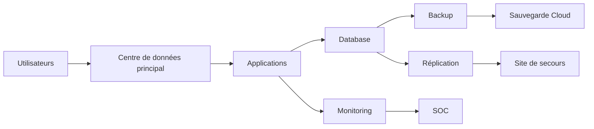

# SEC-118 — Enterprise Business Continuity & Disaster Recovery (BC/DR)

> Référentiel officiel de **continuité d'activité (Business Continuity)** et de **reprise après sinistre (Disaster Recovery)** de l'écosystème **EduWeb Planner**.

---

# Sommaire

1. Vision
2. Objectifs
3. Définitions
4. Principes fondamentaux
5. Architecture de référence
6. Composants BC/DR
7. Cycle de continuité d'activité
8. Gouvernance
9. Cas d'usage EduWeb
10. API conceptuelle
11. KPI
12. Bonnes pratiques
13. Anti-patterns
14. Règles d'architecture
15. Documents associés

---

# 1. Vision

Garantir que les services numériques d'**EduWeb** restent disponibles ou puissent être rétablis rapidement après un incident majeur.

La stratégie BC/DR doit permettre :

- d'assurer la continuité des activités pédagogiques ;
- de protéger les données critiques ;
- de limiter les interruptions de service ;
- de préserver la confiance des établissements scolaires et des partenaires.

---

# 2. Objectifs

- maintenir les services essentiels ;
- réduire le temps d'interruption ;
- limiter la perte de données ;
- assurer une reprise rapide des opérations ;
- disposer de procédures documentées et testées ;
- satisfaire aux exigences réglementaires.

---

# 3. Définitions

## Business Continuity (BC)

Ensemble des dispositions permettant d'assurer la continuité des activités pendant et après un incident.

---

## Disaster Recovery (DR)

Ensemble des moyens techniques permettant de restaurer les systèmes d'information après une catastrophe.

---

## RTO (Recovery Time Objective)

Temps maximal acceptable pour rétablir un service.

---

## RPO (Recovery Point Objective)

Volume maximal de données pouvant être perdu entre deux sauvegardes.

---

## MTPD (Maximum Tolerable Period of Disruption)

Durée maximale d'interruption acceptable avant que les conséquences deviennent critiques.

---

# 4. Principes fondamentaux

- Business First
- High Availability
- Resilience by Design
- Automation First
- Redundancy
- Backup by Default
- Continuous Testing
- Continuous Improvement

---

# 5. Architecture de référence



---

# 6. Composants BC/DR

## Plan de Continuité d'Activité (PCA)

Organisation des activités permettant de maintenir les services essentiels.

---

## Plan de Reprise d'Activité (PRA)

Procédures de restauration des systèmes après un incident majeur.

---

## Sauvegardes

Politique comprenant :

- sauvegardes complètes ;
- sauvegardes incrémentales ;
- sauvegardes différentielles ;
- sauvegardes hors site.

---

## Réplication

Synchronisation :

- temps réel ;
- quasi temps réel ;
- planifiée.

---

## Haute disponibilité

Mise en œuvre :

- clusters ;
- équilibrage de charge ;
- bascule automatique (failover).

---

## Supervision

Surveillance continue :

- disponibilité ;
- performances ;
- intégrité des sauvegardes ;
- réplication.

---

# 7. Cycle de continuité d'activité

```text
Analyse des risques

↓

Business Impact Analysis (BIA)

↓

Définition des stratégies

↓

Mise en œuvre

↓

Tests

↓

Incident

↓

Reprise

↓

Retour d'expérience

↓

Amélioration continue
```

---

# 8. Gouvernance

Responsabilités :

- Direction Générale ;
- RSSI ;
- Responsable Infrastructure ;
- Responsable Cloud ;
- Administrateur Bases de Données ;
- DevSecOps ;
- Responsable BC/DR ;
- SOC ;
- Auditeur SSI.

---

# 9. Cas d'usage EduWeb

### Panne du centre de données principal

Bascule automatique vers le site secondaire.

---

### Attaque par rançongiciel

- isolement des systèmes ;
- restauration des sauvegardes validées ;
- reprise progressive des services.

---

### Défaillance d'une base de données

Restauration à partir de la dernière sauvegarde cohérente.

---

### Perte d'un serveur applicatif

Redémarrage automatique sur une infrastructure redondante.

---

### Indisponibilité du fournisseur Cloud

Activation des ressources sur un second fournisseur ou un site de secours.

---

### Continuité pédagogique

Maintien de l'accès à :

- EduWeb Planner ;
- EduWeb Governance ;
- EduWeb Family ;
- EduWeb Booking.

---

# 10. API conceptuelle

```typescript
interface EnterpriseBusinessContinuity {

backup();

restore();

replicate();

failover();

failback();

verifyBackup();

executeRecoveryPlan();

generateRecoveryReport();

}
```

---

# 11. KPI

| KPI | Objectif |
|------|----------|
| Disponibilité des services critiques | ≥99,99 % |
| Respect du RTO | ≥95 % |
| Respect du RPO | ≥95 % |
| Sauvegardes réussies | ≥99 % |
| Tests PRA réalisés | 100 % |
| Temps moyen de bascule | < 15 min |

---

# 12. Bonnes pratiques

- réaliser une analyse d'impact métier (BIA) ;
- tester régulièrement les sauvegardes ;
- documenter les procédures BC/DR ;
- automatiser les bascules lorsque cela est pertinent ;
- conserver des sauvegardes hors ligne ;
- chiffrer les sauvegardes ;
- organiser des exercices de simulation.

---

# 13. Anti-patterns

- absence de PRA documenté ;
- sauvegardes jamais testées ;
- stockage des sauvegardes sur le même site que la production ;
- absence de réplication ;
- procédures connues d'une seule personne ;
- absence de tests de bascule.

---

# 14. Règles d'architecture

**RA-SEC118-001**

Chaque service critique dispose d'un PCA et d'un PRA validés.

---

**RA-SEC118-002**

Les sauvegardes sont chiffrées, vérifiées et conservées sur un site distinct.

---

**RA-SEC118-003**

Les objectifs RTO et RPO sont définis pour chaque application critique.

---

**RA-SEC118-004**

Les procédures de reprise sont testées au minimum une fois par an.

---

**RA-SEC118-005**

Toute modification majeure de l'infrastructure entraîne une révision du PCA/PRA.

---

# 15. Documents associés

- SEC-101 — Enterprise Security Foundation
- SEC-108 — Enterprise Encryption
- SEC-109 — Enterprise Key Management System
- SEC-110 — Enterprise Network Security
- SEC-111 — Enterprise Security Operations Center
- SEC-116 — Enterprise Cloud Security
- SEC-117 — Enterprise Data Loss Prevention
- SEC-119 — Enterprise Cybersecurity Governance
- ARCH-150 — Enterprise Reference Architecture

---

# Références

- ISO 22301 (Business Continuity Management Systems)
- ISO/IEC 27001
- ISO/IEC 27031 (ICT Readiness for Business Continuity)
- ISO/IEC 24762 (Disaster Recovery Services)
- NIST SP 800-34 Rev. 1 (Contingency Planning Guide)
- NIST Cybersecurity Framework 2.0
- CIS Controls v8
- ENISA Guidelines on Business Continuity

---

# Fin du document
