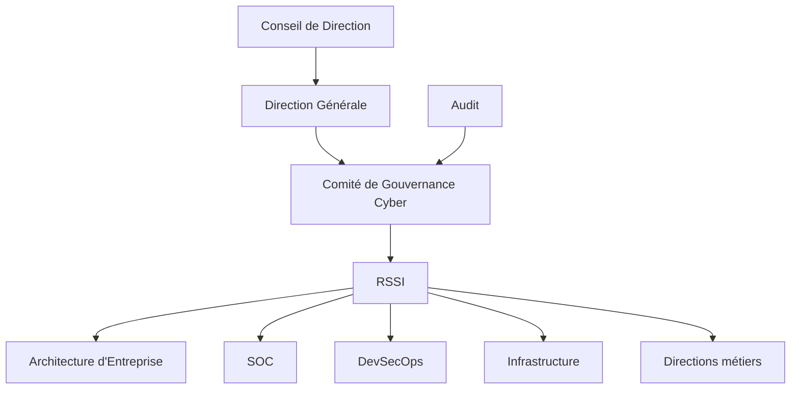

# SEC-119 — Enterprise Cybersecurity Governance

> Référentiel officiel de **gouvernance de la cybersécurité** de l'écosystème **EduWeb Planner**.

---

# Sommaire

1. Vision
2. Objectifs
3. Définitions
4. Principes fondamentaux
5. Architecture de gouvernance
6. Piliers de gouvernance
7. Cycle de gouvernance
8. Organisation et responsabilités
9. Cas d'usage EduWeb
10. API conceptuelle
11. KPI
12. Bonnes pratiques
13. Anti-patterns
14. Règles d'architecture
15. Documents associés

---

# 1. Vision

Mettre en œuvre une gouvernance de cybersécurité garantissant que les risques numériques sont maîtrisés, les responsabilités clairement définies et les investissements alignés sur les objectifs stratégiques d'**EduWeb**.

La cybersécurité devient un levier de confiance, de conformité et de résilience pour l'ensemble des plateformes :

- EduWeb Planner ;
- EduWeb Governance ;
- EduWeb Family ;
- EduWeb Booking ;
- futures solutions numériques.

---

# 2. Objectifs

- aligner la cybersécurité sur la stratégie de l'entreprise ;
- définir les responsabilités de chaque acteur ;
- piloter les risques cyber ;
- assurer la conformité réglementaire ;
- mesurer la performance de la sécurité ;
- promouvoir une culture de cybersécurité.

---

# 3. Définitions

La **gouvernance de la cybersécurité** est l'ensemble des structures, politiques, processus et mécanismes permettant de diriger, contrôler et améliorer la sécurité du système d'information.

Elle couvre notamment :

- la stratégie ;
- la gestion des risques ;
- les politiques de sécurité ;
- la conformité ;
- les audits ;
- la sensibilisation ;
- l'amélioration continue.

---

# 4. Principes fondamentaux

- Security Governance
- Risk-Based Management
- Business Alignment
- Continuous Improvement
- Accountability
- Compliance by Design
- Security by Design
- Zero Trust
- Transparency

---

# 5. Architecture de gouvernance



---

# 6. Piliers de gouvernance

## Gouvernance stratégique

- vision ;
- feuille de route ;
- arbitrages ;
- investissements.

---

## Gestion des risques

- identification ;
- analyse ;
- traitement ;
- acceptation ;
- suivi.

---

## Politiques de sécurité

Définition :

- politiques ;
- normes ;
- standards ;
- procédures.

---

## Conformité

Respect :

- ISO 27001 ;
- ISO 22301 ;
- réglementations nationales ;
- exigences contractuelles.

---

## Gestion des actifs

Inventaire :

- matériels ;
- logiciels ;
- données ;
- identités ;
- services Cloud.

---

## Gestion des fournisseurs

Évaluation de la sécurité :

- hébergeurs ;
- prestataires ;
- partenaires ;
- éditeurs.

---

## Sensibilisation

Programme permanent :

- formations ;
- exercices ;
- simulations de phishing ;
- communication.

---

## Mesure de performance

Suivi des indicateurs :

- risques ;
- incidents ;
- conformité ;
- disponibilité.

---

# 7. Cycle de gouvernance

```text
Définition de la stratégie

↓

Analyse des risques

↓

Élaboration des politiques

↓

Mise en œuvre

↓

Contrôle

↓

Audit

↓

Amélioration continue
```

---

# 8. Organisation et responsabilités

## Conseil de Direction

- définit les orientations stratégiques ;
- valide les investissements majeurs.

---

## Direction Générale

- pilote la gouvernance globale ;
- arbitre les priorités.

---

## RSSI

- définit les politiques ;
- coordonne la cybersécurité ;
- supervise les risques.

---

## Architecte d'Entreprise

- garantit l'intégration de la sécurité dans les architectures.

---

## DevSecOps

- intègre la sécurité dans les développements.

---

## SOC

- surveille les menaces ;
- coordonne la réponse aux incidents.

---

## Directions métiers

- identifient les besoins ;
- appliquent les politiques.

---

## Audit interne

- vérifie la conformité ;
- formule des recommandations.

---

# 9. Cas d'usage EduWeb

### Déploiement d'une nouvelle plateforme

Validation des exigences de sécurité avant mise en production.

---

### Nouvel établissement scolaire

Évaluation des risques avant intégration dans EduWeb Planner.

---

### Nouveau fournisseur Cloud

Évaluation de la conformité et des garanties de sécurité.

---

### Audit annuel

Mesure de conformité aux référentiels internes et internationaux.

---

### Incident majeur

Activation de la cellule de crise et suivi des actions correctives.

---

# 10. API conceptuelle

```typescript
interface EnterpriseCyberGovernance {

assessRisk();

approvePolicy();

launchAudit();

measureCompliance();

registerAsset();

reviewSupplier();

publishDashboard();

manageImprovementPlan();

}
```

---

# 11. KPI

| KPI | Objectif |
|------|----------|
| Actifs inventoriés | 100 % |
| Risques évalués annuellement | 100 % |
| Audits réalisés | 100 % |
| Plans d'action clôturés | ≥95 % |
| Collaborateurs sensibilisés | 100 % |
| Conformité ISO | ≥95 % |

---

# 12. Bonnes pratiques

- aligner la cybersécurité sur les objectifs stratégiques ;
- maintenir un registre des risques ;
- réviser régulièrement les politiques ;
- sensibiliser l'ensemble des collaborateurs ;
- intégrer la sécurité dès la conception des projets ;
- suivre les indicateurs de performance ;
- conduire des audits périodiques.

---

# 13. Anti-patterns

- absence de gouvernance formalisée ;
- responsabilités mal définies ;
- politiques obsolètes ;
- risques non documentés ;
- absence de sensibilisation ;
- audits irréguliers ;
- décisions techniques sans validation stratégique.

---

# 14. Règles d'architecture

**RA-SEC119-001**

Tout projet numérique fait l'objet d'une analyse de risques avant son lancement.

---

**RA-SEC119-002**

Les politiques de cybersécurité sont approuvées par la Direction Générale et révisées au moins une fois par an.

---

**RA-SEC119-003**

Les indicateurs de cybersécurité sont présentés périodiquement au Comité de Gouvernance.

---

**RA-SEC119-004**

Les fournisseurs critiques sont évalués avant contractualisation puis de manière régulière.

---

**RA-SEC119-005**

Chaque incident majeur donne lieu à un retour d'expérience et à un plan d'amélioration.

---

# 15. Documents associés

- SEC-101 — Enterprise Security Foundation
- SEC-111 — Enterprise Security Operations Center
- SEC-112 — Enterprise Security Information and Event Management
- SEC-113 — Enterprise Extended Detection and Response
- SEC-114 — Enterprise Security Orchestration, Automation and Response
- SEC-115 — Enterprise DevSecOps
- SEC-116 — Enterprise Cloud Security
- SEC-117 — Enterprise Data Loss Prevention
- SEC-118 — Enterprise Business Continuity & Disaster Recovery
- SEC-120 — Enterprise Security Reference Architecture
- ARCH-150 — Enterprise Reference Architecture

---

# Références

- ISO/IEC 27001
- ISO/IEC 27002
- ISO 22301
- ISO/IEC 38500 (Governance of IT)
- NIST Cybersecurity Framework 2.0
- COBIT 2019
- CIS Controls v8
- ENISA Cybersecurity Governance Guidelines

---

# Fin du document
