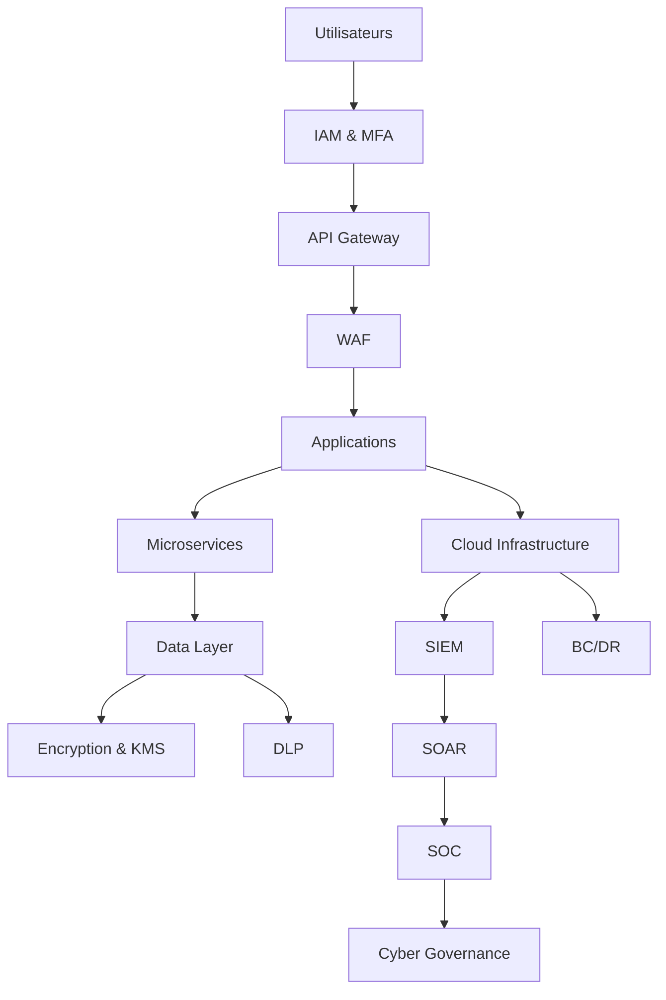

# SEC-120 — Enterprise Security Reference Architecture

> Référentiel de référence de l'architecture de sécurité de l'écosystème **EduWeb Planner**.

---

# Sommaire

1. Vision
2. Objectifs
3. Définitions
4. Principes directeurs
5. Architecture de référence
6. Domaines de sécurité
7. Modèle de défense en profondeur
8. Gouvernance
9. Cas d'usage EduWeb
10. API conceptuelle
11. KPI
12. Bonnes pratiques
13. Anti-patterns
14. Règles d'architecture
15. Documents associés

---

# 1. Vision

Construire une architecture de sécurité unifiée, cohérente et évolutive permettant de protéger l'ensemble de l'écosystème EduWeb contre les menaces internes et externes.

Cette architecture constitue le cadre de référence applicable à toutes les plateformes :

- EduWeb Planner ;
- EduWeb Governance ;
- EduWeb Family ;
- EduWeb Booking ;
- futures plateformes numériques.

Elle garantit une approche homogène de la cybersécurité, indépendamment des technologies employées.

---

# 2. Objectifs

- définir une architecture de sécurité commune ;
- harmoniser les pratiques de cybersécurité ;
- intégrer la sécurité dans tous les projets ;
- réduire les risques de compromission ;
- faciliter la conformité réglementaire ;
- améliorer la résilience du système d'information.

---

# 3. Définitions

L'**Enterprise Security Reference Architecture (ESRA)** est un modèle de référence décrivant l'ensemble des composants, principes, politiques et mécanismes de sécurité qui doivent être appliqués dans toutes les architectures de l'entreprise.

Elle fournit :

- une vision globale ;
- des modèles de référence ;
- des règles d'architecture ;
- des standards techniques ;
- des exigences minimales de sécurité.

---

# 4. Principes directeurs

- Security by Design
- Privacy by Design
- Zero Trust
- Defense in Depth
- Least Privilege
- Secure by Default
- Continuous Monitoring
- Automation First
- Resilience by Design
- Compliance by Default

---

# 5. Architecture de référence



---

# 6. Domaines de sécurité

## Gouvernance

Pilotage :

- politiques ;
- risques ;
- conformité ;
- audit.

---

## Gestion des identités

- IAM ;
- MFA ;
- PAM ;
- fédération d'identité.

---

## Sécurité réseau

- segmentation ;
- VPN ;
- pare-feu ;
- WAF ;
- Zero Trust Network Access.

---

## Sécurité applicative

- DevSecOps ;
- SAST ;
- DAST ;
- API Security ;
- OWASP.

---

## Sécurité des données

- chiffrement ;
- DLP ;
- classification ;
- sauvegardes.

---

## Sécurité Cloud

- Kubernetes ;
- conteneurs ;
- Infrastructure as Code ;
- CSPM ;
- CIEM.

---

## Détection et réponse

- SIEM ;
- SOAR ;
- SOC ;
- XDR.

---

## Continuité d'activité

- PCA ;
- PRA ;
- sauvegardes ;
- réplication ;
- haute disponibilité.

---

# 7. Modèle de défense en profondeur

```text
Niveau 1
Utilisateurs

↓

Niveau 2
Identités

↓

Niveau 3
Terminaux

↓

Niveau 4
Réseaux

↓

Niveau 5
Applications

↓

Niveau 6
API

↓

Niveau 7
Microservices

↓

Niveau 8
Bases de données

↓

Niveau 9
Chiffrement

↓

Niveau 10
Journalisation

↓

Niveau 11
Détection

↓

Niveau 12
Réponse aux incidents

↓

Niveau 13
Continuité d'activité
```

---

# 8. Gouvernance

La gouvernance de l'architecture de sécurité repose sur :

- Conseil de Direction ;
- Direction Générale ;
- Comité de Gouvernance Cyber ;
- RSSI ;
- Architecte d'Entreprise ;
- Architecte Sécurité ;
- DevSecOps ;
- SOC ;
- Audit interne.

Les décisions d'architecture sont documentées, validées et réévaluées périodiquement.

---

# 9. Cas d'usage EduWeb

### Déploiement d'un nouveau module EduWeb Planner

Application automatique des standards ESRA avant la mise en production.

---

### Création d'une nouvelle API

Vérification de la conformité aux exigences d'authentification, d'autorisation et de journalisation.

---

### Intégration d'un nouvel établissement

Application des politiques de sécurité, de gestion des identités et de protection des données.

---

### Migration Cloud

Évaluation des risques, validation des configurations de sécurité et contrôle de conformité.

---

### Gestion d'un incident majeur

Activation coordonnée du SOC, du SIEM, du SOAR et du PRA conformément à l'architecture de référence.

---

# 10. API conceptuelle

```typescript
interface EnterpriseSecurityReferenceArchitecture {

validateArchitecture();

checkCompliance();

assessSecurityControls();

evaluateRisk();

approveDeployment();

monitorSecurity();

manageIncident();

generateArchitectureReport();

}
```

---

# 11. KPI

| KPI | Objectif |
|------|----------|
| Projets conformes à l'ESRA | 100 % |
| Revues d'architecture réalisées | 100 % |
| Contrôles de sécurité automatisés | ≥95 % |
| Vulnérabilités critiques corrigées avant production | ≥99 % |
| Disponibilité des services critiques | ≥99,99 % |
| Audits de conformité réalisés | 100 % |

---

# 12. Bonnes pratiques

- appliquer systématiquement les principes Zero Trust ;
- intégrer la sécurité dès la phase d'architecture ;
- automatiser les contrôles de conformité ;
- maintenir un inventaire des actifs ;
- documenter les décisions d'architecture ;
- effectuer des revues de sécurité régulières ;
- tester les plans de continuité et de reprise.

---

# 13. Anti-patterns

- architecture de sécurité implicite ou non documentée ;
- contrôles de sécurité uniquement en fin de projet ;
- absence de segmentation réseau ;
- multiplication de solutions de sécurité non intégrées ;
- absence de gouvernance centralisée ;
- documentation obsolète ;
- dépendance à des configurations manuelles.

---

# 14. Règles d'architecture

**RA-SEC120-001**

Toute architecture applicative doit être conforme au présent référentiel de sécurité.

---

**RA-SEC120-002**

Les exigences de sécurité sont prises en compte dès les phases de conception et de validation des projets.

---

**RA-SEC120-003**

Les composants de sécurité (IAM, SIEM, SOAR, KMS, DLP, SOC, BC/DR) sont mutualisés autant que possible afin de garantir la cohérence de l'écosystème.

---

**RA-SEC120-004**

Les contrôles de conformité et de sécurité sont automatisés et intégrés aux pipelines DevSecOps.

---

**RA-SEC120-005**

Le présent référentiel est révisé au minimum une fois par an ou à chaque évolution majeure de l'architecture d'entreprise.

---

# 15. Documents associés

## Architecture d'entreprise

- ARCH-150 — Enterprise Reference Architecture

## Gouvernance

- DATA-101 à DATA-120 — Enterprise Data Architecture
- AI-101 à AI-120 — Enterprise Artificial Intelligence Architecture
- INT-101 à INT-120 — Enterprise Integration Architecture

## Référentiels de sécurité

- SEC-101 — Enterprise Security Foundation
- SEC-102 — Zero Trust Architecture
- SEC-103 — Enterprise PKI
- SEC-104 — Enterprise Identity & Access Management
- SEC-105 — Enterprise Privileged Access Management
- SEC-106 — Enterprise Multi-Factor Authentication
- SEC-107 — Enterprise Secrets Management
- SEC-108 — Enterprise Encryption
- SEC-109 — Enterprise Key Management System
- SEC-110 — Enterprise Network Security
- SEC-111 — Enterprise Security Operations Center
- SEC-112 — Enterprise Security Information and Event Management
- SEC-113 — Enterprise Extended Detection and Response
- SEC-114 — Enterprise Security Orchestration, Automation and Response
- SEC-115 — Enterprise DevSecOps
- SEC-116 — Enterprise Cloud Security
- SEC-117 — Enterprise Data Loss Prevention
- SEC-118 — Enterprise Business Continuity & Disaster Recovery
- SEC-119 — Enterprise Cybersecurity Governance

---

# Références

- ISO/IEC 27001 — Information Security Management Systems
- ISO/IEC 27002 — Information Security Controls
- ISO/IEC 27017 — Cloud Security
- ISO/IEC 27018 — Protection of Personally Identifiable Information (PII)
- ISO 22301 — Business Continuity Management Systems
- ISO/IEC 38500 — Governance of IT
- NIST Cybersecurity Framework (CSF) 2.0
- NIST SP 800-53 — Security and Privacy Controls
- NIST SP 800-207 — Zero Trust Architecture
- OWASP Top 10
- OWASP ASVS
- CIS Controls v8
- SABSA (Sherwood Applied Business Security Architecture)
- TOGAF® Standard (Open Group)
- COBIT 2019
- ENISA Cybersecurity Guidelines

---

# Fin du document

> **Ce document constitue le document de synthèse de la série SEC-101 à SEC-120 et représente le référentiel de référence de l'architecture de cybersécurité de l'écosystème EduWeb Planner.**
