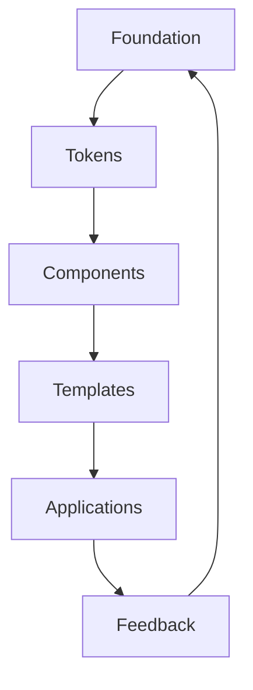

# UX-101 — Design System

> Le Design System d'EduWeb Planner constitue la référence officielle de conception graphique, ergonomique et technique de l'ensemble des applications de l'écosystème EduWeb.

---

# Table des matières

1. Vision
2. Principes
3. Architecture
4. Design Tokens
5. Couleurs
6. Typographie
7. Espacements
8. Grille
9. Rayons
10. Ombres
11. Icônes
12. Illustrations
13. Motion
14. Dark Mode
15. Responsive
16. Internationalisation
17. Accessibilité
18. Bonnes pratiques
19. Gouvernance

---

# 1. Vision

Le Design System poursuit quatre objectifs.

- Uniformiser l'expérience utilisateur.
- Réduire les coûts de développement.
- Améliorer l'accessibilité.
- Garantir une identité visuelle cohérente.

---

# 2. Principes fondateurs

Le Design System repose sur huit principes.

## DS-001 — Simplicité

Chaque écran doit être immédiatement compréhensible.

---

## DS-002 — Cohérence

Un composant conserve toujours le même comportement.

---

## DS-003 — Accessibilité

Le Design System est compatible WCAG 2.2 AA.

---

## DS-004 — Responsive

Chaque composant fonctionne :

- Desktop
- Laptop
- Tablet
- Mobile

---

## DS-005 — Performance

Le Design System limite :

- DOM complexe
- CSS inutile
- JavaScript redondant

---

## DS-006 — Modularité

Tous les composants sont réutilisables.

---

## DS-007 — Human AI

Les composants IA possèdent une identité spécifique.

---

## DS-008 — Pérennité

Le système est versionné.

---

# 3. Architecture

```text
Design System

├── Foundations
│
├── Tokens
│
├── Components
│
├── Templates
│
├── Patterns
│
├── Layouts
│
└── Guidelines
```

---

# 4. Design Tokens

Tous les composants utilisent exclusivement des tokens.

Jamais de valeurs codées en dur.

Exemple :

```css
color-primary

color-success

spacing-md

radius-lg

shadow-xl
```

---

# 5. Couleurs

## Couleurs institutionnelles

### EduWeb Green

Couleur principale.

Utilisation :

- Logo
- Boutons principaux
- Menus actifs
- Validation

---

### EduWeb White

Couleur de fond.

---

### EduWeb Gray

Utilisation :

- bordures
- tableaux
- séparateurs

---

### EduWeb Blue

Informations.

---

### EduWeb Orange

Alertes.

---

### EduWeb Red

Erreurs.

---

### EduWeb Purple

Fonctionnalités IA.

---

# Palette fonctionnelle

| Token | Usage |
|--------|------|
|color-primary|Action principale|
|color-secondary|Action secondaire|
|color-success|Succès|
|color-warning|Attention|
|color-danger|Erreur|
|color-info|Information|
|color-ai|Copilot|

---

# 6. Typographie

Police principale :

```text
Inter
```

Polices alternatives :

```text
Roboto

Noto Sans
```

---

# Échelle typographique

| Token | Taille |
|---------|---------|
|display-xl|48 px|
|display-lg|40 px|
|h1|36 px|
|h2|30 px|
|h3|24 px|
|h4|20 px|
|body-lg|18 px|
|body|16 px|
|body-sm|14 px|
|caption|12 px|

---

# Poids

Light

Regular

Medium

SemiBold

Bold

---

# 7. Espacements

Utilisation d'une grille de 8 px.

```text
4

8

16

24

32

40

48

64
```

Aucun espacement arbitraire.

---

# 8. Layout Grid

Desktop :

12 colonnes

---

Tablet :

8 colonnes

---

Mobile :

4 colonnes

---

Largeur maximale :

1440 px

---

# 9. Border Radius

```text
none

xs

sm

md

lg

xl

full
```

---

# 10. Ombres

Niveaux :

```text
shadow-xs

shadow-sm

shadow-md

shadow-lg

shadow-xl
```

---

# 11. Icônes

Bibliothèque :

Material Symbols.

Les icônes :

- restent simples ;
- sont homogènes ;
- possèdent un libellé.

---

# 12. Illustrations

Style :

- moderne
- inclusif
- africain lorsque pertinent
- professionnel

Les illustrations ne remplacent jamais une information essentielle.

---

# 13. Motion

Animations discrètes.

Durée :

150 ms

200 ms

300 ms

Maximum :

500 ms

---

Transitions :

Fade

Slide

Scale

Expand

---

# 14. Dark Mode

Deux thèmes officiels.

```text
Light

Dark
```

Le changement est instantané.

Le contraste reste conforme WCAG.

---

# 15. Responsive

Breakpoints.

| Taille | Largeur |
|----------|----------|
|xs|0-599|
|sm|600|
|md|768|
|lg|1024|
|xl|1280|
|xxl|1536|

---

# 16. Internationalisation

Le système prend en charge :

- français
- anglais
- arabe
- portugais
- espagnol

Tous les composants supportent Unicode.

---

# 17. Accessibilité

Chaque composant doit être compatible :

- clavier
- lecteur d'écran
- contraste
- zoom 200 %
- navigation tactile

---

# 18. Bonnes pratiques

Toujours :

✔ utiliser les tokens

✔ utiliser les composants officiels

✔ respecter les espacements

✔ respecter la grille

Jamais :

✘ couleur codée en dur

✘ police différente

✘ composant personnalisé sans validation

---

# 19. Gouvernance

Toute évolution du Design System :

- est documentée ;
- est revue ;
- est testée ;
- est versionnée ;
- est approuvée.

---

# Diagramme Mermaid



---

# KPI

| KPI | Objectif |
|------|----------|
|Réutilisation des composants|>95 %|
|Conformité Design System|100 %|
|Temps moyen de développement réduit|−40 %|
|Conformité accessibilité|100 % AA|

---

# Règles métier

## RM-UX101-001

Tout composant doit utiliser les Design Tokens.

---

## RM-UX101-002

Les couleurs sont exclusivement définies par les tokens officiels.

---

## RM-UX101-003

Les composants personnalisés nécessitent une validation UX.

---

## RM-UX101-004

Les composants doivent être compatibles Responsive.

---

## RM-UX101-005

Le thème sombre est obligatoire pour tous les nouveaux composants.

---

# Documents liés

- UX-100
- UX-102
- UX-103
- UX-104
- UX-108

---

# Fin du document
