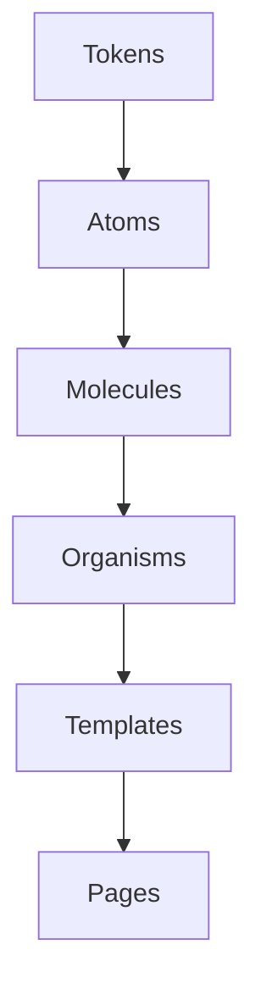

# UX-102 — UI Components

> Référentiel officiel des composants d'interface utilisateur d'EduWeb Planner.

---

# Table des matières

1. Objectifs
2. Architecture des composants
3. Atomic Design
4. États communs
5. Boutons
6. Champs de saisie
7. Listes déroulantes
8. Cases à cocher
9. Boutons radio
10. Switch
11. Badges
12. Alertes
13. Cartes
14. Modales
15. Onglets
16. Accordéons
17. Tooltips
18. Tableaux
19. Pagination
20. Recherche
21. Composants IA
22. Gouvernance

---

# 1. Objectifs

Tous les composants doivent être :

- cohérents
- réutilisables
- accessibles
- responsives
- documentés
- testables

---

# 2. Architecture

```text
Design Tokens

↓

Atoms

↓

Molecules

↓

Organisms

↓

Templates

↓

Pages
```

---

# 3. Atomic Design

## Atoms

Composants élémentaires.

Exemples :

- bouton
- texte
- icône
- champ
- avatar

---

## Molecules

Assemblage d'Atoms.

Exemples :

- champ + libellé
- recherche
- filtre

---

## Organisms

Assemblage de Molecules.

Exemples :

- formulaire
- tableau
- calendrier
- carte

---

## Templates

Structure d'écran.

---

## Pages

Application métier.

---

# 4. États communs

Tous les composants possèdent les états suivants.

```text
Default

Hover

Focus

Active

Loading

Disabled

Success

Warning

Error
```

---

# 5. Button

## Anatomie

```text
┌────────────────────┐

Icon

Label

Loading

└────────────────────┘
```

---

## Variantes

Primary

Secondary

Outline

Ghost

Danger

Success

AI

Link

---

## Tailles

XS

SM

MD

LG

XL

---

## États

Normal

Hover

Focus

Loading

Disabled

---

## Utilisation

Primary

Une seule par écran.

---

Secondary

Actions complémentaires.

---

Danger

Suppression.

---

AI

Interaction avec Copilot.

---

# 6. TextField

## Anatomie

```text
Label

┌──────────────┐

Valeur

└──────────────┘

Helper

Error
```

---

## Types

Text

Number

Email

Password

Phone

Money

Date

Time

Search

---

## Validation

Temps réel.

---

## États

Vide

Prérempli

Erreur

Succès

Lecture seule

---

# 7. Select

Variantes :

Simple

Multiple

Recherche

Hiérarchique

Async

---

# 8. Checkbox

Utilisation :

Sélection multiple.

---

États :

☐

☑

Indéterminé

---

# 9. Radio

Sélection unique.

---

# 10. Switch

Activation.

Exemple :

Notifications

ON

OFF

---

# 11. Badge

Types.

Info

Warning

Danger

Success

AI

Draft

Archived

---

# 12. Alert

Variantes.

Information

Succès

Erreur

Attention

IA

---

# 13. Card

Structure.

```text
Titre

Sous-titre

Contenu

Actions

Footer
```

---

Types.

Statistique

Élève

Enseignant

Document

Planning

Finance

---

# 14. Modal

Comporte.

Titre

Corps

Actions

Fermeture

---

Tailles.

XS

SM

MD

LG

XL

Fullscreen

---

# 15. Tabs

Horizontal.

Vertical.

Scrollable.

---

# 16. Accordion

Sections repliables.

---

# 17. Tooltip

Affichage :

Hover

Focus

Touch

---

# 18. DataTable

Composant majeur.

Fonctions :

Tri

Filtre

Recherche

Pagination

Export

Colonnes

Responsive

Sélection

Actions

---

## États

Vide

Chargement

Erreur

Lecture

Édition

---

# Exemple

```text
┌────────────────────────────┐

Recherche

Filtres

─────────────────────────────

Tableau

─────────────────────────────

Pagination

└────────────────────────────┘
```

---

# 19. Pagination

Modes.

Classique

Infinite Scroll

Load More

---

# 20. Search

Recherche universelle.

Suggestions.

Historique.

Recherche IA.

---

# 21. Copilot Widget

Le composant principal IA.

Structure.

```text
Question

↓

Compréhension

↓

Réponse

↓

Sources

↓

Actions
```

---

Fonctions.

Conversation

Documents

Workflow

Recherche

RAG

Knowledge Graph

---

États.

Écoute

Réflexion

Réponse

Erreur

Interruption

---

# AI Suggestion

Composant spécialisé.

```text
Suggestion IA

Pourquoi ?

Confiance

Accepter

Refuser
```

---

# AI Confidence

Affichage.

```text
██████████

96 %
```

---

# AI Explanation

Toujours affichée.

Structure.

Pourquoi

Comment

Sources

Limites

---

# Workflow Card

Composant métier.

Affiche.

Étape

Responsable

Date

Statut

Actions

---

# Notification Card

Affiche.

Titre

Message

Priorité

Date

Action

---

# Dashboard Widget

Variantes.

Graphique

KPI

Carte

Liste

Timeline

IA

---

# Timeline

Utilisée pour :

Historique

Audit

Workflow

Activités

---

# Calendar

Supporte.

Jour

Semaine

Mois

Année

Planning

Ressources

---

# Scheduler

Composant spécifique EduWeb Planner.

Fonctions.

Drag & Drop

Conflits

Optimisation IA

Contraintes

Double vacation

---

# Kanban

Colonnes.

À faire

En cours

Validation

Terminé

---

# Chart

Types.

Barres

Lignes

Camembert

Radar

Heatmap

Treemap

Sunburst

---

# File Upload

Fonctions.

Glisser-déposer

Prévisualisation

Validation

Antivirus

Historique

---

# Avatar

Variantes.

Utilisateur

Établissement

IA

Organisation

---

# Empty State

Toujours illustré.

Comprend.

Illustration

Message

Action

---

# Skeleton

Utilisé pendant le chargement.

Jamais d'écran vide.

---

# Error State

Toujours expliquer.

Le problème

La cause

La solution

---

# Success State

Toujours confirmer.

Icône

Texte

Action suivante

---

# Responsive

Chaque composant est compatible :

Desktop

Laptop

Tablet

Phone

---

# Accessibilité

Tous les composants :

ARIA

Navigation clavier

Lecteurs d'écran

Contrastes WCAG

Focus visible

---

# Diagramme Mermaid



---

# KPI

| KPI | Objectif |
|------|-----------|
|Réutilisation|>95 %|
|Conformité UX|100 %|
|Accessibilité|100 %|
|Responsive|100 %|
|Tests automatisés|100 %|

---

# Règles métier

## RM-UX102-001

Tous les composants héritent des Design Tokens.

---

## RM-UX102-002

Aucun composant ne définit directement ses couleurs.

---

## RM-UX102-003

Tous les composants supportent le thème sombre.

---

## RM-UX102-004

Tous les composants sont documentés avec exemples.

---

## RM-UX102-005

Tous les composants sont testés unitairement et visuellement.

---

# Documents liés

UX-100

UX-101

UX-103

UX-104

UX-106

---

# Fin du document
