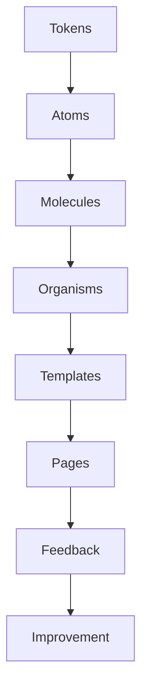

# UX-102-00 — UI Components Overview

> Référentiel général des composants d'interface d'EduWeb Planner.

---

# Table des matières

1. Vision
2. Objectifs
3. Architecture
4. Classification
5. Cycle de vie
6. États communs
7. Responsive
8. Accessibilité
9. IA
10. Versionning

---

# 1. Vision

Les composants UI constituent le langage visuel officiel d'EduWeb Planner.

Ils permettent :

- une expérience homogène ;
- une maintenance simplifiée ;
- une génération automatique d'interfaces par IA ;
- une réduction des coûts de développement.

Chaque écran est construit exclusivement à partir de composants standards.

---

# 2. Objectifs

Chaque composant doit être :

- réutilisable ;
- configurable ;
- testable ;
- documenté ;
- responsive ;
- accessible ;
- internationalisable.

---

# 3. Architecture

```text
Design Tokens

↓

Atoms

↓

Molecules

↓

Organisms

↓

Templates

↓

Pages
```

---

# 4. Classification

## Inputs

- TextField
- Password
- Number
- Date
- Time
- Search
- Upload

---

## Selection

- Checkbox
- Radio
- Switch
- Select
- TreeSelect
- MultiSelect

---

## Navigation

- Menu
- Tabs
- Breadcrumb
- Pagination
- Sidebar

---

## Feedback

- Alert
- Toast
- Dialog
- Snackbar
- Progress

---

## Data Display

- Table
- Card
- List
- Timeline
- Badge
- Avatar
- Calendar
- Scheduler
- Chart

---

## IA

- Copilot
- AI Suggestion
- AI Confidence
- AI Explanation
- Prompt Box
- Conversation
- Knowledge Card

---

## ERP

- Workflow
- Budget Card
- Accounting Entry
- Planning Grid
- Student Card
- HR Card

---

# 5. Cycle de vie d'un composant

Chaque composant suit les étapes suivantes :

```text
Conception

↓

Prototype

↓

Validation UX

↓

Développement

↓

Tests

↓

Documentation

↓

Publication

↓

Maintenance

↓

Dépréciation

↓

Retrait
```

---

# 6. États communs

Tous les composants doivent implémenter les états suivants :

| État | Description |
|------|-------------|
| Default | État normal |
| Hover | Survol |
| Focus | Navigation clavier |
| Active | Interaction en cours |
| Loading | Chargement |
| Success | Action réussie |
| Warning | Attention |
| Error | Erreur |
| Disabled | Désactivé |
| ReadOnly | Lecture seule |

---

# 7. Responsive

Tous les composants doivent fonctionner sur :

| Support | Statut |
|----------|--------|
| Desktop | ✔ |
| Laptop | ✔ |
| Tablet | ✔ |
| Smartphone | ✔ |
| PWA | ✔ |

Les composants adaptent automatiquement :

- largeur ;
- hauteur ;
- disposition ;
- densité d'information.

---

# 8. Accessibilité

Chaque composant respecte :

- WCAG 2.2 AA ;
- navigation clavier complète ;
- ARIA Labels ;
- lecteurs d'écran ;
- contraste minimum 4.5:1 ;
- focus visible.

---

# 9. Composants IA

Les composants IA disposent d'éléments supplémentaires :

- score de confiance ;
- justification ;
- sources ;
- niveau de risque ;
- validation humaine ;
- historique.

Exemple :

```text
Réponse IA

█████████░

92 %

Pourquoi ?

Sources

Accepter

Modifier

Refuser
```

---

# 10. Convention de nommage

Tous les composants suivent la convention :

```text
UiButton

UiCard

UiTable

UiModal

UiTimeline

UiCopilot

UiScheduler

UiChart
```

Les variantes sont suffixées :

```text
UiButtonPrimary

UiButtonDanger

UiButtonGhost

UiButtonAI
```

---

# 11. Diagramme Mermaid



---

# 12. Tests obligatoires

Chaque composant possède :

- tests unitaires ;
- tests visuels ;
- tests d'accessibilité ;
- tests responsive ;
- tests de performance.

---

# 13. KPI

| KPI | Objectif |
|------|----------|
|Réutilisation des composants|>95 %|
|Couverture des tests|100 %|
|Accessibilité|100 %|
|Temps moyen de rendu|<50 ms|
|Conformité Design System|100 %|

---

# 14. Règles métier

## RM-UX10200-001

Tout composant est documenté avant publication.

---

## RM-UX10200-002

Tout composant utilise exclusivement les Design Tokens officiels.

---

## RM-UX10200-003

Les composants doivent être indépendants des modules métier.

---

## RM-UX10200-004

Les composants critiques disposent d'exemples d'utilisation et de tests automatisés.

---

## Documents liés

- UX-101 – Design System
- UX-102-01 – Inputs
- UX-102-02 – Buttons
- UX-102-03 – Selections
- UX-104 – Accessibility

---

# Fin du document
