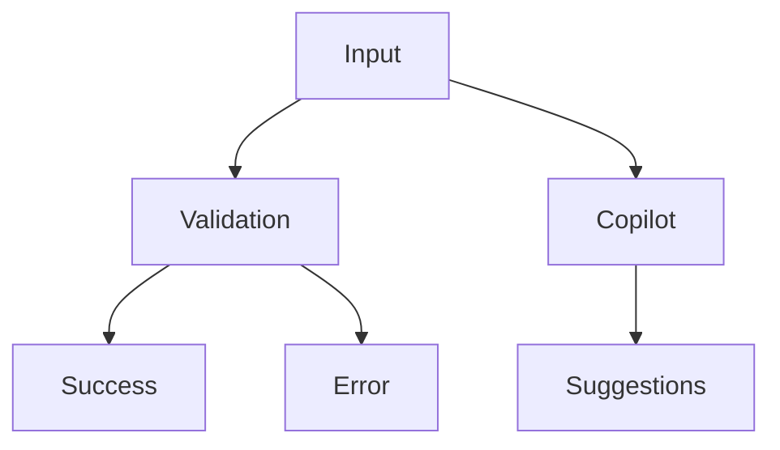

# UX-102-01 — Input Components

> Référentiel officiel des composants de saisie d'EduWeb Planner.

---

# Sommaire

1. Vision
2. Principes
3. Architecture
4. États communs
5. TextField
6. TextArea
7. NumberField
8. CurrencyField
9. EmailField
10. PhoneField
11. PasswordField
12. SearchField
13. DatePicker
14. TimePicker
15. DateTimePicker
16. Select
17. MultiSelect
18. Upload
19. Signature
20. QR Scanner
21. Barcode Scanner
22. Biometric Input
23. Voice Input
24. AI Prompt
25. Validation
26. Accessibilité
27. Responsive
28. KPI
29. Règles métier

---

# 1. Vision

Tous les composants de saisie doivent être :

- simples ;
- rapides ;
- tolérants aux erreurs ;
- accessibles ;
- cohérents ;
- compatibles IA.

Le système doit réduire au maximum les saisies inutiles.

---

# 2. Principes UX

Les composants de saisie appliquent les principes suivants :

- libellé toujours visible ;
- validation immédiate lorsque cela est pertinent ;
- aide contextuelle ;
- exemples de format ;
- messages d'erreur explicites ;
- conservation automatique des données saisies.

---

# 3. Architecture commune

Tous les champs héritent de la même structure.

```text
Label

Description

Champ

Icône optionnelle

Aide

Erreur

Succès
```

---

# 4. États communs

Tous les composants possèdent les états suivants.

```text
Vide

Prérempli

Focus

Hover

Lecture seule

Erreur

Succès

Chargement

Désactivé
```

---

# 5. TextField

## Description

Champ texte standard.

---

## Utilisations

- Nom
- Prénom
- Ville
- Fonction
- Discipline
- Matière
- Classe
- Établissement

---

## Variantes

Simple

Avec icône

Avec compteur

Lecture seule

Prérempli

---

## Contraintes

Longueur minimale

Longueur maximale

Expressions régulières

Validation IA

---

# 6. TextArea

Utilisé pour :

- observations ;
- commentaires ;
- décisions ;
- rapports ;
- comptes rendus.

Fonctions :

- redimensionnement automatique ;
- compteur de caractères ;
- aperçu Markdown (optionnel).

---

# 7. NumberField

Supporte :

- entier ;
- décimal ;
- positif ;
- négatif.

Fonctions :

- incrément ;
- décrément ;
- validation automatique.

---

# 8. CurrencyField

Compatible :

- FCFA
- EUR
- USD
- autres devises configurables.

Fonctions :

- séparateurs de milliers ;
- décimales ;
- symbole monétaire ;
- validation.

Exemple :

```text
25 000 FCFA
```

---

# 9. EmailField

Validation automatique :

✔ format

✔ domaine

✔ doublon éventuel

Suggestion :

gmail.com

eduweb.ci

gouv.ci

---

# 10. PhoneField

Support :

- indicatif pays ;
- format automatique ;
- validation.

Exemple :

```text
+225 01 23 45 67 89
```

---

# 11. PasswordField

Fonctions :

Afficher

Masquer

Génération

Copie

Force du mot de passe

---

Critères :

8 caractères minimum

Majuscule

Minuscule

Chiffre

Caractère spécial

---

# 12. SearchField

Recherche instantanée.

Fonctions :

- auto-complétion ;
- historique ;
- recherche IA ;
- suggestions.

---

# 13. DatePicker

Modes :

Jour

Mois

Année

Période

---

Validation :

date valide

jours fériés

périodes ouvertes

---

# 14. TimePicker

Formats :

24 h

12 h

Minutes

Secondes

---

# 15. DateTimePicker

Fusion :

Date

+

Heure

Utilisé notamment pour :

- rendez-vous ;
- examens ;
- réunions ;
- événements.

---

# 16. Select

Variantes.

Simple

Recherche

Hiérarchique

Asynchrone

Dépendant

---

# 17. MultiSelect

Support :

sélection multiple

groupes

recherche

tags

---

# 18. Upload

Types autorisés.

PDF

DOCX

XLSX

PPTX

PNG

JPG

ZIP

CSV

---

Fonctions.

Drag & Drop

Prévisualisation

Validation antivirus

Compression

Historique

---

# 19. Signature

Support :

Signature manuscrite

Stylet

Souris

Doigt

---

Export :

PNG

SVG

PDF

---

# 20. QR Scanner

Utilisé pour :

- documents ;
- élèves ;
- badges ;
- certificats ;
- inventaire.

---

# 21. Barcode Scanner

Compatibilité :

EAN

Code128

QR

DataMatrix

---

# 22. Biometric Input

Support futur :

Empreinte digitale

Reconnaissance faciale

Iris

---

Nécessite :

- consentement ;
- chiffrement ;
- conformité réglementaire.

---

# 23. Voice Input

Fonctions.

Dictée

Commandes vocales

Recherche

Interaction Copilot

---

# 24. AI Prompt Input

Composant spécifique à EduWeb.

Structure.

```text
Question

↓

Compréhension

↓

Contexte

↓

Réponse
```

Fonctions.

Suggestions

Historique

Prompts favoris

Bibliothèque

Variables

---

# 25. Validation

Validation :

temps réel

ou

à la soumission

Selon le contexte.

Les erreurs sont expliquées.

Jamais uniquement :

"Erreur"

---

# 26. Accessibilité

Tous les champs :

ARIA

Navigation clavier

Lecteurs d'écran

Messages vocaux

Contrastes WCAG

---

# 27. Responsive

Tous les composants fonctionnent sur :

Desktop

Laptop

Tablet

Smartphone

PWA

---

# Diagramme Mermaid



---

# KPI

| KPI | Objectif |
|------|-----------|
|Validation immédiate|100 %|
|Temps moyen de saisie|<30 s|
|Erreurs utilisateur|<1 %|
|Compatibilité mobile|100 %|
|Accessibilité WCAG|100 %|

---

# Règles métier

## RM-UX10201-001

Chaque champ possède un libellé explicite.

---

## RM-UX10201-002

Les erreurs doivent être compréhensibles.

---

## RM-UX10201-003

Les données saisies sont sauvegardées automatiquement lorsqu'un processus long est en cours.

---

## RM-UX10201-004

Les formats sont validés avant l'envoi au serveur.

---

## RM-UX10201-005

Les composants biométriques sont soumis à des politiques de confidentialité renforcées.

---

# Documents liés

- UX-101 — Design System
- UX-102-02 — Buttons
- UX-104 — Accessibility
- UX-106 — Forms Guidelines

---

# Fin du document
