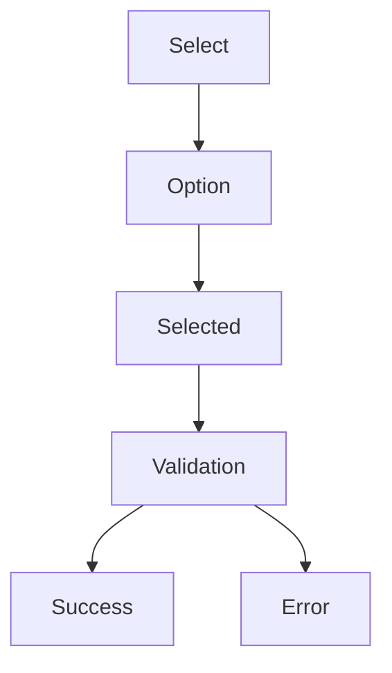

# UX-102-03 — Selection Components

> Référentiel officiel des composants de sélection d'EduWeb Planner.

---

# Sommaire

1. Objectifs
2. Principes UX
3. Architecture
4. États communs
5. Checkbox
6. Radio Button
7. Switch
8. Select
9. MultiSelect
10. TreeSelect
11. Cascading Select
12. Chips
13. Tags
14. Pickers
15. Responsive
16. Accessibilité
17. API
18. Bonnes pratiques
19. Anti-patterns
20. KPI
21. Règles métier

---

# 1. Objectifs

Les composants de sélection permettent à l'utilisateur de choisir une ou plusieurs valeurs parmi un ensemble d'options.

Ils doivent :

- limiter les erreurs de saisie ;
- accélérer les choix ;
- être compréhensibles immédiatement ;
- fonctionner aussi bien à la souris qu'au clavier et sur écran tactile.

---

# 2. Principes UX

Les sélections doivent :

- limiter le nombre de choix visibles lorsque la liste est longue ;
- utiliser des libellés métier explicites ;
- éviter les ambiguïtés ;
- afficher clairement les éléments sélectionnés.

---

# 3. Architecture commune

Tous les composants héritent de la structure suivante :

```text
Label

Description

Composant

Valeur(s)

Aide

Erreur éventuelle
```

---

# 4. États communs

Tous les composants possèdent les états suivants.

```text
Normal

Hover

Focus

Sélectionné

Chargement

Erreur

Lecture seule

Désactivé
```

---

# 5. Checkbox

Utilisation :

Sélection multiple indépendante.

Exemples :

☐ Recevoir les notifications

☑ Publier automatiquement

☐ Autoriser les parents

---

## Variantes

- standard
- avec description
- avec icône
- hiérarchique

---

## États

☐ Non sélectionné

☑ Sélectionné

◩ Indéterminé

---

# 6. Radio Button

Utilisé lorsqu'un seul choix est possible.

Exemple :

○ Public

● Privé

---

Ne jamais utiliser un bouton radio pour une liste très longue.

---

# 7. Switch

Utilisé pour activer ou désactiver une fonctionnalité.

Exemple :

Notifications

OFF  ○────

ON   ────●

---

Utilisations :

- activer Copilot
- mode sombre
- synchronisation
- sauvegarde automatique

---

# 8. Select

Liste déroulante.

Utilisations :

- classe
- matière
- établissement
- enseignant
- région
- année scolaire

---

## Variantes

Simple

Recherche

Icône

Groupé

Asynchrone

---

# 9. MultiSelect

Permet plusieurs sélections.

Exemple :

Disciplines

☑ Mathématiques

☑ Physique

☐ SVT

☑ Français

---

Affichage sous forme de badges.

---

# 10. TreeSelect

Utilisé pour les structures hiérarchiques.

Exemple :

```text
Pays

└── Côte d'Ivoire

     ├── DRENA

          ├── Établissement

               ├── Classe
```

---

# 11. Cascading Select

Les choix dépendent de la sélection précédente.

Exemple :

Pays

↓

Région

↓

Ville

↓

Établissement

↓

Classe

---

# 12. Chips

Utilisées pour :

- filtres ;
- catégories ;
- mots-clés ;
- disciplines.

Exemple :

[6e]

[Mathématiques]

[Urgent]

---

# 13. Tags

Utilisés pour :

- documents ;
- workflows ;
- IA ;
- finance ;
- planning.

---

# 14. Pickers

Composants spécialisés.

Date Picker

Color Picker

Emoji Picker

Icon Picker

Teacher Picker

Student Picker

Room Picker

Subject Picker

---

# 15. Responsive

Sur smartphone :

- listes plein écran lorsque nécessaire ;
- recherche intégrée ;
- boutons tactiles ≥ 44 px ;
- sélection simplifiée.

---

# 16. Accessibilité

Tous les composants :

- compatibles clavier ;
- compatibles lecteurs d'écran ;
- disposent d'étiquettes ARIA ;
- offrent un focus visible ;
- respectent les contrastes WCAG.

---

# 17. API (concept)

```typescript
UiSelect {

    options

    value

    placeholder

    multiple

    searchable

    disabled

    loading

    clearable

    required

    onChange

}
```

---

# 18. Bonnes pratiques

✔ Utiliser des listes courtes lorsque possible.

✔ Trier les options de manière logique.

✔ Ajouter un champ de recherche au-delà de 10 à 15 éléments.

✔ Pré-remplir lorsque le contexte est connu.

✔ Mémoriser les choix récents lorsque cela est pertinent.

---

# 19. Anti-patterns

✘ Liste de plusieurs centaines d'éléments sans recherche.

✘ Valeurs codées ("A1", "X12") sans libellé.

✘ Cases à cocher pour un choix unique.

✘ Boutons radio avec plus de cinq à sept options.

✘ Menus imbriqués trop profonds.

---

# Diagramme Mermaid



---

# KPI

| KPI | Objectif |
|------|----------|
|Temps moyen de sélection|< 5 s|
|Taux d'erreur de sélection|< 1 %|
|Compatibilité mobile|100 %|
|Accessibilité|100 %|
|Recherche dans les longues listes|100 %|

---

# Règles métier

## RM-UX10203-001

Les listes de plus de 15 éléments doivent proposer une recherche.

---

## RM-UX10203-002

Les structures hiérarchiques utilisent **TreeSelect**.

---

## RM-UX10203-003

Les sélections dépendantes utilisent **Cascading Select**.

---

## RM-UX10203-004

Les composants de sélection doivent mémoriser les choix récents lorsque cela améliore l'expérience utilisateur.

---

## RM-UX10203-005

Les composants doivent fonctionner intégralement au clavier et sur écran tactile.

---

# Documents liés

- UX-101 — Design System
- UX-102-01 — Input Components
- UX-102-02 — Button Components
- UX-102-04 — Navigation Components
- UX-104 — Accessibility

---

# Fin du document
