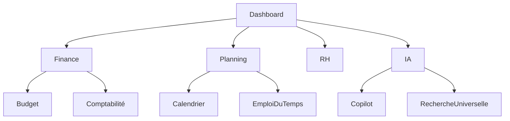

# UX-102-04 — Navigation Components

> Référentiel officiel des composants de navigation d'EduWeb Planner.

---

# Sommaire

1. Vision
2. Principes UX
3. Architecture de navigation
4. App Shell
5. Sidebar
6. Top Bar
7. Bottom Navigation
8. Mega Menu
9. Breadcrumb
10. Tabs
11. Stepper
12. Wizard
13. Pagination
14. Recherche universelle
15. Palette de commandes
16. Navigation contextuelle
17. Favoris
18. Historique
19. Navigation IA
20. Responsive
21. Accessibilité
22. API
23. Bonnes pratiques
24. Anti-patterns
25. KPI
26. Règles métier

---

# 1. Vision

La navigation constitue la colonne vertébrale d'EduWeb Planner.

Elle doit permettre à chaque utilisateur de :

- comprendre immédiatement où il se trouve ;
- accéder rapidement aux fonctionnalités ;
- revenir facilement en arrière ;
- retrouver les éléments récemment utilisés ;
- naviguer sans apprentissage préalable.

---

# 2. Principes UX

La navigation repose sur les principes suivants :

- simplicité ;
- cohérence ;
- prévisibilité ;
- faible charge cognitive ;
- orientation permanente ;
- recherche avant navigation lorsque cela est plus efficace.

---

# 3. Architecture générale

```text
Application

│

├── Tableau de bord

├── Modules

│      ├── Scolarité

│      ├── Planning

│      ├── Finance

│      ├── RH

│      ├── Patrimoine

│      ├── Examens

│      ├── IA

│      └── Administration

│

└── Paramètres
```

---

# 4. App Shell

Chaque écran possède la même structure.

```text
+--------------------------------------+

Top Bar

+---------+----------------------------+

Sidebar   Contenu

Sidebar   Contenu

Sidebar   Contenu

+--------------------------------------+

Status Bar
```

L'App Shell garantit une expérience uniforme.

---

# 5. Sidebar

La barre latérale constitue la navigation principale.

Elle comprend :

- logo ;
- changement d'établissement ;
- modules ;
- favoris ;
- raccourcis ;
- paramètres.

---

## États

Déployée

Réduite

Masquée (mobile)

---

## Fonctionnalités

Recherche

Icônes

Badges

Favoris

Notifications

---

# 6. Top Bar

La barre supérieure contient :

- recherche globale ;
- IA Copilot ;
- notifications ;
- aide ;
- profil utilisateur ;
- changement de langue ;
- changement de thème.

---

# 7. Bottom Navigation

Utilisée uniquement sur smartphone.

Maximum :

5 actions principales.

Exemple :

```
Accueil

Planning

Recherche

Notifications

Profil
```

---

# 8. Mega Menu

Utilisé lorsque le nombre de fonctionnalités devient important.

Exemple :

```
Administration

├── Utilisateurs

├── Rôles

├── Établissements

├── Paramètres

├── Sauvegardes

└── Journaux
```

---

# 9. Breadcrumb

Permet de connaître sa position.

Exemple :

```
Accueil

>

Finance

>

Budget

>

Exercice 2027
```

Chaque élément est cliquable.

---

# 10. Tabs

Permettent de changer rapidement de contexte.

Exemple :

```
Informations

Planning

Documents

Historique

Statistiques
```

---

# 11. Stepper

Utilisé pour les procédures.

Exemple :

```
1

Identification

↓

2

Informations

↓

3

Validation

↓

4

Confirmation
```

---

# 12. Wizard

Assistant guidé.

Utilisé pour :

- création d'établissement ;
- génération d'emploi du temps ;
- préparation budgétaire ;
- import de données.

Chaque étape affiche :

- progression ;
- validation ;
- possibilité de revenir en arrière.

---

# 13. Pagination

Composant standard.

Navigation :

```
<<

<

1

2

3

4

>

>>
```

Fonctions :

- taille de page ;
- aller à la page ;
- nombre total de résultats.

---

# 14. Recherche universelle

Accessible partout.

Raccourci :

```
CTRL + K
```

Recherche :

- élèves ;
- enseignants ;
- classes ;
- documents ;
- établissements ;
- budgets ;
- décisions ;
- workflows ;
- IA.

Résultats instantanés.

---

# 15. Palette de commandes

Inspirée de VS Code.

Exemples :

```
Créer un établissement

Créer une classe

Publier

Exporter Excel

Exporter PDF

Lancer Copilot

Ouvrir paramètres
```

---

# 16. Navigation contextuelle

Selon le contexte affiché.

Exemple :

Élève

↓

Actions disponibles :

Modifier

Documents

Parents

Historique

Planning

Bulletins

Absences

---

# 17. Favoris

Chaque utilisateur peut enregistrer :

- écrans ;
- rapports ;
- tableaux de bord ;
- recherches ;
- workflows.

Synchronisation multi-appareils.

---

# 18. Historique

Conserve :

- derniers écrans ;
- derniers documents ;
- dernières recherches ;
- derniers établissements.

---

# 19. Navigation IA

Le Copilot devient un point d'entrée.

Exemple :

```
Montre-moi :

les absences de la semaine.

↓

Ouverture automatique :

Module

↓

Classe

↓

Absences
```

Ou :

```
Prépare le budget 2028

↓

Ouverture automatique

↓

Module Finance

↓

Assistant Budget
```

---

# 20. Responsive

Desktop :

Sidebar permanente.

---

Tablet :

Sidebar rétractable.

---

Smartphone :

Drawer.

Bottom Navigation.

Menus simplifiés.

---

# 21. Accessibilité

Tous les composants :

- navigation clavier ;
- raccourcis clavier ;
- lecteurs d'écran ;
- focus visible ;
- contraste WCAG AA.

---

# 22. API (concept)

```typescript
UiNavigation {

    sidebar

    topbar

    breadcrumb

    tabs

    favorites

    history

    search

    commandPalette

    aiNavigation

}
```

---

# 23. Bonnes pratiques

✔ Toujours afficher la position actuelle.

✔ Limiter la profondeur de navigation.

✔ Permettre le retour rapide.

✔ Uniformiser les menus.

✔ Utiliser la recherche pour les grandes applications.

✔ Mettre en avant les actions fréquentes.

---

# 24. Anti-patterns

✘ Menus différents selon les modules.

✘ Navigation trop profonde (> 4 niveaux).

✘ Libellés ambigus.

✘ Menus cachés sans justification.

✘ Multiplication des chemins vers une même fonction sans cohérence.

---

# Diagramme Mermaid



---

# KPI

| KPI | Objectif |
|------|-----------|
|Temps d'accès à une fonctionnalité|< 3 clics|
|Temps moyen de recherche|< 2 s|
|Compatibilité mobile|100 %|
|Utilisation des favoris|> 60 %|
|Utilisation de la recherche universelle|> 70 %|

---

# Règles métier

## RM-UX10204-001

Chaque écran appartient à une arborescence clairement définie.

---

## RM-UX10204-002

La recherche universelle est disponible sur toutes les pages.

---

## RM-UX10204-003

Les favoris sont propres à chaque utilisateur.

---

## RM-UX10204-004

Les raccourcis clavier sont documentés et personnalisables.

---

## RM-UX10204-005

La navigation IA doit permettre d'accéder directement à toute fonctionnalité métier à partir d'une requête en langage naturel.

---

# Documents liés

- UX-101 — Design System
- UX-102-01 — Input Components
- UX-102-02 — Button Components
- UX-102-03 — Selection Components
- UX-102-05 — Feedback Components
- UX-103 — Information Architecture

---

# Fin du document
