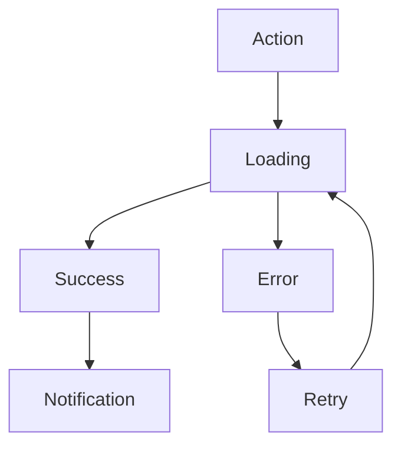

# UX-102-05 — Feedback Components

> Référentiel officiel des composants de retour utilisateur (Feedback) d'EduWeb Planner.

---

# Sommaire

1. Vision
2. Principes UX
3. Taxonomie des feedbacks
4. Alert
5. Toast
6. Snackbar
7. Dialog
8. Confirmation Dialog
9. Progress Indicator
10. Loading Spinner
11. Skeleton
12. Empty State
13. Error State
14. Success State
15. Notification Center
16. Inline Validation
17. Workflow Feedback
18. AI Feedback
19. Temps de réponse
20. Responsive
21. Accessibilité
22. API
23. Bonnes pratiques
24. Anti-patterns
25. KPI
26. Règles métier

---

# 1. Vision

Le feedback informe continuellement l'utilisateur de ce qui se passe.

Aucune action ne doit laisser l'utilisateur dans l'incertitude.

Le système communique :

- ce qu'il fait ;
- pourquoi ;
- combien de temps cela prendra ;
- ce qui est attendu ;
- le résultat obtenu.

---

# 2. Principes UX

Le feedback doit être :

- immédiat ;
- compréhensible ;
- proportionné ;
- contextualisé ;
- non intrusif.

Chaque retour doit aider l'utilisateur à poursuivre sa tâche.

---

# 3. Taxonomie des feedbacks

Les principaux composants sont :

- Alert
- Toast
- Snackbar
- Dialog
- Confirmation
- Progress
- Loading
- Skeleton
- Empty State
- Error State
- Success State
- Notification Center
- AI Feedback

---

# 4. Alert

Utilisée pour signaler une information importante.

## Types

Information

Succès

Attention

Erreur

Critique

---

## Exemple

```
✓ Les paramètres ont été enregistrés.
```

---

# 5. Toast

Notification temporaire.

Durée :

3 à 5 secondes.

Exemples :

```
Document enregistré.

Message envoyé.

Import terminé.
```

Aucune action utilisateur requise.

---

# 6. Snackbar

Notification discrète pouvant proposer une action.

Exemple

```
Classe supprimée.

ANNULER
```

---

# 7. Dialog

Fenêtre modale nécessitant une décision.

Exemple

```
Supprimer cet établissement ?

Annuler

Supprimer
```

---

# 8. Confirmation Dialog

Obligatoire pour :

- suppression définitive ;
- clôture d'exercice ;
- validation officielle ;
- paiement ;
- archivage irréversible.

---

# 9. Progress Indicator

Affiche l'avancement.

## Déterminé

```
████████░░

80 %
```

---

## Indéterminé

```
○○○○○
```

Utilisé lorsque la durée est inconnue.

---

# 10. Loading Spinner

Affiche un traitement court.

Ne jamais dépasser quelques secondes sans fournir davantage d'informations.

Au-delà, préférer une barre de progression.

---

# 11. Skeleton

Affichage provisoire simulant la structure du contenu.

Exemple :

```
████████████

██████

██████████████
```

Réduit la perception du temps d'attente.

---

# 12. Empty State

Lorsqu'aucune donnée n'est disponible.

Exemple

```
Aucun emploi du temps disponible.

Créer un emploi du temps.
```

Toujours proposer une action.

---

# 13. Error State

Les erreurs doivent être explicites.

Exemple

```
Impossible d'enregistrer le document.

Cause :

Connexion interrompue.

Réessayer
```

Ne jamais afficher uniquement :

```
Erreur 500
```

---

# 14. Success State

Exemple

```
✓

Le budget a été validé.
```

Peut inclure :

- lien vers le document ;
- action suivante ;
- partage.

---

# 15. Notification Center

Centralise :

- messages ;
- validations ;
- échéances ;
- tâches ;
- alertes IA.

Chaque notification possède :

- date ;
- priorité ;
- catégorie ;
- état (lu/non lu).

---

# 16. Inline Validation

Validation directement sous le champ.

Exemple

```
Adresse électronique invalide.

Format attendu :

nom@eduweb.ci
```

---

# 17. Workflow Feedback

Pendant les workflows :

```
Étape 2 / 5

Validation terminée.

Prochaine étape :

Signature.
```

L'utilisateur visualise toujours sa progression.

---

# 18. AI Feedback

Spécifique au Copilot.

Exemple

```
Réponse générée.

Confiance :

94 %

Sources :

3

Temps :

1,2 s

Pourquoi ?

Voir l'explication.
```

---

En cas d'incertitude :

```
Confiance :

42 %

Une validation humaine est recommandée.
```

---

# 19. Temps de réponse

| Situation | Feedback attendu |
|------------|-----------------|
|< 100 ms|Aucun|
|100 ms à 1 s|Animation légère|
|1 à 5 s|Spinner|
|> 5 s|Progression détaillée|
|Très long traitement|Notification différée|

---

# 20. Responsive

Les composants s'adaptent automatiquement.

Desktop :

Toast en haut à droite.

Mobile :

Snackbar en bas.

Dialog plein écran si nécessaire.

---

# 21. Accessibilité

Tous les feedbacks :

- compatibles lecteurs d'écran ;
- focus automatique ;
- contrastes WCAG AA ;
- annonces ARIA Live ;
- fermeture clavier.

---

# 22. API (concept)

```typescript
UiFeedback {

    type

    title

    message

    severity

    action

    duration

    icon

    closable

}
```

---

# 23. Bonnes pratiques

✔ Expliquer la situation.

✔ Indiquer la prochaine action.

✔ Utiliser un langage métier.

✔ Limiter les interruptions.

✔ Afficher les succès.

✔ Proposer une solution après une erreur.

---

# 24. Anti-patterns

✘ Messages techniques incompréhensibles.

✘ Pop-ups multiples.

✘ Aucune confirmation après enregistrement.

✘ Alertes permanentes.

✘ Fermeture automatique d'un message critique.

✘ Couleurs seules pour transmettre une information.

---

# Diagramme Mermaid



---

# KPI

| KPI | Objectif |
|------|-----------|
|Temps moyen de feedback|< 200 ms|
|Messages compréhensibles|100 %|
|Erreurs accompagnées d'une solution|100 %|
|Compatibilité mobile|100 %|
|Conformité WCAG|100 %|

---

# Règles métier

## RM-UX10205-001

Toute action déclenchée par l'utilisateur produit un feedback visible.

---

## RM-UX10205-002

Toute erreur doit expliquer la cause probable et proposer une action corrective.

---

## RM-UX10205-003

Les opérations longues affichent une progression ou un état de traitement.

---

## RM-UX10205-004

Les notifications critiques restent visibles jusqu'à leur prise en compte.

---

## RM-UX10205-005

Les réponses de l'IA affichent systématiquement un niveau de confiance et, lorsque disponible, les sources ayant servi à la génération.

---

# Documents liés

- UX-101 — Design System
- UX-102-01 — Input Components
- UX-102-02 — Button Components
- UX-102-03 — Selection Components
- UX-102-04 — Navigation Components
- UX-102-06 — Data Display Components
- UX-104 — Accessibility

---

# Fin du document
