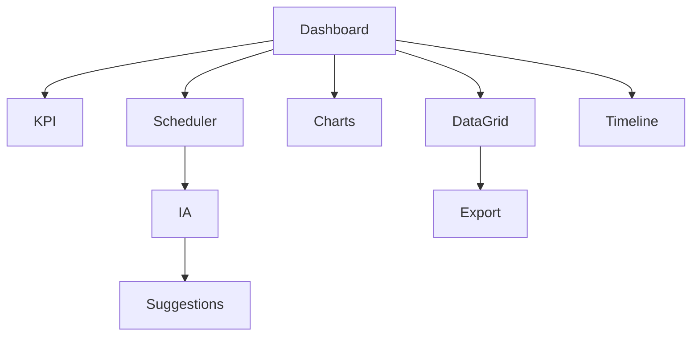

# UX-102-06 — Data Display Components

> Référentiel officiel des composants d'affichage de données d'EduWeb Planner.

---

# Sommaire

1. Vision
2. Principes UX
3. Classification
4. Cards
5. DataGrid
6. DataTable
7. List
8. Timeline
9. Kanban
10. Calendar
11. Scheduler
12. Gantt
13. Charts
14. Dashboard Widgets
15. KPI Cards
16. Empty States
17. Responsive
18. Accessibilité
19. API
20. Bonnes pratiques
21. Anti-patterns
22. KPI
23. Règles métier

---

# 1. Vision

Les composants d'affichage transforment les données en informations exploitables.

Ils doivent permettre :

- une lecture rapide ;
- une compréhension immédiate ;
- une prise de décision facilitée ;
- une exploration progressive ;
- une interaction fluide.

L'utilisateur doit pouvoir passer d'une vue synthétique à une vue détaillée sans rupture.

---

# 2. Principes UX

Chaque composant respecte les principes suivants :

- hiérarchie visuelle claire ;
- densité d'information adaptée au contexte ;
- tri et filtrage intuitifs ;
- personnalisation des vues ;
- performances optimisées.

---

# 3. Classification

Les composants d'affichage sont répartis en huit familles :

- Cartes (Cards)
- Tableaux (Tables / DataGrid)
- Listes
- Frises chronologiques
- Calendriers
- Graphiques
- Tableaux de bord
- Vues spécialisées (Planning, Finance, RH)

---

# 4. Cards

Les cartes présentent une information synthétique.

## Cas d'usage

- Élève
- Enseignant
- Classe
- Établissement
- Budget
- Projet
- Décision
- Document

---

## Structure

```text
Titre

Sous-titre

Contenu

Indicateurs

Actions
```

---

## Variantes

- Carte simple
- Carte enrichie
- Carte KPI
- Carte IA
- Carte interactive

---

# 5. DataGrid

Le DataGrid est le composant principal de consultation.

Fonctionnalités :

- tri multi-colonnes ;
- filtres avancés ;
- colonnes redimensionnables ;
- colonnes masquables ;
- regroupement ;
- export ;
- édition en ligne ;
- pagination ;
- virtualisation.

---

## Exemple

| Élève | Classe | Moyenne | Statut |
|--------|--------|----------|--------|
| A. Kouassi | 6e A | 15,20 | Admis |
| M. Koné | 5e B | 12,45 | Admis |

---

# 6. DataTable

Version simplifiée du DataGrid.

Utilisée lorsque :

- le volume de données est limité ;
- aucune édition n'est nécessaire ;
- la consultation est prioritaire.

---

# 7. List

Affichage linéaire.

Exemples :

- notifications ;
- messages ;
- documents ;
- tâches ;
- établissements.

Chaque élément comprend :

- titre ;
- description ;
- métadonnées ;
- actions rapides.

---

# 8. Timeline

Visualisation chronologique.

Applications :

- historique administratif ;
- workflow ;
- journal d'activité ;
- progression d'un dossier.

Exemple :

```text
08:00  Création

↓

09:15  Validation

↓

10:30  Signature

↓

11:45  Archivage
```

---

# 9. Kanban

Organisation par colonnes.

Exemple :

```text
À faire

↓

En cours

↓

À valider

↓

Terminé
```

Utilisé pour :

- tâches ;
- projets ;
- workflows ;
- maintenance.

---

# 10. Calendar

Vue calendaire.

Modes :

- Jour
- Semaine
- Mois
- Année

Utilisations :

- examens ;
- réunions ;
- congés ;
- événements ;
- formations.

---

# 11. Scheduler

Composant stratégique d'EduWeb Planner.

Il gère :

- emplois du temps ;
- disponibilité des salles ;
- disponibilité des enseignants ;
- contraintes horaires ;
- double vacation ;
- conflits.

---

## Vues

Classe

Enseignant

Salle

Discipline

Établissement

---

## Interactions

Glisser-déposer

Redimensionnement

Duplication

Détection automatique des conflits

Suggestion IA

---

# 12. Gantt

Gestion des projets.

Exemple :

```text
Analyse

██████

Développement

██████████

Tests

████

Déploiement

██
```

Utilisations :

- projets numériques ;
- travaux ;
- maintenance ;
- déploiements.

---

# 13. Charts

Graphiques disponibles :

- Barres
- Colonnes
- Lignes
- Aires
- Secteurs
- Radar
- Histogramme
- Nuage de points
- Treemap
- Heatmap

---

## Fonctionnalités

- zoom ;
- export ;
- comparaison ;
- annotations ;
- lecture IA.

---

# 14. Dashboard Widgets

Les tableaux de bord sont composés de widgets.

Exemples :

- effectifs ;
- absences ;
- finances ;
- résultats ;
- tâches ;
- alertes ;
- IA.

Chaque widget peut être déplacé et redimensionné.

---

# 15. KPI Cards

Présentation synthétique d'indicateurs.

Exemple :

```text
Élèves

4 258

+6 %

Depuis septembre
```

Ou :

```text
Recettes

18 250 000 FCFA

+12 %
```

---

# 16. Empty States

Exemple :

```text
Aucune donnée disponible.

Créer un nouvel enregistrement.
```

Chaque état vide doit proposer une action.

---

# 17. Responsive

Desktop :

Affichage complet.

Tablet :

Réorganisation automatique.

Mobile :

- cartes verticales ;
- tableaux simplifiés ;
- colonnes prioritaires ;
- widgets empilés.

---

# 18. Accessibilité

Tous les composants :

- compatibles clavier ;
- compatibles lecteurs d'écran ;
- contrastes WCAG AA ;
- descriptions alternatives pour les graphiques ;
- navigation logique.

---

# 19. API (concept)

```typescript
UiDataGrid {

    columns

    rows

    filters

    sorting

    pagination

    export

    editable

    selectable

}
```

---

# 20. Bonnes pratiques

✔ Afficher les informations les plus importantes en premier.

✔ Utiliser la couleur avec parcimonie.

✔ Limiter le nombre de colonnes visibles.

✔ Prévoir un mode plein écran pour les tableaux complexes.

✔ Fournir des outils de recherche et de filtrage.

---

# 21. Anti-patterns

✘ Tableaux trop chargés.

✘ Colonnes sans intitulé explicite.

✘ Graphiques 3D inutiles.

✘ Données non triables.

✘ Widgets impossibles à personnaliser.

---

# Diagramme Mermaid



---

# KPI

| KPI | Objectif |
|------|----------|
|Temps de chargement d'un tableau|< 2 s|
|Temps de rendu d'un graphique|< 1 s|
|Compatibilité mobile|100 %|
|Export des données|100 %|
|Accessibilité|100 %|

---

# Règles métier

## RM-UX10206-001

Tout tableau de plus de 100 lignes doit proposer un filtrage et un tri.

---

## RM-UX10206-002

Les emplois du temps utilisent exclusivement le composant **Scheduler** officiel.

---

## RM-UX10206-003

Les tableaux de bord sont personnalisables par utilisateur selon son rôle.

---

## RM-UX10206-004

Les graphiques doivent pouvoir être exportés en PNG, SVG et PDF.

---

## RM-UX10206-005

Les indicateurs critiques (KPI) doivent être actualisés automatiquement selon la fréquence définie par le module métier.

---

# Documents liés

- UX-101 — Design System
- UX-102-04 — Navigation Components
- UX-102-05 — Feedback Components
- UX-102-07 — Layout Components
- UX-103 — Information Architecture

---

# Fin du document
