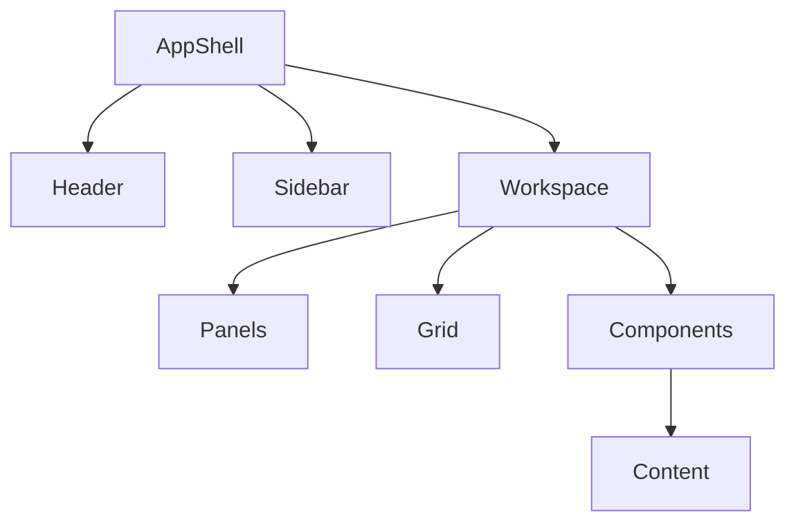

# UX-102-07 — Layout Components

> Référentiel officiel des composants de mise en page (Layout) d'EduWeb Planner.

---

# Sommaire

1. Vision
2. Principes UX
3. Architecture générale
4. Grid System
5. Containers
6. Sections
7. Panels
8. Split View
9. Stack Layout
10. Dashboard Layout
11. Workspace
12. Master-Detail
13. Responsive Layout
14. Sidebar Layout
15. Header Layout
16. Footer
17. Modal Layout
18. Drawer Layout
19. Density
20. White Space
21. Responsive
22. Accessibilité
23. API
24. Bonnes pratiques
25. Anti-patterns
26. KPI
27. Règles métier

---

# 1. Vision

Le Layout organise l'ensemble des composants visuels.

Il garantit :

- une lecture naturelle ;
- une navigation intuitive ;
- une hiérarchisation claire ;
- une cohérence entre tous les modules.

Le Layout ne transporte aucune logique métier.

---

# 2. Principes UX

Chaque écran doit respecter :

- une hiérarchie visuelle stable ;
- un alignement cohérent ;
- des marges homogènes ;
- une grille commune ;
- une densité adaptée au contexte.

---

# 3. Architecture générale

```
Application

↓

App Shell

↓

Layout

↓

Containers

↓

Components

↓

Content
```

---

# 4. Grid System

EduWeb Planner repose sur une grille de 12 colonnes.

```
□□□□□□□□□□□□□□□□□□□□
12 colonnes
```

Possibilités :

- 12
- 6 + 6
- 4 + 4 + 4
- 3 + 3 + 3 + 3
- 8 + 4
- 9 + 3

---

## Espacement

Gouttières :

24 px

Marge externe :

32 px

---

# 5. Containers

Chaque page utilise un conteneur principal.

Types :

- fixe ;
- fluide ;
- pleine largeur ;
- centré.

---

# 6. Sections

Les sections regroupent des contenus homogènes.

Exemple :

```
Informations générales

--------------------

Contenu

--------------------

Informations financières

--------------------

Contenu
```

Chaque section possède :

- un titre ;
- une description optionnelle ;
- des actions.

---

# 7. Panels

Les panneaux permettent de découper l'interface.

Utilisations :

- filtres ;
- propriétés ;
- aperçu ;
- historique ;
- Copilot.

---

## Variantes

Fixe

Rétractable

Redimensionnable

---

# 8. Split View

Deux zones affichées simultanément.

```
Liste

│

│

│

────────────

Détail
```

Utilisations :

- documents ;
- élèves ;
- finances ;
- planning.

---

# 9. Stack Layout

Disposition verticale.

```
Widget

↓

Widget

↓

Widget
```

Principalement utilisé sur mobile.

---

# 10. Dashboard Layout

Disposition modulaire.

```
KPI

KPI

KPI

──────────────

Graphique

──────────────

Planning

──────────────

Alertes
```

Chaque widget est :

- déplaçable ;
- redimensionnable ;
- masquable.

---

# 11. Workspace

Le Workspace représente l'espace de travail.

Exemple :

```
Sidebar

↓

Tableau

↓

Panneau IA

↓

Historique
```

Chaque métier dispose de son Workspace.

---

# 12. Master-Detail

Disposition classique.

```
Liste

↓

Élément sélectionné

↓

Détails
```

Utilisée dans :

- les élèves ;
- les enseignants ;
- les établissements ;
- les comptes.

---

# 13. Responsive Layout

Desktop

3 ou 4 colonnes.

Tablet

2 colonnes.

Smartphone

1 colonne.

La réorganisation est automatique.

---

# 14. Sidebar Layout

```
Sidebar

│

│

Contenu
```

Modes :

- permanente ;
- réduite ;
- masquée.

---

# 15. Header Layout

Le Header contient :

- titre ;
- fil d'Ariane ;
- recherche ;
- actions principales ;
- profil utilisateur.

Il reste visible lors du défilement lorsque nécessaire.

---

# 16. Footer

Contient :

- version ;
- copyright ;
- aide ;
- mentions légales ;
- statut système.

Le Footer peut être masqué sur les écrans de travail intensif.

---

# 17. Modal Layout

Structure :

```
Titre

────────────

Contenu

────────────

Actions
```

Largeurs standard :

- Small
- Medium
- Large
- Extra Large
- Plein écran

---

# 18. Drawer Layout

Panneau latéral.

Utilisé pour :

- filtres ;
- détails ;
- édition rapide ;
- Copilot.

Le Drawer n'interrompt pas la navigation principale.

---

# 19. Density

Trois niveaux de densité.

Confort

Standard

Compact

Chaque utilisateur peut choisir son niveau.

---

# 20. White Space

L'espace blanc améliore la lisibilité.

Règles :

- espacement cohérent ;
- éviter les blocs trop denses ;
- distinguer clairement les groupes fonctionnels.

---

# 21. Responsive

Tous les layouts sont compatibles :

Desktop

Laptop

Tablet

Smartphone

PWA

---

# 22. Accessibilité

Tous les layouts garantissent :

- ordre logique de lecture ;
- navigation clavier ;
- focus visible ;
- compatibilité lecteurs d'écran ;
- contrastes conformes WCAG AA.

---

# 23. API (concept)

```typescript
UiLayout {

    type

    container

    grid

    sidebar

    header

    footer

    responsive

    density

}
```

---

# 24. Bonnes pratiques

✔ Respecter la grille de 12 colonnes.

✔ Conserver une hiérarchie visuelle stable.

✔ Éviter les changements de disposition inutiles.

✔ Préserver des marges constantes.

✔ Adapter automatiquement les écrans mobiles.

---

# 25. Anti-patterns

✘ Colonnes désalignées.

✘ Espacements incohérents.

✘ Contenu surchargé.

✘ Multiplication des panneaux.

✘ Fenêtres modales imbriquées.

✘ Changement brutal de disposition entre modules.

---

# Diagramme Mermaid



---

# KPI

| KPI | Objectif |
|------|-----------|
|Temps de compréhension d'un écran|< 5 s|
|Compatibilité responsive|100 %|
|Réutilisation des layouts|> 95 %|
|Conformité à la grille|100 %|
|Respect des marges|100 %|

---

# Règles métier

## RM-UX10207-001

Toutes les pages utilisent exclusivement les layouts officiels du Design System.

---

## RM-UX10207-002

La grille de 12 colonnes constitue la référence pour les interfaces desktop.

---

## RM-UX10207-003

Chaque écran doit proposer une expérience équivalente sur desktop, tablette et smartphone.

---

## RM-UX10207-004

Les espaces de travail métier sont personnalisables selon le rôle de l'utilisateur.

---

## RM-UX10207-005

Les composants de mise en page ne contiennent aucune logique métier ; ils assurent uniquement l'organisation visuelle des contenus.

---

# Documents liés

- UX-101 — Design System
- UX-102-04 — Navigation Components
- UX-102-05 — Feedback Components
- UX-102-06 — Data Display Components
- UX-102-08 — AI Components
- UX-103 — Information Architecture

---

# Fin du document
