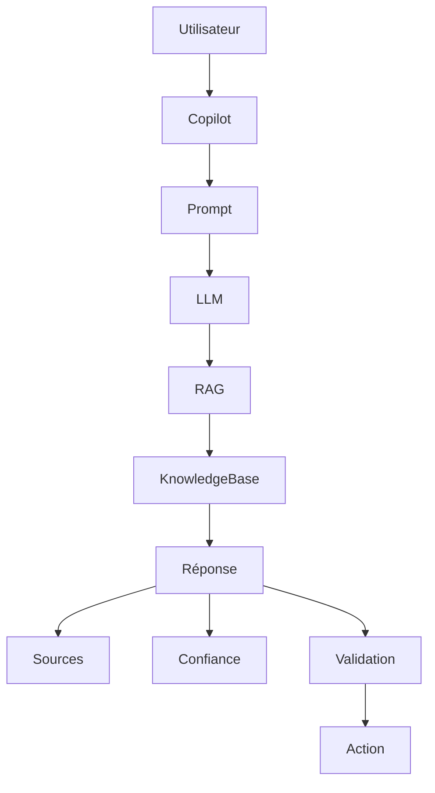

# UX-102-08 — AI Components

> Référentiel officiel des composants d'Intelligence Artificielle d'EduWeb Planner.

---

# Sommaire

1. Vision
2. Principes UX de l'IA
3. Architecture des composants IA
4. AI Copilot
5. AI Chat
6. Prompt Box
7. Prompt Library
8. AI Suggestions
9. AI Recommendations
10. AI Confidence Card
11. AI Explainability
12. Sources & Citations
13. AI Actions
14. AI Workflow
15. AI Agents
16. AI Knowledge Card
17. AI Notifications
18. AI Reasoning Viewer
19. AI History
20. Human Validation
21. Multi-Agent Collaboration
22. Multimodal Components
23. AI Settings
24. Responsive
25. Accessibilité
26. API
27. Bonnes pratiques
28. Anti-patterns
29. KPI
30. Règles métier

---

# 1. Vision

L'Intelligence Artificielle constitue un assistant de travail.

Elle :

- accompagne ;
- explique ;
- propose ;
- automatise ;
- apprend.

Elle ne remplace jamais la décision humaine.

---

# 2. Principes UX de l'IA

Chaque interaction IA respecte les principes suivants :

- transparence ;
- explicabilité ;
- contrôle humain ;
- confidentialité ;
- traçabilité ;
- confiance.

L'utilisateur reste toujours décisionnaire.

---

# 3. Architecture générale

```text
Utilisateur

↓

Copilot

↓

Compréhension

↓

LLM

↓

RAG

↓

Knowledge Base

↓

Réponse

↓

Validation humaine
```

---

# 4. AI Copilot

Le Copilot est présent sur toutes les pages.

Fonctions :

- répondre aux questions ;
- expliquer les données ;
- créer du contenu ;
- lancer des workflows ;
- guider les utilisateurs.

---

## Modes

Assistant

Expert

Administrateur

Analyste

Pédagogue

---

# 5. AI Chat

Interface conversationnelle.

Fonctions :

- conversations multiples ;
- historique ;
- pièces jointes ;
- recherche contextuelle ;
- réponses enrichies.

---

Structure :

```text
Utilisateur

↓

Question

↓

Réponse

↓

Sources

↓

Actions proposées
```

---

# 6. Prompt Box

Champ spécialisé.

Fonctions :

- autocomplétion ;
- suggestions ;
- historique ;
- modèles ;
- variables.

Exemple :

```
Prépare l'emploi du temps de la 6e A.
```

---

# 7. Prompt Library

Bibliothèque de prompts.

Catégories :

- Administration
- Scolarité
- RH
- Finance
- Comptabilité
- Planning
- Examens
- Gouvernance

Favoris disponibles.

---

# 8. AI Suggestions

Suggestions contextuelles.

Exemples :

- optimiser un emploi du temps ;
- détecter une anomalie ;
- compléter un document ;
- proposer une décision.

---

# 9. AI Recommendations

L'IA peut recommander :

- une organisation ;
- un planning ;
- un budget ;
- une affectation ;
- un scénario.

Chaque recommandation est justifiée.

---

# 10. AI Confidence Card

Chaque réponse affiche :

```
Confiance

94 %

██████████
```

Informations :

- score ;
- niveau de risque ;
- recommandation de validation.

---

## Niveaux

| Score | Interprétation |
|--------|----------------|
|95–100 %|Très forte confiance|
|80–94 %|Confiance élevée|
|60–79 %|Confiance moyenne|
|<60 %|Validation humaine fortement recommandée|

---

# 11. AI Explainability

Chaque réponse peut être expliquée.

L'utilisateur peut demander :

- pourquoi ;
- comment ;
- quelles règles ;
- quelles hypothèses.

---

Exemple

```
Pourquoi cette affectation ?

↓

Disponibilité

Compétence

Contraintes

Priorités
```

---

# 12. Sources & Citations

Chaque réponse peut présenter :

- textes réglementaires ;
- documents internes ;
- base documentaire ;
- politiques institutionnelles ;
- références externes.

Les sources sont consultables.

---

# 13. AI Actions

Chaque réponse peut proposer des actions.

Exemple :

```
Créer le document

Exporter PDF

Envoyer

Modifier

Programmer
```

---

# 14. AI Workflow

L'IA peut lancer :

- validation ;
- génération ;
- notification ;
- publication ;
- archivage.

Toujours avec confirmation si nécessaire.

---

# 15. AI Agents

Agents spécialisés.

- Agent Planning
- Agent Finance
- Agent RH
- Agent Comptabilité
- Agent Examens
- Agent Patrimoine
- Agent Gouvernance
- Agent Juridique

Chaque agent possède son domaine d'expertise.

---

# 16. AI Knowledge Card

Affiche :

- résumé ;
- concepts ;
- références ;
- liens ;
- niveau de confiance.

---

# 17. AI Notifications

Alertes :

- nouvelle analyse ;
- anomalie détectée ;
- optimisation proposée ;
- traitement terminé.

---

# 18. AI Reasoning Viewer

Visualisation simplifiée du raisonnement.

Exemple :

```
Question

↓

Analyse

↓

Recherche documentaire

↓

Règles

↓

Synthèse

↓

Réponse
```

Le raisonnement détaillé interne du modèle n'est pas exposé ; cette vue présente uniquement une explication fonctionnelle destinée à l'utilisateur.

---

# 19. AI History

Historique :

- prompts ;
- réponses ;
- validations ;
- exports ;
- actions exécutées.

Recherche disponible.

---

# 20. Human Validation

Certaines actions exigent une validation humaine.

Exemples :

- paie ;
- budget ;
- sanctions ;
- décisions administratives ;
- publication officielle.

---

# 21. Multi-Agent Collaboration

Les agents peuvent collaborer.

Exemple :

```
Planning

↓

Finance

↓

RH

↓

Rapport unique
```

---

# 22. Multimodal Components

Entrées :

- texte ;
- voix ;
- image ;
- PDF ;
- Excel ;
- PowerPoint.

Sorties :

- texte ;
- tableau ;
- graphique ;
- document ;
- présentation.

---

# 23. AI Settings

Paramètres utilisateur.

Choix :

- langue ;
- niveau de détail ;
- style des réponses ;
- mode pédagogique ;
- mode expert ;
- confidentialité.

---

# 24. Responsive

Desktop :

Panneau latéral Copilot.

Tablet :

Drawer.

Mobile :

Assistant plein écran.

---

# 25. Accessibilité

Tous les composants IA :

- compatibles clavier ;
- compatibles lecteurs d'écran ;
- navigation vocale ;
- synthèse vocale ;
- contraste WCAG AA.

---

# 26. API (concept)

```typescript
UiCopilot {

    prompt

    context

    conversation

    confidence

    citations

    recommendations

    actions

    history

}
```

---

# 27. Bonnes pratiques

✔ Expliquer les recommandations.

✔ Afficher les sources.

✔ Demander une validation avant les actions critiques.

✔ Conserver un historique.

✔ Adapter le niveau de détail au profil utilisateur.

---

# 28. Anti-patterns

✘ Réponses sans contexte.

✘ Absence de niveau de confiance.

✘ Automatisation irréversible sans confirmation.

✘ Suggestions impossibles à modifier.

✘ Réponses opaques.

---

# Diagramme Mermaid



---

# KPI

| KPI | Objectif |
|------|----------|
|Temps moyen de réponse IA|< 3 s|
|Réponses avec niveau de confiance|100 %|
|Réponses avec sources disponibles|100 % lorsque applicable|
|Validation humaine des actions critiques|100 %|
|Disponibilité du Copilot|99,9 %|

---

# Règles métier

## RM-UX10208-001

Toute réponse générée par l'IA doit afficher un niveau de confiance.

---

## RM-UX10208-002

Les recommandations doivent être accompagnées d'une justification compréhensible par l'utilisateur.

---

## RM-UX10208-003

Les actions à impact administratif, financier ou juridique nécessitent une validation humaine avant exécution.

---

## RM-UX10208-004

Les conversations sont historisées selon la politique de conservation des données de l'organisation.

---

## RM-UX10208-005

Les composants IA doivent respecter les politiques de sécurité, de confidentialité et de gouvernance définies pour EduWeb Planner.

---

# Documents liés

- UX-101 — Design System
- UX-102-05 — Feedback Components
- UX-102-06 — Data Display Components
- UX-102-07 — Layout Components
- UX-103 — Information Architecture
- AI-001 — AI Governance
- AI-002 — AI Trust & Explainability

---

# Fin du document
