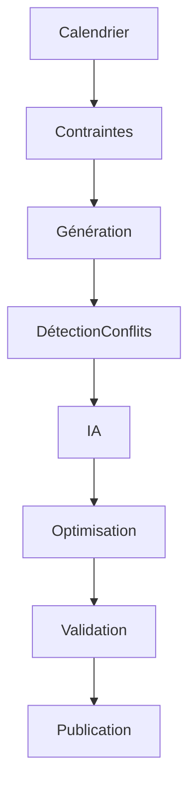

# UX-102-09 — Planning Components

> Référentiel officiel des composants de planification d'EduWeb Planner.

---

# Sommaire

1. Vision
2. Objectifs
3. Principes UX
4. Architecture
5. Academic Calendar
6. Timetable Grid
7. Teacher Planner
8. Classroom Planner
9. Student Planner
10. Resource Scheduler
11. Availability Matrix
12. Conflict Detection
13. Constraint Viewer
14. AI Planning Assistant
15. Drag & Drop
16. Bulk Operations
17. Version Management
18. Simulation Mode
19. Responsive
20. Accessibilité
21. API
22. Bonnes pratiques
23. Anti-patterns
24. KPI
25. Règles métier

---

# 1. Vision

La planification constitue le cœur fonctionnel d'EduWeb Planner.

Tous les composants doivent permettre de gérer efficacement :

- les emplois du temps ;
- les calendriers scolaires ;
- les disponibilités ;
- les ressources pédagogiques ;
- les contraintes d'organisation ;
- les simulations ;
- les optimisations par IA.

---

# 2. Objectifs

Le système doit permettre de :

- réduire les conflits horaires ;
- optimiser l'utilisation des ressources ;
- faciliter les modifications ;
- conserver un historique ;
- produire automatiquement les emplois du temps.

---

# 3. Principes UX

Les composants de planification doivent être :

- visuels ;
- interactifs ;
- intuitifs ;
- rapides ;
- collaboratifs ;
- compatibles avec les écrans tactiles.

---

# 4. Architecture

```text
Calendrier académique

↓

Contraintes

↓

Disponibilités

↓

Planification

↓

Validation

↓

Publication

↓

Historique
```

---

# 5. Academic Calendar

Gestion :

- année scolaire ;
- périodes ;
- trimestres ;
- semestres ;
- vacances ;
- jours fériés ;
- examens ;
- conseils de classe.

---

## Modes

Jour

Semaine

Mois

Année

---

# 6. Timetable Grid

Composant principal.

Structure :

| Heure | Lundi | Mardi | Mercredi | Jeudi | Vendredi |
|--------|--------|--------|-----------|--------|-----------|

Chaque cellule représente un créneau.

---

## Fonctions

- glisser-déposer ;
- duplication ;
- redimensionnement ;
- verrouillage ;
- couleur par discipline ;
- couleur par enseignant ;
- couleur par salle.

---

# 7. Teacher Planner

Vue dédiée à un enseignant.

Affiche :

- heures de cours ;
- heures libres ;
- conflits ;
- remplacements ;
- heures supplémentaires.

---

# 8. Classroom Planner

Vue d'une salle.

Permet de connaître :

- disponibilité ;
- occupation ;
- capacité ;
- équipements ;
- conflits.

---

# 9. Student Planner

Vue personnalisée.

Affiche :

- emploi du temps ;
- examens ;
- devoirs ;
- activités ;
- événements.

---

# 10. Resource Scheduler

Gestion :

- laboratoires ;
- salles multimédias ;
- amphithéâtres ;
- véhicules ;
- équipements.

---

# 11. Availability Matrix

Visualisation des disponibilités.

Exemple :

```
███ Disponible

██ Occupé

█ Indisponible
```

Filtres :

- enseignant ;
- salle ;
- discipline ;
- niveau.

---

# 12. Conflict Detection

Détection automatique :

- double affectation ;
- salle occupée ;
- enseignant indisponible ;
- dépassement horaire ;
- chevauchement ;
- contraintes réglementaires.

---

## Gravité

Critique

Majeure

Mineure

Information

---

# 13. Constraint Viewer

Visualise :

- contraintes fortes ;
- contraintes souples ;
- priorités ;
- exceptions.

Exemples :

- EPS le matin ;
- maximum 6 heures/jour ;
- éviter les trous ;
- laboratoire obligatoire.

---

# 14. AI Planning Assistant

Le Copilot Planning peut :

- générer un emploi du temps ;
- optimiser un planning ;
- résoudre les conflits ;
- proposer des permutations ;
- équilibrer les charges.

---

Exemple :

```
3 conflits détectés.

Suggestion :

Déplacer Physique

Jeudi 10h

↓

Vendredi 8h
```

---

# 15. Drag & Drop

Toutes les opérations principales sont disponibles :

- déplacer ;
- copier ;
- échanger ;
- dupliquer ;
- supprimer.

---

# 16. Bulk Operations

Actions de masse :

- déplacer une journée ;
- déplacer une semaine ;
- remplacer un enseignant ;
- modifier plusieurs créneaux.

---

# 17. Version Management

Chaque planning possède :

- un numéro de version ;
- un auteur ;
- une date ;
- un commentaire.

Possibilité :

- restaurer ;
- comparer ;
- publier.

---

# 18. Simulation Mode

Mode sécurisé.

Permet :

- tester des hypothèses ;
- comparer plusieurs scénarios ;
- mesurer les impacts ;
- valider avant publication.

---

# 19. Responsive

Desktop :

Grille complète.

Tablet :

Navigation tactile.

Mobile :

Vue simplifiée.

Planning journalier.

Recherche rapide.

---

# 20. Accessibilité

Tous les composants :

- navigation clavier ;
- lecteurs d'écran ;
- contrastes WCAG AA ;
- raccourcis clavier ;
- alternatives textuelles.

---

# 21. API (concept)

```typescript
UiScheduler {

    calendar

    resources

    timetable

    constraints

    conflicts

    aiSuggestions

    versions

    simulation

}
```

---

# 22. Bonnes pratiques

✔ Afficher immédiatement les conflits.

✔ Utiliser des couleurs cohérentes.

✔ Permettre l'annulation.

✔ Sauvegarder automatiquement.

✔ Fournir une vue par enseignant, classe et salle.

✔ Utiliser l'IA comme outil d'assistance, jamais comme validation automatique.

---

# 23. Anti-patterns

✘ Modifier un planning publié sans historique.

✘ Masquer les conflits.

✘ Utiliser des codes couleur non documentés.

✘ Autoriser les chevauchements sans justification.

✘ Ne pas conserver les versions.

---

# Diagramme Mermaid



---

# KPI

| KPI | Objectif |
|------|----------|
|Temps moyen de génération d'un emploi du temps|< 60 s|
|Conflits détectés automatiquement|100 %|
|Temps moyen de résolution d'un conflit|< 30 s|
|Temps de sauvegarde|< 2 s|
|Disponibilité du Scheduler|99,9 %|

---

# Règles métier

## RM-UX10209-001

Toute modification d'un planning publié crée automatiquement une nouvelle version.

---

## RM-UX10209-002

Aucun conflit critique ne peut subsister avant la publication d'un emploi du temps.

---

## RM-UX10209-003

Les propositions de l'IA doivent être présentées comme des recommandations modifiables par l'utilisateur.

---

## RM-UX10209-004

Chaque emploi du temps peut être visualisé selon les perspectives **Classe**, **Enseignant**, **Salle**, **Discipline** et **Établissement**.

---

## RM-UX10209-005

Toutes les opérations de glisser-déposer doivent être compatibles avec les interfaces tactiles et les interactions clavier.

---

# Documents liés

- UX-101 — Design System
- UX-102-04 — Navigation Components
- UX-102-06 — Data Display Components
- UX-102-08 — AI Components
- UX-102-10 — Finance Components
- UX-103 — Information Architecture
- RM-Planning-001 — Moteur de planification

---

# Fin du document
