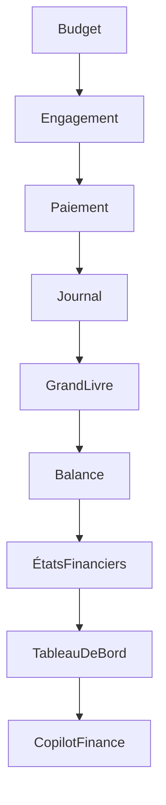

# UX-102-10 — Finance Components

> Référentiel officiel des composants d'interface des modules Finance, Comptabilité, Budget et Trésorerie d'EduWeb Planner.

---

# Sommaire

1. Vision
2. Objectifs
3. Principes UX
4. Architecture
5. Dashboard Financier
6. Budget Workspace
7. Comptabilité Workspace
8. Journal Comptable
9. Grand Livre
10. Balance Générale
11. Balance Analytique
12. Plan Comptable OHADA
13. Pièces Comptables
14. Trésorerie
15. Banque
16. Immobilisations
17. Facturation
18. Paiements
19. Rapports Financiers
20. IA Financière
21. Responsive
22. Accessibilité
23. API
24. Bonnes pratiques
25. Anti-patterns
26. KPI
27. Règles métier

---

# 1. Vision

Les composants financiers permettent une gestion :

- fiable ;
- transparente ;
- conforme aux normes OHADA ;
- traçable ;
- sécurisée ;
- assistée par l'IA.

Ils doivent offrir une expérience adaptée aussi bien aux comptables qu'aux responsables administratifs et aux décideurs.

---

# 2. Objectifs

Le module Finance vise à :

- simplifier les opérations comptables ;
- accélérer la préparation budgétaire ;
- sécuriser les écritures ;
- produire des états financiers fiables ;
- faciliter le pilotage financier.

---

# 3. Principes UX

Les interfaces financières privilégient :

- la lisibilité ;
- la précision ;
- la cohérence ;
- la traçabilité ;
- la prévention des erreurs ;
- la validation progressive.

---

# 4. Architecture

```text
Budget

↓

Engagement

↓

Liquidation

↓

Ordonnancement

↓

Paiement

↓

Comptabilité

↓

États financiers
```

---

# 5. Dashboard Financier

Le tableau de bord présente :

- budget consommé ;
- budget disponible ;
- recettes ;
- dépenses ;
- trésorerie ;
- alertes ;
- indicateurs OHADA.

Widgets :

- graphiques ;
- jauges ;
- KPI ;
- alertes IA.

---

# 6. Budget Workspace

Fonctionnalités :

- préparation budgétaire ;
- simulation ;
- arbitrage ;
- validation ;
- suivi d'exécution.

Chaque ligne budgétaire affiche :

- crédits votés ;
- engagements ;
- consommations ;
- disponible.

---

# 7. Comptabilité Workspace

Vue principale du comptable.

Accès direct :

- journal ;
- grand livre ;
- balance ;
- comptes ;
- écritures ;
- pièces justificatives.

---

# 8. Journal Comptable

Colonnes standards :

| Date | Journal | Compte | Libellé | Débit | Crédit |

Fonctionnalités :

- saisie assistée ;
- équilibrage automatique ;
- brouillon ;
- validation ;
- export.

---

# 9. Grand Livre

Consultation :

- par compte ;
- par période ;
- par établissement ;
- par exercice.

Chaque mouvement est consultable.

Navigation chronologique.

---

# 10. Balance Générale

Affichage :

- compte ;
- débit ;
- crédit ;
- solde.

Filtres :

- exercice ;
- période ;
- établissement.

---

# 11. Balance Analytique

Permet une analyse :

- par projet ;
- par établissement ;
- par centre de coût ;
- par activité.

---

# 12. Plan Comptable OHADA

Navigation hiérarchique :

```text
Classe

↓

Compte principal

↓

Sous-compte

↓

Compte détaillé
```

Recherche instantanée.

Favoris possibles.

Descriptions intégrées.

---

# 13. Pièces Comptables

Gestion :

- facture ;
- reçu ;
- bon de commande ;
- bon de livraison ;
- mandat ;
- ordre de paiement ;
- justificatifs.

Prévisualisation intégrée.

Archivage électronique.

---

# 14. Trésorerie

Visualisation :

- caisse ;
- banque ;
- encaissements ;
- décaissements ;
- prévisions.

Graphiques d'évolution.

---

# 15. Banque

Fonctions :

- rapprochement bancaire ;
- import de relevés ;
- lettrage ;
- détection des écarts ;
- validation.

---

# 16. Immobilisations

Suivi :

- acquisitions ;
- amortissements ;
- sorties ;
- inventaire ;
- localisation.

Visualisation sous forme de fiches.

---

# 17. Facturation

Gestion :

- devis ;
- factures ;
- avoirs ;
- échéances ;
- relances.

Statuts :

- brouillon ;
- validée ;
- payée ;
- partiellement payée ;
- annulée.

---

# 18. Paiements

Modes :

- espèces ;
- virement ;
- chèque ;
- mobile money ;
- carte bancaire.

Suivi :

- date ;
- montant ;
- statut ;
- référence.

---

# 19. Rapports Financiers

Exports :

- PDF ;
- Excel ;
- CSV.

États :

- balance ;
- grand livre ;
- compte de résultat ;
- bilan ;
- budget ;
- trésorerie.

---

# 20. IA Financière

Le Copilot Finance peut :

- détecter des anomalies ;
- suggérer des imputations comptables ;
- analyser les écarts budgétaires ;
- produire un commentaire financier ;
- proposer des scénarios de rééquilibrage.

Exemple :

```text
Alerte

Le poste "Maintenance"

présente un dépassement de 18 %.

Suggestion :

Réaffecter une partie des crédits du poste "Équipements".
```

Les suggestions restent toujours soumises à validation humaine.

---

# 21. Responsive

Desktop :

Affichage complet.

Tablette :

Tableaux simplifiés.

Mobile :

Consultation des indicateurs, validation et approbation des opérations principales.

---

# 22. Accessibilité

Tous les composants :

- navigation clavier ;
- lecteurs d'écran ;
- contraste WCAG AA ;
- messages explicites ;
- focus visible.

---

# 23. API (concept)

```typescript
UiFinance {

    dashboard

    budget

    journal

    ledger

    balance

    treasury

    invoices

    payments

    reports

    aiAssistant

}
```

---

# 24. Bonnes pratiques

✔ Utiliser des intitulés comptables explicites.

✔ Afficher les montants selon la convention locale.

✔ Prévoir un historique complet des écritures.

✔ Faciliter les recherches multicritères.

✔ Permettre des exports normalisés.

✔ Journaliser toutes les validations.

---

# 25. Anti-patterns

✘ Modifier une écriture validée sans traçabilité.

✘ Masquer un écart comptable.

✘ Supprimer une pièce justificative liée à une écriture.

✘ Afficher des tableaux sans possibilité de filtrage.

✘ Utiliser des codes comptables sans description.

---

# Diagramme Mermaid



---

# KPI

| KPI | Objectif |
|------|----------|
|Temps de saisie d'une écriture|< 30 s|
|Temps de génération d'une balance|< 5 s|
|Temps de rapprochement bancaire assisté|< 2 min|
|Disponibilité du module|99,9 %|
|Traçabilité des opérations|100 %|

---

# Règles métier

## RM-UX10210-001

Toute écriture validée est historisée et ne peut être modifiée sans procédure de régularisation.

---

## RM-UX10210-002

Chaque pièce comptable est liée à son écriture et reste consultable pendant toute la durée de conservation réglementaire.

---

## RM-UX10210-003

Les rapprochements bancaires conservent l'historique des écarts et des corrections.

---

## RM-UX10210-004

Les recommandations de l'IA ne produisent jamais d'écriture comptable automatique sans validation explicite d'un utilisateur habilité.

---

## RM-UX10210-005

Les composants financiers doivent être compatibles avec le référentiel **Plan Comptable OHADA** et les règles comptables configurées pour l'organisation.

---

# Documents liés

- 11A-Plan-Comptable-OHADA
- UX-101 — Design System
- UX-102-06 — Data Display Components
- UX-102-08 — AI Components
- UX-102-09 — Planning Components
- UX-102-11 — Mobile Components
- RM-FIN-001 — Architecture Financière

---

# Fin du document
