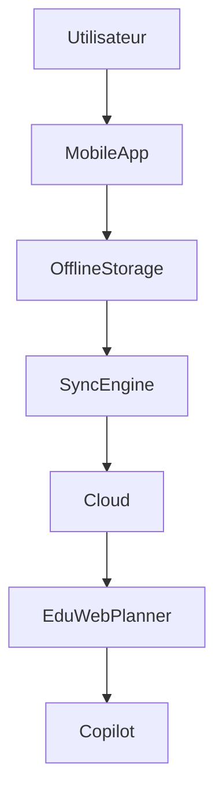

# UX-102-11 — Mobile Components

> Référentiel officiel des composants mobiles d'EduWeb Planner.

---

# Sommaire

1. Vision
2. Objectifs
3. Principes Mobile First
4. Architecture Mobile
5. Mobile App Shell
6. Bottom Navigation
7. Mobile App Bar
8. Mobile Cards
9. Mobile Lists
10. Mobile Forms
11. Gestes tactiles
12. Floating Action Button
13. Drawers
14. Bottom Sheets
15. Notifications Push
16. Synchronisation Offline
17. Capture Mobile
18. Signature Mobile
19. Scan QR / Code-barres
20. Géolocalisation
21. Calendrier Mobile
22. Emploi du Temps Mobile
23. Copilot Mobile
24. Sécurité Mobile
25. Performance
26. Responsive
27. Accessibilité
28. API
29. Bonnes pratiques
30. Anti-patterns
31. KPI
32. Règles métier

---

# 1. Vision

Les interfaces mobiles permettent d'utiliser EduWeb Planner partout.

Le smartphone devient un véritable poste de travail pour :

- chefs d'établissement ;
- enseignants ;
- inspecteurs ;
- secrétaires ;
- parents ;
- élèves ;
- administrateurs.

---

# 2. Objectifs

Le module Mobile doit :

- offrir une expérience fluide ;
- fonctionner avec une connexion limitée ;
- exploiter les capacités natives des appareils ;
- garantir la sécurité des données ;
- synchroniser automatiquement les informations.

---

# 3. Principes Mobile First

Les interfaces sont conçues d'abord pour le smartphone.

Principes :

- simplicité ;
- rapidité ;
- interactions tactiles ;
- lecture verticale ;
- faible consommation de données ;
- priorité aux actions essentielles.

---

# 4. Architecture Mobile

```text
Application

↓

Navigation

↓

Workspace

↓

Composants

↓

Services

↓

Synchronisation

↓

Cloud
```

---

# 5. Mobile App Shell

Structure standard :

```text
AppBar

↓

Contenu

↓

Bottom Navigation

↓

FAB (optionnel)
```

Le shell est identique dans tous les modules.

---

# 6. Bottom Navigation

Maximum :

5 entrées principales.

Exemple :

```
🏠 Accueil

📅 Planning

🔍 Recherche

🔔 Notifications

👤 Profil
```

---

# 7. Mobile App Bar

Contient :

- titre ;
- recherche ;
- Copilot ;
- notifications ;
- menu utilisateur.

Elle reste accessible pendant le défilement lorsque nécessaire.

---

# 8. Mobile Cards

Les informations sont présentées sous forme de cartes.

Exemple :

```
6e A

Mathématiques

08h00 - 09h00

Salle 12

Prof. KOUASSI
```

Chaque carte offre des actions rapides.

---

# 9. Mobile Lists

Utilisées pour :

- élèves ;
- enseignants ;
- documents ;
- messages ;
- tâches ;
- notifications.

Fonctions :

- recherche ;
- filtrage ;
- défilement infini ;
- actualisation par glissement.

---

# 10. Mobile Forms

Les formulaires sont optimisés pour :

- clavier numérique ;
- clavier e-mail ;
- date native ;
- heure native ;
- listes simplifiées.

Sauvegarde automatique activée.

---

# 11. Gestes tactiles

Gestes pris en charge :

- toucher ;
- double toucher ;
- appui long ;
- glisser ;
- déposer ;
- pincer ;
- zoomer.

---

## Exemples

Glisser vers la gauche :

Supprimer

Glisser vers la droite :

Archiver

Appui long :

Menu contextuel

---

# 12. Floating Action Button (FAB)

Utilisé pour l'action principale.

Exemples :

- créer ;
- ajouter ;
- scanner ;
- lancer le Copilot.

Un seul FAB par écran.

---

# 13. Drawers

Panneaux latéraux.

Utilisés pour :

- filtres ;
- détails ;
- paramètres ;
- IA.

---

# 14. Bottom Sheets

Fenêtres apparaissant depuis le bas.

Utilisations :

- partage ;
- actions rapides ;
- sélection ;
- aperçu.

---

# 15. Notifications Push

Catégories :

- planning ;
- absences ;
- validation ;
- paiement ;
- workflow ;
- IA.

Chaque notification peut ouvrir directement le module concerné.

---

# 16. Synchronisation Offline

Le mode hors ligne permet :

- consultation des données synchronisées ;
- création de nouveaux enregistrements ;
- modifications locales ;
- synchronisation automatique dès le retour du réseau.

---

## États

```
Synchronisé

En attente

Erreur

Conflit
```

Les conflits sont signalés à l'utilisateur.

---

# 17. Capture Mobile

Capture native :

- photo ;
- vidéo ;
- audio ;
- documents.

Compression automatique configurable.

---

# 18. Signature Mobile

Signature :

- doigt ;
- stylet.

Formats :

- PNG ;
- SVG.

Intégration directe aux workflows.

---

# 19. Scan QR / Code-barres

Utilisations :

- contrôle de présence ;
- authentification de documents ;
- inventaire ;
- paiement ;
- badge élève.

Lecture en temps réel.

---

# 20. Géolocalisation

Utilisations :

- contrôle de présence ;
- missions ;
- visites d'inspection ;
- cartographie des établissements.

La collecte est soumise aux politiques de confidentialité et au consentement lorsque requis.

---

# 21. Calendrier Mobile

Vues :

- jour ;
- semaine ;
- mois.

Navigation tactile fluide.

---

# 22. Emploi du Temps Mobile

Vue optimisée.

Affichage :

```
08h00

Mathématiques

↓

09h00

Français

↓

10h00

Pause
```

Recherche rapide.

Couleurs harmonisées.

---

# 23. Copilot Mobile

Fonctions :

- commande vocale ;
- conversation ;
- capture photo ;
- résumé ;
- traduction ;
- génération de documents.

Le Copilot peut utiliser le contexte de l'écran affiché.

---

# 24. Sécurité Mobile

Authentification :

- mot de passe ;
- empreinte digitale ;
- Face ID (si disponible) ;
- code PIN.

Fonctions :

- chiffrement local ;
- verrouillage automatique ;
- effacement sécurisé des données locales après déconnexion (selon la politique de l'organisation).

---

# 25. Performance

Objectifs :

- démarrage < 3 secondes ;
- navigation fluide ;
- consommation mémoire maîtrisée ;
- faible utilisation réseau.

Les ressources sont chargées à la demande.

---

# 26. Responsive

Compatibilité :

- smartphone ;
- tablette ;
- PWA ;
- mode paysage ;
- mode portrait.

---

# 27. Accessibilité

Tous les composants :

- compatibles lecteurs d'écran ;
- taille tactile ≥ 44 px ;
- contraste WCAG AA ;
- commandes vocales lorsque disponibles ;
- navigation clavier sur tablette avec clavier externe.

---

# 28. API (concept)

```typescript
UiMobile {

    appShell

    bottomNavigation

    notifications

    offlineSync

    scanner

    signature

    copilot

    geolocation

}
```

---

# 29. Bonnes pratiques

✔ Concevoir en priorité pour une utilisation à une main.

✔ Limiter les saisies longues.

✔ Exploiter les composants natifs.

✔ Prévoir le mode hors ligne.

✔ Optimiser les performances.

✔ Réduire le nombre d'étapes.

---

# 30. Anti-patterns

✘ Reproduire l'interface Desktop sans adaptation.

✘ Multiplier les fenêtres modales.

✘ Négliger les interactions tactiles.

✘ Afficher des tableaux trop larges.

✘ Bloquer l'application en cas d'absence de réseau.

---

# Diagramme Mermaid



---

# KPI

| KPI | Objectif |
|------|----------|
|Temps de démarrage|< 3 s|
|Temps moyen de synchronisation|< 10 s|
|Disponibilité du mode hors ligne|100 %|
|Compatibilité Android / iOS / PWA|100 %|
|Taux de réussite des synchronisations|> 99 %|

---

# Règles métier

## RM-UX10211-001

Les fonctionnalités essentielles (consultation, création, modification) doivent rester disponibles en mode hors ligne lorsque les données nécessaires ont été synchronisées.

---

## RM-UX10211-002

Les conflits de synchronisation sont détectés automatiquement et présentés à l'utilisateur pour résolution.

---

## RM-UX10211-003

Les composants mobiles utilisent les services natifs de l'appareil lorsqu'ils sont disponibles (appareil photo, biométrie, notifications, géolocalisation).

---

## RM-UX10211-004

Les données sensibles stockées localement sont chiffrées et supprimées conformément à la politique de sécurité après déconnexion ou expiration de session.

---

## RM-UX10211-005

Les interfaces mobiles garantissent une expérience cohérente avec les versions Desktop et Web tout en restant optimisées pour les contraintes des écrans tactiles.

---

# Documents liés

- UX-101 — Design System
- UX-102-04 — Navigation Components
- UX-102-08 — AI Components
- UX-102-09 — Planning Components
- UX-102-10 — Finance Components
- UX-102-12 — Accessibility
- UX-103 — Information Architecture

---

# Fin du document
