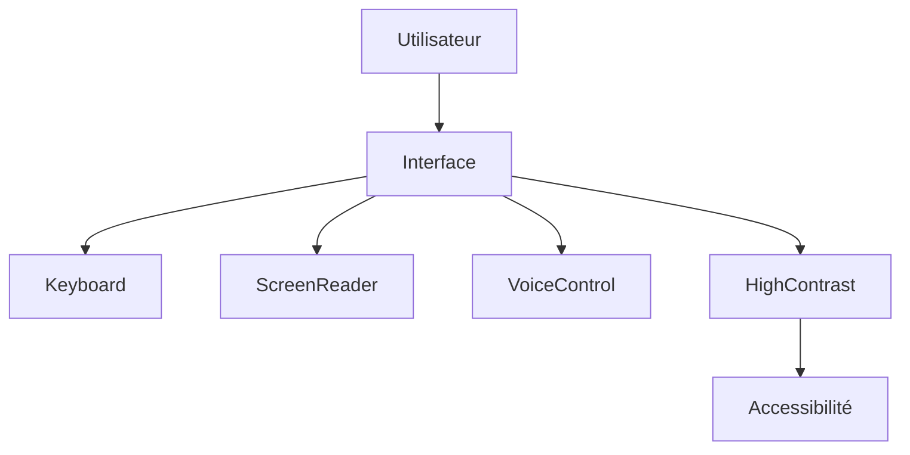

# UX-102-12 — Accessibility Components & Standards

> Référentiel officiel d'accessibilité d'EduWeb Planner.

---

# Sommaire

1. Vision
2. Objectifs
3. Principes
4. Les quatre principes WCAG
5. Navigation clavier
6. Gestion du focus
7. Composants accessibles
8. Couleurs et contrastes
9. Typographie
10. Images
11. Icônes
12. Tableaux
13. Graphiques
14. Formulaires
15. Messages d'erreur
16. Dialogues
17. Notifications
18. Multimédia
19. IA et Accessibilité
20. Mobile Accessibility
21. Tests
22. API
23. Bonnes pratiques
24. Anti-patterns
25. KPI
26. Règles métier

---

# 1. Vision

EduWeb Planner est conçu selon le principe :

> **Accessible par défaut.**

L'accessibilité n'est pas une fonctionnalité optionnelle.

Elle constitue une exigence de conception.

Chaque utilisateur doit pouvoir accéder à l'ensemble des fonctionnalités, quelles que soient :

- ses capacités ;
- sa situation ;
- son équipement ;
- sa connexion.

---

# 2. Objectifs

Garantir :

- l'autonomie des utilisateurs ;
- l'égalité d'accès ;
- la conformité réglementaire ;
- une expérience universelle.

---

# 3. Principes

Toutes les interfaces respectent :

- WCAG 2.2 AA ;
- WAI-ARIA 1.2 ;
- EN 301 549 ;
- ISO 9241.

---

# 4. Les quatre principes WCAG

## Perceptible

L'information doit pouvoir être perçue.

Exemples :

- contraste suffisant ;
- textes alternatifs ;
- sous-titres ;
- taille adaptable.

---

## Utilisable

L'interface est manipulable.

Exemples :

- navigation clavier ;
- focus visible ;
- temps suffisant.

---

## Compréhensible

L'utilisateur comprend :

- le contenu ;
- les erreurs ;
- les actions.

---

## Robuste

Compatible avec :

- navigateurs ;
- lecteurs d'écran ;
- technologies d'assistance.

---

# 5. Navigation clavier

Toutes les fonctionnalités sont accessibles sans souris.

Touches principales :

```text
TAB

SHIFT + TAB

ENTER

SPACE

ESC

↑ ↓ ← →
```

Raccourcis documentés.

---

# 6. Gestion du focus

Le focus est :

- visible ;
- contrasté ;
- logique.

Le focus n'est jamais perdu.

Après fermeture d'une fenêtre :

retour automatique au composant d'origine.

---

# 7. Composants accessibles

Tous les composants disposent :

- d'un rôle ARIA ;
- d'un nom accessible ;
- d'un état ;
- d'une description si nécessaire.

---

Exemple

```html
<button
aria-label="Enregistrer le document">
```

---

# 8. Couleurs et contrastes

Contraste minimal :

Texte normal :

4.5 : 1

Grand texte :

3 : 1

Les couleurs ne sont jamais le seul moyen de transmettre une information.

---

# 9. Typographie

Taille minimale recommandée :

16 px.

Interligne :

≥ 1,5.

Longueur des lignes :

50 à 90 caractères.

---

# 10. Images

Toutes les images informatives possèdent :

```text
Texte alternatif
```

Les images décoratives sont ignorées par les lecteurs d'écran.

---

# 11. Icônes

Les icônes importantes possèdent :

- un libellé ;
- une info-bulle ;
- une alternative textuelle.

---

# 12. Tableaux

Les tableaux disposent :

- d'un en-tête ;
- d'un résumé lorsque nécessaire ;
- d'une navigation clavier.

Les cellules fusionnées sont limitées.

---

# 13. Graphiques

Chaque graphique possède :

- un titre ;
- une description ;
- un tableau de données alternatif.

Les couleurs sont complétées par des formes ou des motifs.

---

# 14. Formulaires

Chaque champ possède :

- un label explicite ;
- une aide contextuelle ;
- un message d'erreur précis.

Exemple :

```
Adresse électronique invalide.

Exemple attendu :

nom@eduweb.ci
```

---

# 15. Messages d'erreur

Les erreurs :

- expliquent le problème ;
- indiquent la correction ;
- conservent les données saisies.

---

# 16. Dialogues

Les fenêtres modales :

- capturent le focus ;
- se ferment avec ESC ;
- annoncent leur ouverture ;
- restituent le focus à la fermeture.

---

# 17. Notifications

Les notifications utilisent :

ARIA Live.

Niveaux :

- polite ;
- assertive.

Selon l'urgence.

---

# 18. Multimédia

Les vidéos disposent de :

- sous-titres ;
- transcription ;
- contrôle du volume ;
- arrêt automatique des contenus sonores non essentiels.

---

# 19. IA et Accessibilité

Le Copilot est utilisable :

- au clavier ;
- à la voix (lorsque disponible) ;
- avec les lecteurs d'écran.

Les réponses IA peuvent être :

- lues à haute voix ;
- agrandies ;
- exportées.

---

# 20. Mobile Accessibility

Respect :

- zones tactiles ≥ 44 × 44 px ;
- contraste suffisant ;
- orientation portrait et paysage ;
- prise en charge des lecteurs d'écran mobiles.

---

# 21. Tests

Tests obligatoires :

- navigation clavier ;
- NVDA ;
- JAWS (si disponible) ;
- VoiceOver ;
- TalkBack ;
- contraste ;
- zoom 200 % ;
- navigation sans souris.

---

# 22. API (concept)

```typescript
UiAccessibility {

    aria

    focus

    keyboard

    contrast

    liveRegions

    captions

    altText

    screenReader

}
```

---

# 23. Bonnes pratiques

✔ Utiliser des libellés explicites.

✔ Prévoir des raccourcis clavier.

✔ Tester avec un lecteur d'écran.

✔ Fournir des alternatives textuelles.

✔ Éviter les animations excessives.

✔ Préserver une hiérarchie logique des titres.

---

# 24. Anti-patterns

✘ Texte gris clair sur fond blanc.

✘ Focus invisible.

✘ Boutons sans nom accessible.

✘ Images sans texte alternatif.

✘ Formulaires sans libellés.

✘ Utilisation exclusive de la couleur pour signaler une erreur.

---

# Diagramme Mermaid



---

# KPI

| KPI | Objectif |
|------|----------|
|Conformité WCAG 2.2 AA|100 %|
|Navigation clavier|100 %|
|Composants compatibles ARIA|100 %|
|Contrastes conformes|100 %|
|Tests d'accessibilité automatisés|100 %|

---

# Règles métier

## RM-UX10212-001

Tout nouveau composant doit démontrer sa conformité aux exigences d'accessibilité avant sa mise en production.

---

## RM-UX10212-002

Les composants interactifs sont entièrement utilisables au clavier.

---

## RM-UX10212-003

Les contenus graphiques essentiels disposent d'une alternative textuelle.

---

## RM-UX10212-004

Les réponses de l'IA restent accessibles aux technologies d'assistance.

---

## RM-UX10212-005

Les régressions d'accessibilité bloquent la publication d'une nouvelle version tant qu'elles ne sont pas corrigées.

---

# Documents liés

- UX-101 — Design System
- UX-102-01 — Input Components
- UX-102-04 — Navigation Components
- UX-102-08 — AI Components
- UX-102-11 — Mobile Components
- UX-102-13 — Component Governance
- UX-104 — Accessibility Framework

---

# Fin du document
