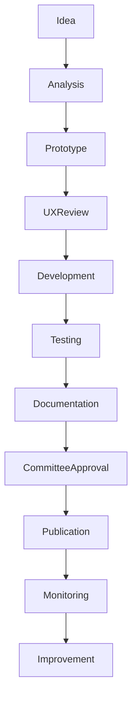

# UX-102-13 — Component Governance

> Référentiel officiel de gouvernance des composants du Design System d'EduWeb Planner.

---

# Sommaire

1. Vision
2. Objectifs
3. Principes
4. Gouvernance
5. Cycle de vie des composants
6. Workflow de création
7. Versionnement
8. Documentation
9. Tests
10. Validation
11. Publication
12. Dépréciation
13. Suppression
14. Gestion des dépendances
15. Gestion des Design Tokens
16. Gestion des Breaking Changes
17. Sécurité
18. IA et Gouvernance
19. Audit
20. Indicateurs
21. API
22. Bonnes pratiques
23. Anti-patterns
24. KPI
25. Règles métier

---

# 1. Vision

Le Design System constitue un actif stratégique.

Chaque composant est :

- gouverné ;
- documenté ;
- testé ;
- versionné ;
- maintenu.

Aucun composant ne peut être ajouté directement en production.

---

# 2. Objectifs

Garantir :

- cohérence graphique ;
- cohérence fonctionnelle ;
- stabilité ;
- maintenabilité ;
- réutilisation maximale.

---

# 3. Principes

Tous les composants doivent être :

- réutilisables ;
- indépendants ;
- documentés ;
- testés ;
- accessibles ;
- internationalisés.

---

# 4. Gouvernance

## Comité Design System

Composition :

- UX Lead
- UI Lead
- Architecte logiciel
- Responsable Front-end
- Expert Accessibilité
- Expert IA
- Product Owner
- Responsable Qualité

---

## Responsabilités

- validation des nouveaux composants ;
- évolution du Design System ;
- arbitrage ;
- gestion des versions ;
- conformité.

---

# 5. Cycle de vie

```text
Idée

↓

Analyse

↓

Prototype

↓

Validation UX

↓

Développement

↓

Tests

↓

Documentation

↓

Publication

↓

Maintenance

↓

Dépréciation

↓

Retrait
```

---

# 6. Workflow de création

Étape 1

Expression du besoin

↓

Étape 2

Analyse UX

↓

Étape 3

Prototype

↓

Étape 4

Validation Design

↓

Étape 5

Développement

↓

Étape 6

Tests

↓

Étape 7

Documentation

↓

Étape 8

Publication

---

# 7. Versionnement

Convention :

```
MAJEUR.MINEUR.CORRECTIF

1.0.0

1.1.0

1.1.2

2.0.0
```

## Version majeure

Breaking changes.

---

## Version mineure

Nouvelles fonctionnalités compatibles.

---

## Correctif

Correction sans impact fonctionnel.

---

# 8. Documentation

Chaque composant possède :

- description ;
- captures d'écran ;
- cas d'utilisation ;
- variantes ;
- API ;
- exemples de code ;
- règles UX ;
- contraintes ;
- historique.

---

# 9. Tests

Tests obligatoires :

- unitaires ;
- intégration ;
- accessibilité ;
- responsive ;
- performance ;
- sécurité ;
- régression visuelle.

Couverture minimale :

95 %.

---

# 10. Validation

Critères :

✔ UX

✔ UI

✔ Accessibilité

✔ Sécurité

✔ Performance

✔ Documentation

✔ Internationalisation

---

# 11. Publication

Publication uniquement après :

- validation du comité ;
- documentation complète ;
- exécution des tests ;
- génération automatique de la documentation.

---

# 12. Dépréciation

Lorsqu'un composant devient obsolète :

Statut :

```
Deprecated
```

Documentation :

- raison ;
- remplacement ;
- date de retrait prévue.

Le composant reste disponible pendant une période de transition définie par la gouvernance.

---

# 13. Suppression

Conditions :

- plus aucune dépendance ;
- migration terminée ;
- validation du comité.

---

# 14. Gestion des dépendances

Chaque composant référence :

- composants parents ;
- composants enfants ;
- Design Tokens ;
- bibliothèques.

Aucune dépendance circulaire.

---

# 15. Gestion des Design Tokens

Tous les composants utilisent exclusivement :

- couleurs officielles ;
- typographies ;
- espacements ;
- rayons ;
- ombres ;
- animations.

Les valeurs codées en dur sont interdites.

---

# 16. Gestion des Breaking Changes

Toute rupture de compatibilité doit :

- être documentée ;
- proposer un guide de migration ;
- préciser les impacts ;
- être annoncée avant publication.

---

# 17. Sécurité

Contrôles :

- dépendances vulnérables ;
- injections ;
- scripts ;
- conformité CSP ;
- conformité OWASP.

Les composants manipulant des données sensibles font l'objet d'une revue de sécurité renforcée.

---

# 18. IA et Gouvernance

L'IA peut assister :

- la génération de composants ;
- la documentation ;
- les tests ;
- la détection des incohérences ;
- les propositions d'amélioration.

Toute proposition générée par l'IA est revue par un membre de l'équipe avant intégration.

---

# 19. Audit

Audit trimestriel :

- conformité UX ;
- conformité UI ;
- accessibilité ;
- performances ;
- dette technique ;
- composants inutilisés.

Rapport automatique.

---

# 20. Indicateurs

Suivi :

- nombre de composants ;
- taux de réutilisation ;
- dette UX ;
- dette technique ;
- conformité WCAG ;
- couverture documentaire.

---

# 21. API (concept)

```typescript
UiGovernance {

    lifecycle

    version

    documentation

    tests

    accessibility

    security

    audit

    publication

}
```

---

# 22. Bonnes pratiques

✔ Réutiliser avant de créer.

✔ Documenter systématiquement.

✔ Tester automatiquement.

✔ Éviter les duplications.

✔ Maintenir la compatibilité.

✔ Prévoir une migration lors des évolutions majeures.

---

# 23. Anti-patterns

✘ Copier un composant existant au lieu de le faire évoluer.

✘ Modifier un composant sans augmenter sa version.

✘ Publier sans documentation.

✘ Ignorer les tests.

✘ Ajouter des variantes non validées.

✘ Utiliser des composants non officiels.

---

# Diagramme Mermaid



---

# KPI

| KPI | Objectif |
|------|----------|
|Réutilisation des composants|> 95 %|
|Couverture des tests|≥ 95 %|
|Documentation complète|100 %|
|Conformité WCAG|100 %|
|Temps moyen d'approbation d'un nouveau composant|< 10 jours ouvrés|
|Régressions après publication|< 1 %|
|Composants obsolètes encore utilisés|0 à terme|

---

# Règles métier

## RM-UX10213-001

Tout nouveau composant doit être approuvé par le Comité Design System avant sa publication.

---

## RM-UX10213-002

Chaque composant possède un identifiant unique, un propriétaire fonctionnel et un responsable technique.

---

## RM-UX10213-003

Aucun composant ne peut être publié sans documentation, tests et validation d'accessibilité.

---

## RM-UX10213-004

Les changements majeurs sont accompagnés d'un guide de migration et d'une période de coexistence lorsque cela est nécessaire.

---

## RM-UX10213-005

Les composants dépréciés restent identifiés comme tels jusqu'à leur retrait officiel et leur remplacement complet dans les applications.

---

# Documents liés

- UX-101 — Design System
- UX-102-00 — Overview
- UX-102-01 à UX-102-12
- UX-103 — Information Architecture
- UX-104 — Accessibility Framework
- DEV-001 — Front-end Development Standards
- QA-001 — Quality Assurance Standards

---

# Conclusion

La gouvernance des composants garantit que le Design System d'EduWeb Planner demeure cohérent, évolutif, sécurisé et maintenable. Elle fournit un cadre commun aux équipes Produit, UX, Développement, QA et Architecture afin d'assurer une expérience utilisateur homogène sur l'ensemble des modules de la plateforme.

# Fin du document
