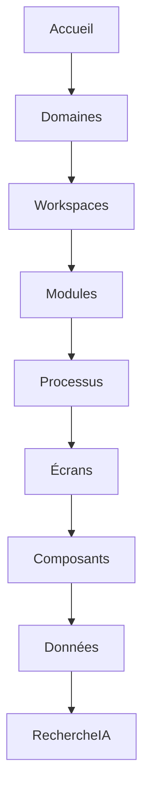

# UX-103 — Information Architecture

> Référentiel officiel de l'Architecture de l'Information (IA) d'EduWeb Planner.

---

# Sommaire

1. Vision
2. Objectifs
3. Principes directeurs
4. Architecture globale
5. Domaines fonctionnels
6. Espaces de travail (Workspaces)
7. Taxonomie
8. Hiérarchie des contenus
9. Navigation globale
10. Navigation contextuelle
11. Métadonnées
12. Moteur de recherche
13. Recherche intelligente
14. Organisation documentaire
15. Architecture des tableaux de bord
16. Gestion des favoris
17. Historique
18. Breadcrumb
19. URLs
20. Identifiants
21. Multilinguisme
22. IA et Architecture de l'information
23. API conceptuelle
24. Bonnes pratiques
25. Anti-patterns
26. KPI
27. Règles métier

---

# 1. Vision

L'Architecture de l'Information définit la manière dont les données, contenus, fonctionnalités et connaissances sont organisés dans EduWeb Planner.

Son objectif est de permettre à chaque utilisateur de trouver rapidement la bonne information, au bon moment, quel que soit son profil.

---

# 2. Objectifs

L'architecture doit permettre :

- une navigation intuitive ;
- une recherche rapide ;
- une organisation cohérente ;
- une forte réutilisation des contenus ;
- une montée en charge sur plusieurs milliers d'établissements ;
- une évolution sans rupture de l'expérience utilisateur.

---

# 3. Principes directeurs

L'architecture repose sur les principes suivants :

- simplicité ;
- cohérence ;
- modularité ;
- évolutivité ;
- traçabilité ;
- interopérabilité ;
- accessibilité.

---

# 4. Architecture globale

```text
Organisation

↓

Établissement

↓

Module

↓

Workspace

↓

Processus

↓

Fonction

↓

Écran

↓

Composant

↓

Donnée
```

---

# 5. Domaines fonctionnels

Les modules sont organisés en grands domaines.

## Gouvernance

- Administration
- Paramétrage
- Sécurité
- Référentiels

---

## Vie scolaire

- Élèves
- Enseignants
- Classes
- Absences
- Discipline

---

## Pédagogie

- Emplois du temps
- Progressions
- Évaluations
- Bulletins

---

## Finance

- Budget
- Comptabilité
- Trésorerie
- Facturation

---

## Ressources humaines

- Personnel
- Carrières
- Congés
- Évaluations

---

## Patrimoine

- Locaux
- Inventaire
- Maintenance

---

## Communication

- Messages
- Notifications
- Publications

---

## Décisionnel

- KPI
- Statistiques
- Rapports
- IA décisionnelle

---

# 6. Espaces de travail (Workspaces)

Chaque domaine possède son propre espace de travail.

Exemple :

```
Finance Workspace

↓

Journal

↓

Grand Livre

↓

Balance

↓

Rapports
```

---

# 7. Taxonomie

Chaque élément appartient à une taxonomie officielle.

Exemple :

```
Éducation

↓

Secondaire

↓

Classe

↓

6e

↓

6e A
```

Cette taxonomie est centralisée afin de garantir une terminologie uniforme dans toute la plateforme.

---

# 8. Hiérarchie des contenus

La profondeur maximale recommandée est de **5 niveaux**.

Exemple :

```
Accueil

↓

Pédagogie

↓

Planning

↓

Classes

↓

6e A
```

Au-delà, privilégier la recherche ou les liens contextuels.

---

# 9. Navigation globale

Navigation permanente :

- tableau de bord ;
- modules ;
- recherche ;
- notifications ;
- profil utilisateur.

La navigation globale est identique sur Desktop, Mobile et PWA.

---

# 10. Navigation contextuelle

Chaque module propose des accès rapides :

- tâches récentes ;
- favoris ;
- éléments associés ;
- historique.

---

# 11. Métadonnées

Chaque objet possède des métadonnées normalisées.

Exemple :

| Champ | Description |
|--------|-------------|
| ID | Identifiant unique |
| Titre | Nom de l'objet |
| Type | Catégorie |
| Auteur | Créateur |
| Date | Création |
| Statut | Brouillon, validé, archivé |
| Version | Révision |
| Tags | Mots-clés |

---

# 12. Moteur de recherche

Le moteur permet une recherche sur :

- documents ;
- élèves ;
- enseignants ;
- classes ;
- établissements ;
- ressources ;
- règlements ;
- statistiques.

---

## Filtres

- date ;
- établissement ;
- type ;
- auteur ;
- statut ;
- catégorie.

---

# 13. Recherche intelligente

La recherche assistée par IA permet :

- l'autocomplétion ;
- la correction orthographique ;
- la recherche sémantique ;
- les synonymes ;
- les recommandations.

Exemple :

```
Recherche :

emploi math 6A

↓

Résultat :

Emploi du temps de la classe 6e A
```

---

# 14. Organisation documentaire

Les documents sont classés selon :

```
Organisation

↓

Établissement

↓

Service

↓

Année

↓

Catégorie

↓

Document
```

---

# 15. Architecture des tableaux de bord

Tous les tableaux de bord utilisent une structure homogène.

```text
Indicateurs

↓

Graphiques

↓

Alertes

↓

Actions rapides

↓

Historique
```

---

# 16. Gestion des favoris

Chaque utilisateur peut enregistrer :

- écrans ;
- recherches ;
- rapports ;
- documents ;
- tableaux de bord.

Les favoris sont synchronisés entre les appareils.

---

# 17. Historique

Le système conserve :

- écrans consultés ;
- recherches ;
- documents récents ;
- actions importantes.

L'utilisateur peut reprendre rapidement une activité interrompue.

---

# 18. Breadcrumb

Exemple :

```
Accueil

>

Pédagogie

>

Planning

>

Classes

>

6e A
```

Le fil d'Ariane reflète toujours la structure logique de navigation.

---

# 19. URLs

Convention :

```
/planning/classes/6A

/finance/journal

/hr/employees
```

Les URLs sont :

- lisibles ;
- stables ;
- hiérarchiques ;
- sans identifiants techniques visibles lorsque cela n'est pas nécessaire.

---

# 20. Identifiants

Chaque objet dispose d'un identifiant unique.

Exemple :

```
STD-00015478

EMP-000874

CLS-6A-2026

FIN-JRN-001245
```

Les identifiants métiers restent indépendants des identifiants techniques de la base de données.

---

# 21. Multilinguisme

L'architecture prévoit :

- français ;
- anglais ;
- espagnol ;
- arabe ;
- portugais.

Tous les libellés utilisent des ressources de traduction centralisées.

---

# 22. IA et Architecture de l'information

Le Copilot peut :

- retrouver un document ;
- proposer un raccourci ;
- résumer une page ;
- suggérer un processus ;
- guider la navigation.

L'IA s'appuie sur la taxonomie officielle pour améliorer la pertinence des réponses.

---

# 23. API (concept)

```typescript
UiInformationArchitecture {

    taxonomy

    navigation

    metadata

    search

    workspace

    favorites

    history

    aiSearch

}
```

---

# 24. Bonnes pratiques

✔ Limiter la profondeur de navigation.

✔ Utiliser une terminologie cohérente.

✔ Structurer les contenus selon la taxonomie officielle.

✔ Fournir plusieurs points d'accès à une même information (navigation, recherche, favoris).

✔ Documenter toute nouvelle catégorie.

---

# 25. Anti-patterns

✘ Multiplier les niveaux de menus.

✘ Employer des intitulés ambigus.

✘ Dupliquer des contenus identiques dans plusieurs arborescences.

✘ Modifier fréquemment les URLs.

✘ Créer des catégories sans gouvernance.

---

# Diagramme Mermaid



---

# KPI

| KPI | Objectif |
|------|----------|
|Temps moyen pour accéder à une fonctionnalité|< 3 clics|
|Temps moyen de recherche|< 2 s|
|Pertinence des résultats de recherche|> 95 %|
|Taux d'utilisation des favoris|> 70 %|
|Taux de succès des recherches IA|> 90 %|

---

# Règles métier

## RM-UX103-001

Toute nouvelle fonctionnalité doit être intégrée à la taxonomie officielle avant son développement.

---

## RM-UX103-002

Chaque contenu est rattaché à un seul emplacement principal dans l'arborescence afin d'éviter les duplications.

---

## RM-UX103-003

Toutes les recherches doivent être compatibles avec les filtres standard de la plateforme.

---

## RM-UX103-004

Les métadonnées obligatoires sont renseignées lors de la création de tout nouvel objet métier.

---

## RM-UX103-005

Toute évolution de l'architecture de l'information fait l'objet d'une validation par le Comité Design System et Architecture.

---

# Documents liés

- UX-101 — Design System
- UX-102 — UI Components
- UX-104 — Accessibility Framework
- RM-001 — Enterprise Data Model
- DEV-001 — Front-end Standards
- GOV-001 — Enterprise Governance

---

# Fin du document
