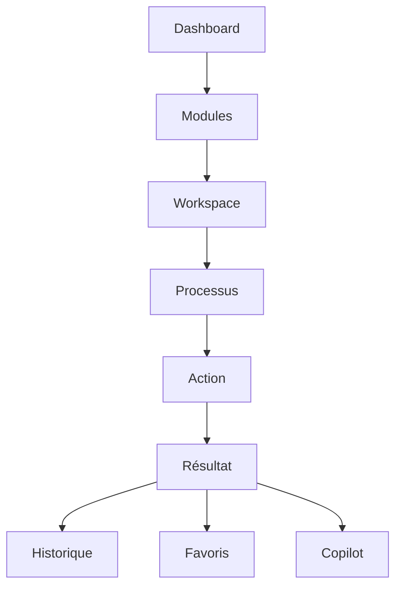

# UX-105 — Enterprise Navigation Framework

> Référentiel officiel de la navigation d'EduWeb Planner.

---

# Sommaire

1. Vision
2. Objectifs
3. Principes
4. Architecture de navigation
5. Types de navigation
6. Navigation globale
7. Navigation contextuelle
8. Navigation métier
9. Navigation personnelle
10. Navigation adaptative
11. Navigation assistée par IA
12. Recherche universelle
13. Command Palette
14. Navigation mobile
15. Navigation tablette
16. Navigation Desktop
17. Navigation multi-fenêtres
18. Navigation Workflow
19. Navigation décisionnelle
20. Navigation documentaire
21. Breadcrumb
22. Historique
23. Favoris
24. Liens rapides
25. Notifications
26. API conceptuelle
27. Bonnes pratiques
28. Anti-patterns
29. KPI
30. Règles métier

---

# 1. Vision

La navigation constitue le **système circulatoire** de la plateforme EduWeb Planner.

Elle doit permettre à tout utilisateur d'accéder rapidement à n'importe quelle fonctionnalité, quel que soit :

- son métier ;
- son établissement ;
- son appareil ;
- son niveau d'expertise.

---

# 2. Objectifs

La navigation doit être :

- intuitive ;
- cohérente ;
- rapide ;
- personnalisable ;
- prédictive ;
- assistée par l'IA.

---

# 3. Principes

La navigation repose sur six principes fondamentaux :

- Cohérence
- Simplicité
- Prévisibilité
- Continuité
- Contextualisation
- Accessibilité

---

# 4. Architecture de navigation

```text
Accueil

↓

Domaines

↓

Modules

↓

Workspaces

↓

Processus

↓

Écrans

↓

Actions
```

Cette architecture est identique pour tous les modules.

---

# 5. Types de navigation

EduWeb Planner comporte plusieurs niveaux de navigation :

## Navigation globale

Accès aux grands domaines.

---

## Navigation locale

Navigation propre à un module.

---

## Navigation contextuelle

Liée à un objet métier.

---

## Navigation transversale

Recherche, favoris, IA.

---

## Navigation décisionnelle

Tableaux de bord.

---

# 6. Navigation globale

Visible sur toutes les pages.

Elle contient :

- Logo EduWeb
- Tableau de bord
- Modules
- Recherche
- Notifications
- Copilot IA
- Profil utilisateur

---

# 7. Navigation contextuelle

Chaque écran propose :

- actions possibles ;
- éléments liés ;
- raccourcis ;
- documents associés.

Exemple :

```
Classe

↓

Élèves

↓

Absences

↓

Notes

↓

Emploi du temps

↓

Documents
```

---

# 8. Navigation métier

Chaque profil dispose d'une navigation adaptée.

Exemple :

## Enseignant

- Planning
- Notes
- Cahier de textes
- Évaluations

---

## Comptable

- Budget
- Journal
- Trésorerie
- Paiements

---

## Proviseur

- Pilotage
- Ressources
- Personnel
- Statistiques

---

# 9. Navigation personnelle

Chaque utilisateur peut personnaliser :

- son menu ;
- ses favoris ;
- ses raccourcis ;
- son tableau de bord.

---

# 10. Navigation adaptative

Le système apprend progressivement les habitudes.

Exemple :

```
Mathématiques

consulté

327 fois

↓

placé automatiquement

dans les accès rapides.
```

Les suggestions restent configurables et peuvent être désactivées.

---

# 11. Navigation assistée par IA

Le Copilot peut répondre :

> "Où puis-je créer un nouvel emploi du temps ?"

↓

Il ouvre directement :

```
Planning

↓

Créer

↓

Nouvel emploi du temps
```

Autres fonctions :

- retrouver un écran ;
- ouvrir un rapport ;
- guider un nouvel utilisateur ;
- expliquer un processus.

---

# 12. Recherche universelle

Recherche instantanée sur :

- élèves ;
- enseignants ;
- classes ;
- documents ;
- établissements ;
- finances ;
- textes réglementaires ;
- statistiques.

Résultats regroupés par catégories.

---

# 13. Command Palette

Raccourci :

```
CTRL + K
```

Fonctions :

- ouvrir un écran ;
- lancer une action ;
- rechercher un document ;
- exécuter une commande ;
- invoquer le Copilot.

---

# 14. Navigation mobile

Structure :

```
AppBar

↓

Contenu

↓

Bottom Navigation

↓

FAB
```

Maximum :

5 onglets.

---

# 15. Navigation tablette

Sidebar repliable.

Optimisée pour le tactile.

---

# 16. Navigation Desktop

Organisation :

```
Sidebar

+

Workspace

+

Panneau latéral

+

Notifications
```

Navigation simultanée entre plusieurs modules.

---

# 17. Navigation multi-fenêtres

Possibilité d'ouvrir :

- plusieurs dossiers ;
- plusieurs emplois du temps ;
- plusieurs rapports.

Le contexte de chaque fenêtre est conservé.

---

# 18. Navigation Workflow

Chaque processus indique :

```
Étape 1

↓

Étape 2

↓

Étape 3

↓

Validation

↓

Publication
```

La progression est visible en permanence.

---

# 19. Navigation décisionnelle

Depuis un KPI :

```
KPI

↓

Rapport

↓

Données

↓

Écriture

↓

Pièce justificative
```

Navigation descendante ("drill-down").

---

# 20. Navigation documentaire

Organisation :

```
Catégorie

↓

Sous-catégorie

↓

Document

↓

Version
```

Prévisualisation intégrée.

---

# 21. Breadcrumb

Exemple :

```
Accueil

>

Vie scolaire

>

Classes

>

6e A

>

Absences
```

Toujours visible sur Desktop.

Optionnel sur Mobile.

---

# 22. Historique

Historique personnel :

- derniers écrans ;
- derniers rapports ;
- dernières recherches ;
- dernières validations.

Reprise rapide d'activité.

---

# 23. Favoris

Chaque utilisateur peut épingler :

- écrans ;
- rapports ;
- recherches ;
- tableaux de bord ;
- workflows.

Synchronisation multi-appareils.

---

# 24. Liens rapides

Zone personnalisable.

Exemples :

- Nouvelle facture
- Nouvel élève
- Générer EDT
- Nouvelle évaluation

---

# 25. Notifications

Navigation directe depuis une notification.

Exemple :

```
Nouvelle absence

↓

Fiche élève

↓

Justification
```

---

# 26. API (concept)

```typescript
UiNavigation {

    globalMenu

    workspace

    breadcrumbs

    favorites

    recentItems

    search

    commandPalette

    aiNavigation

}
```

---

# 27. Bonnes pratiques

✔ Maximum trois clics vers une fonction courante.

✔ Menus cohérents entre modules.

✔ Recherche toujours accessible.

✔ Navigation clavier complète.

✔ IA disponible depuis tous les écrans.

✔ Conservation du contexte utilisateur.

---

# 28. Anti-patterns

✘ Menus différents selon les pages.

✘ Plus de trois niveaux de sous-menus.

✘ Fenêtres modales imbriquées.

✘ Liens cassés.

✘ Duplication des menus.

✘ Navigation non compatible clavier.

---

# Diagramme Mermaid



---

# KPI

| KPI | Objectif |
|------|----------|
|Temps moyen pour accéder à une fonction|< 3 clics|
|Temps moyen de recherche|< 2 s|
|Taux d'utilisation des favoris|> 75 %|
|Succès des recherches IA|> 95 %|
|Taux d'abandon de navigation|< 2 %|

---

# Règles métier

## RM-UX105-001

Toutes les fonctionnalités majeures doivent être accessibles en trois interactions maximum depuis le tableau de bord principal, sauf lorsqu'une procédure réglementaire impose un parcours plus long.

---

## RM-UX105-002

La navigation conserve le contexte de travail lors des changements de module.

---

## RM-UX105-003

Le menu affiché est adapté aux droits de l'utilisateur, sans masquer les contrôles de sécurité ni divulguer d'informations sensibles.

---

## RM-UX105-004

Le moteur de recherche universel indexe l'ensemble des objets autorisés par les permissions de l'utilisateur.

---

## RM-UX105-005

Toute nouvelle fonctionnalité doit être intégrée à la navigation globale, à la recherche universelle et, lorsque pertinent, au Copilot IA.

---

# Documents liés

- UX-101 — Design System
- UX-102 — UI Components
- UX-103 — Information Architecture
- UX-104 — Accessibility Framework
- UX-106 — Search & Knowledge Architecture
- DEV-001 — Front-End Standards

---

# Conclusion

Le **Enterprise Navigation Framework** définit une navigation unifiée, cohérente et évolutive pour l'ensemble des produits EduWeb. Associé au Copilot IA, il permet de réduire le temps d'accès à l'information, d'améliorer la productivité des utilisateurs et d'offrir une expérience homogène sur tous les appareils.

# Fin du document
