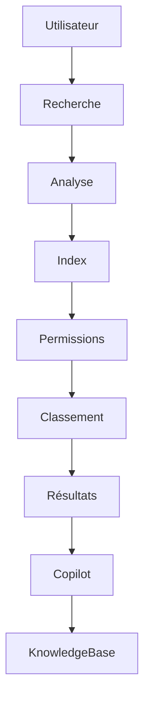

# UX-106 — Enterprise Search & Knowledge Architecture

> Référentiel officiel du moteur de recherche, de la gestion des connaissances et de l'architecture documentaire d'EduWeb Planner.

---

# Sommaire

1. Vision
2. Objectifs
3. Principes
4. Architecture générale
5. Sources de données
6. Indexation
7. Taxonomie
8. Métadonnées
9. Moteur de recherche
10. Recherche sémantique
11. Recherche assistée par IA
12. Recherche conversationnelle
13. Recherche fédérée
14. Suggestions intelligentes
15. Résultats de recherche
16. Navigation documentaire
17. Base de connaissances
18. Moteur de recommandations
19. Gestion documentaire
20. Versionnement documentaire
21. API conceptuelle
22. Bonnes pratiques
23. Anti-patterns
24. KPI
25. Gouvernance
26. Règles métier

---

# 1. Vision

Le moteur de recherche constitue le **point d'entrée universel** d'EduWeb Planner.

L'utilisateur ne doit jamais avoir à se demander :

> « Dans quel module se trouve cette information ? »

Une seule recherche permet d'accéder :

- aux données métiers ;
- aux documents ;
- aux tableaux de bord ;
- aux règlements ;
- aux procédures ;
- aux connaissances.

---

# 2. Objectifs

Le système doit permettre :

- une recherche instantanée ;
- une recherche intelligente ;
- une recherche conversationnelle ;
- une recherche multilingue ;
- une recherche contextuelle.

---

# 3. Principes

La recherche est :

- universelle ;
- sécurisée ;
- contextualisée ;
- personnalisée ;
- assistée par l'IA.

---

# 4. Architecture générale

```text
Utilisateur

↓

Recherche

↓

Analyse linguistique

↓

Index

↓

Filtrage des droits

↓

Classement

↓

Résultats

↓

Copilot IA
```

---

# 5. Sources de données

Le moteur indexe :

## Administration

- établissements
- utilisateurs
- paramètres

---

## Vie scolaire

- élèves
- enseignants
- classes
- absences
- sanctions

---

## Pédagogie

- emplois du temps
- évaluations
- progressions
- bulletins

---

## Finance

- budgets
- écritures
- factures
- paiements

---

## RH

- agents
- contrats
- carrières

---

## Documents

- PDF
- Word
- Excel
- PowerPoint
- Images OCR
- Archives

---

## IA

- connaissances générées
- FAQ
- guides
- procédures

---

# 6. Indexation

Chaque objet possède :

- un identifiant ;
- un titre ;
- une description ;
- des métadonnées ;
- des permissions ;
- un score de pertinence.

L'indexation peut être :

- temps réel ;
- différée ;
- planifiée.

---

# 7. Taxonomie

Tous les contenus utilisent la taxonomie officielle.

Exemple :

```
Éducation

↓

Pédagogie

↓

Mathématiques

↓

Évaluation

↓

Contrôle continu
```

---

# 8. Métadonnées

Métadonnées standard :

| Champ | Description |
|---------|-------------|
|ID|Identifiant|
|Auteur|Créateur|
|Date|Création|
|Version|Révision|
|Catégorie|Classification|
|Tags|Mots-clés|
|Établissement|Organisation|
|Confidentialité|Niveau d'accès|

---

# 9. Moteur de recherche

Fonctions :

- texte libre ;
- opérateurs booléens ;
- recherche exacte ;
- recherche par filtre ;
- recherche multicritère.

Exemple :

```
classe:6A

discipline:Mathématiques

année:2026
```

---

# 10. Recherche sémantique

Le moteur comprend :

- synonymes ;
- acronymes ;
- variantes orthographiques ;
- expressions proches.

Exemple :

```
emploi

↓

emploi du temps

↓

planning

↓

horaire
```

---

# 11. Recherche assistée par IA

Le Copilot peut interpréter :

> "Montre-moi les élèves absents plus de 10 jours."

↓

Le moteur construit automatiquement la requête métier appropriée et présente les résultats autorisés.

---

# 12. Recherche conversationnelle

L'utilisateur peut dialoguer :

```
Quels enseignants ont le plus grand volume horaire cette semaine ?
```

↓

Le Copilot :

- interprète ;
- recherche ;
- calcule ;
- répond ;
- cite les sources lorsque cela est pertinent.

---

# 13. Recherche fédérée

Une seule requête interroge :

- base métier ;
- GED ;
- base réglementaire ;
- base documentaire ;
- IA ;
- statistiques.

Les résultats sont fusionnés et classés.

---

# 14. Suggestions intelligentes

Pendant la saisie :

```
emplo...
```

Suggestions :

- emploi du temps
- emploi enseignant
- emploi salle
- génération EDT

Les suggestions tiennent compte de l'historique et du contexte de l'utilisateur.

---

# 15. Résultats de recherche

Organisation :

```
Résultat

↓

Titre

↓

Résumé

↓

Catégorie

↓

Source

↓

Actions rapides
```

Actions :

- ouvrir ;
- partager ;
- télécharger ;
- ajouter aux favoris ;
- demander un résumé IA.

---

# 16. Navigation documentaire

Depuis un document :

- versions ;
- documents liés ;
- procédures associées ;
- textes réglementaires ;
- modèles.

---

# 17. Base de connaissances

La Knowledge Base centralise :

- procédures ;
- FAQ ;
- guides ;
- tutoriels ;
- politiques ;
- documentation technique.

Chaque article possède :

- un propriétaire ;
- une date de révision ;
- un statut.

---

# 18. Moteur de recommandations

Le système propose automatiquement :

- documents similaires ;
- règlements associés ;
- procédures liées ;
- modèles ;
- formations recommandées.

Les recommandations reposent sur le contexte de travail et les autorisations de l'utilisateur.

---

# 19. Gestion documentaire

Fonctions :

- classement ;
- archivage ;
- versionnement ;
- signature ;
- OCR ;
- indexation automatique.

Formats :

- PDF
- DOCX
- XLSX
- PPTX
- Images
- Audio
- Vidéo

---

# 20. Versionnement documentaire

Chaque document possède :

- version ;
- auteur ;
- historique ;
- comparaison ;
- restauration.

Exemple :

```
v1.0

↓

v1.1

↓

v2.0
```

---

# 21. API (concept)

```typescript
UiEnterpriseSearch {

    universalSearch

    semanticSearch

    aiSearch

    documentSearch

    knowledgeBase

    recommendations

    indexing

    metadata

}
```

---

# 22. Bonnes pratiques

✔ Indexer toutes les données pertinentes.

✔ Utiliser des métadonnées normalisées.

✔ Conserver l'historique des versions.

✔ Fournir des résultats classés par pertinence.

✔ Afficher les filtres actifs.

✔ Respecter strictement les autorisations d'accès.

---

# 23. Anti-patterns

✘ Résultats non filtrés par les droits.

✘ Documents dupliqués.

✘ Métadonnées incomplètes.

✘ Index non mis à jour.

✘ Recherche limitée à un seul module.

---

# Diagramme Mermaid



---

# KPI

| KPI | Objectif |
|------|----------|
|Temps moyen de recherche|< 2 s|
|Pertinence des résultats|> 95 %|
|Indexation temps réel|< 30 s|
|Disponibilité du moteur|99,9 %|
|Succès des recherches conversationnelles|> 90 %|

---

# Gouvernance

Le moteur de recherche est administré par :

- Architecte Data
- Responsable GED
- Responsable IA
- Responsable Sécurité
- Comité Architecture

Une revue semestrielle vérifie :

- qualité des index ;
- taxonomie ;
- pertinence ;
- couverture documentaire.

---

# Règles métier

## RM-UX106-001

Toute donnée publiée doit être indexée automatiquement lorsqu'elle est éligible à la recherche.

---

## RM-UX106-002

Les résultats de recherche respectent strictement les autorisations de l'utilisateur ; aucun contenu non autorisé ne peut être révélé, y compris par les suggestions ou les résumés.

---

## RM-UX106-003

Toute recherche conversationnelle est traduite en requêtes métier auditables avant l'exécution des traitements.

---

## RM-UX106-004

Les documents officiels conservent l'intégralité de leur historique de versions et de leurs métadonnées.

---

## RM-UX106-005

Le Copilot peut proposer des résumés, des explications et des recommandations, mais ne modifie jamais le contenu source sans validation explicite d'un utilisateur habilité.

---

# Documents liés

- UX-101 — Design System
- UX-102 — UI Components
- UX-103 — Information Architecture
- UX-104 — Accessibility Framework
- UX-105 — Enterprise Navigation Framework
- UX-107 — Dashboard Framework
- KM-001 — Knowledge Management
- GED-001 — Enterprise Document Management

---

# Conclusion

L'architecture **Search & Knowledge** transforme EduWeb Planner en une plateforme de connaissance unifiée où les données, les documents et les processus sont accessibles via une recherche intelligente, sécurisée et assistée par l'IA. Elle constitue un pilier essentiel de la productivité, de la gouvernance documentaire et de l'aide à la décision.

# Fin du document
