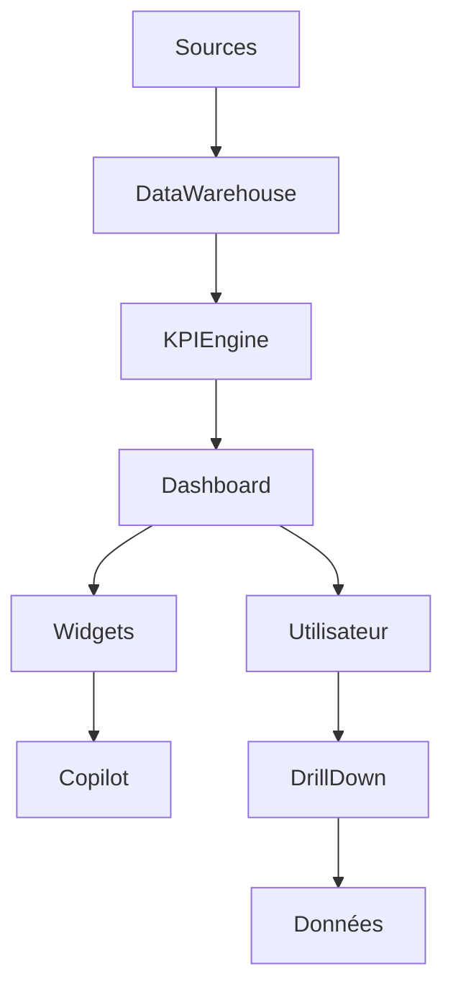

# UX-107 — Enterprise Dashboard Framework

> Référentiel officiel des tableaux de bord décisionnels d'EduWeb Planner.

---

# Sommaire

1. Vision
2. Objectifs
3. Principes directeurs
4. Architecture des tableaux de bord
5. Typologie des dashboards
6. Dashboard personnel
7. Dashboard métier
8. Dashboard exécutif
9. Dashboard institutionnel
10. Dashboard analytique
11. Dashboard opérationnel
12. Widgets
13. KPI Cards
14. Graphiques
15. Tableaux analytiques
16. Cartographie
17. Timeline
18. Alertes intelligentes
19. IA décisionnelle
20. Personnalisation
21. Temps réel
22. Responsive
23. API conceptuelle
24. Bonnes pratiques
25. Anti-patterns
26. KPI
27. Gouvernance
28. Règles métier

---

# 1. Vision

Les tableaux de bord constituent le **centre de pilotage** d'EduWeb Planner.

Ils transforment les données opérationnelles en informations exploitables afin d'améliorer :

- le pilotage ;
- l'anticipation ;
- la prise de décision ;
- l'amélioration continue.

---

# 2. Objectifs

Les dashboards permettent :

- un suivi en temps réel ;
- une lecture synthétique ;
- une exploration détaillée (*drill-down*) ;
- une aide à la décision assistée par l'IA.

---

# 3. Principes directeurs

Chaque tableau de bord doit être :

- pertinent ;
- lisible ;
- interactif ;
- personnalisable ;
- sécurisé ;
- performant.

---

# 4. Architecture

```text
Sources

↓

Collecte

↓

Calcul KPI

↓

Widgets

↓

Dashboard

↓

Décision

↓

Action
```

---

# 5. Typologie des dashboards

EduWeb Planner distingue :

## Personnel

Suivi individuel.

---

## Métier

Pilotage d'un service.

---

## Exécutif

Direction Générale.

---

## Institutionnel

Ministère, Académie, DRE.

---

## Analytique

Analyse approfondie.

---

## Opérationnel

Suivi quotidien.

---

# 6. Dashboard personnel

Affiche notamment :

- tâches du jour ;
- agenda ;
- notifications ;
- validations en attente ;
- indicateurs personnels ;
- favoris.

---

# 7. Dashboard métier

Exemple :

## Enseignant

- cours du jour ;
- absences ;
- évaluations ;
- cahier de textes ;
- progression.

---

## Comptable

- trésorerie ;
- paiements ;
- factures ;
- rapprochements.

---

## Proviseur

- effectifs ;
- discipline ;
- emplois du temps ;
- statistiques.

---

# 8. Dashboard exécutif

Destiné :

- Directeur Général
- Recteur
- Ministre
- DRE
- Inspecteur Général

Indicateurs :

- performance ;
- budget ;
- ressources ;
- risques ;
- qualité.

---

# 9. Dashboard institutionnel

Agrégation multi-établissements.

Visualisation :

```
Pays

↓

Région

↓

Académie

↓

Établissement
```

---

# 10. Dashboard analytique

Permet :

- comparaison ;
- tendances ;
- prévisions ;
- analyses multidimensionnelles.

---

# 11. Dashboard opérationnel

Actualisation permanente.

Affichage :

- incidents ;
- validations ;
- alertes ;
- workflows.

---

# 12. Widgets

Widgets standards :

- KPI Card ;
- Graphique ;
- Tableau ;
- Calendrier ;
- Timeline ;
- Carte géographique ;
- IA ;
- Notifications.

Tous les widgets sont réutilisables et configurables.

---

# 13. KPI Cards

Structure :

```
Valeur

↓

Évolution

↓

Objectif

↓

Variation

↓

Actions
```

Exemple :

```
Élèves

3 482

+4 %

↑
```

---

# 14. Graphiques

Types :

- barres ;
- lignes ;
- secteurs ;
- radar ;
- histogrammes ;
- nuages de points ;
- jauges.

Chaque graphique est accompagné d'une alternative textuelle.

---

# 15. Tableaux analytiques

Fonctions :

- tri ;
- filtre ;
- regroupement ;
- export ;
- drill-down ;
- pagination.

---

# 16. Cartographie

Visualisation :

- établissements ;
- inspections ;
- infrastructures ;
- interventions.

Intégration SIG possible.

---

# 17. Timeline

Affichage chronologique :

- événements ;
- validations ;
- incidents ;
- publications ;
- audits.

---

# 18. Alertes intelligentes

Catégories :

- critique ;
- majeure ;
- mineure ;
- informative.

Les alertes peuvent être :

- affichées ;
- notifiées ;
- transmises au Copilot.

---

# 19. IA décisionnelle

Le Copilot peut :

- expliquer un indicateur ;
- détecter une anomalie ;
- proposer un plan d'action ;
- générer un rapport ;
- produire une synthèse exécutive.

Exemple :

> **Pourquoi le taux d'absentéisme a-t-il augmenté cette semaine ?**

Le Copilot présente une analyse basée sur les données disponibles et indique les éléments ayant conduit à cette conclusion.

---

# 20. Personnalisation

Chaque utilisateur peut :

- déplacer les widgets ;
- modifier leur taille ;
- enregistrer plusieurs vues ;
- partager une configuration.

Les personnalisations sont synchronisées entre les appareils.

---

# 21. Temps réel

Les indicateurs peuvent être :

- temps réel ;
- différé ;
- quotidien ;
- hebdomadaire ;
- mensuel.

Chaque widget affiche sa date de dernière mise à jour.

---

# 22. Responsive

Desktop :

Grille complète.

Tablette :

Deux colonnes.

Mobile :

Widgets empilés.

---

# 23. API (concept)

```typescript
UiDashboard {

    widgets

    kpis

    charts

    tables

    timeline

    alerts

    copilot

    personalization

}
```

---

# 24. Bonnes pratiques

✔ Limiter le nombre de KPI prioritaires.

✔ Mettre en avant les tendances.

✔ Permettre le drill-down.

✔ Conserver une cohérence graphique.

✔ Fournir des explications contextuelles.

✔ Indiquer la fraîcheur des données.

---

# 25. Anti-patterns

✘ Surcharger l'écran.

✘ Utiliser des graphiques inadaptés.

✘ Mélanger plusieurs niveaux de granularité sans distinction.

✘ Masquer les sources des indicateurs.

✘ Afficher des données obsolètes sans avertissement.

---

# Diagramme Mermaid



---

# KPI

| KPI | Objectif |
|------|----------|
|Temps d'affichage initial|< 3 s|
|Actualisation temps réel|< 10 s|
|Disponibilité|99,9 %|
|Temps moyen d'accès à un détail|< 2 clics|
|Précision des indicateurs|100 % des données validées|

---

# Gouvernance

Chaque tableau de bord possède :

- un propriétaire métier ;
- un responsable technique ;
- un dictionnaire des indicateurs ;
- une fréquence de mise à jour ;
- une procédure de validation.

Les définitions des KPI sont centralisées afin de garantir une interprétation homogène dans toute la plateforme.

---

# Règles métier

## RM-UX107-001

Chaque indicateur affiche sa définition, son unité de mesure, sa période de calcul et sa date de dernière mise à jour.

---

## RM-UX107-002

Les utilisateurs n'accèdent qu'aux indicateurs correspondant à leurs droits et à leur périmètre d'autorisation.

---

## RM-UX107-003

Les recommandations du Copilot sont présentées comme des aides à la décision et ne remplacent pas la validation humaine.

---

## RM-UX107-004

Toute modification de la définition d'un KPI est versionnée et documentée.

---

## RM-UX107-005

Les tableaux de bord critiques disposent d'un mécanisme d'actualisation contrôlé afin d'éviter l'affichage de données incohérentes pendant les traitements.

---

# Documents liés

- UX-101 — Design System
- UX-102 — UI Components
- UX-103 — Information Architecture
- UX-104 — Accessibility Framework
- UX-105 — Enterprise Navigation Framework
- UX-106 — Search & Knowledge Architecture
- UX-108 — Enterprise Workflow UX
- BI-001 — Business Intelligence Standards

---

# Conclusion

Le **Enterprise Dashboard Framework** fournit une architecture unifiée pour tous les tableaux de bord d'EduWeb Planner. Il garantit une visualisation cohérente, fiable et exploitable des données, tout en intégrant des capacités d'analyse avancées et une assistance par l'IA pour accélérer la prise de décision à tous les niveaux de l'organisation.

# Fin du document
