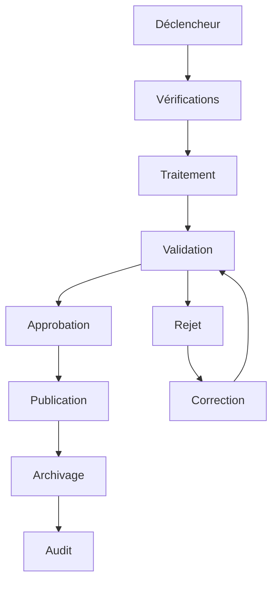

# UX-108 — Enterprise Workflow UX Framework

> Référentiel officiel de conception des workflows, des processus métiers et des interactions utilisateur dans EduWeb Planner.

---

# Sommaire

1. Vision
2. Objectifs
3. Principes UX
4. Architecture des workflows
5. Typologie des workflows
6. Cycle de vie d'un workflow
7. Modélisation BPMN
8. États métier
9. Transitions
10. Validation
11. Approbation
12. Signature électronique
13. Notifications
14. Escalade
15. Gestion des exceptions
16. Workflow collaboratif
17. Workflow assisté par IA
18. Historique
19. Audit
20. Tableaux de bord
21. Responsive
22. API conceptuelle
23. Bonnes pratiques
24. Anti-patterns
25. KPI
26. Gouvernance
27. Règles métier

---

# 1. Vision

Les workflows représentent les **processus métier officiels** d'EduWeb Planner.

Ils garantissent :

- la continuité administrative ;
- la conformité réglementaire ;
- la traçabilité ;
- la qualité des décisions ;
- l'automatisation des tâches répétitives.

---

# 2. Objectifs

Le framework vise à :

- standardiser les processus ;
- réduire les délais de traitement ;
- améliorer la collaboration ;
- assurer la traçabilité complète ;
- intégrer l'IA comme assistance.

---

# 3. Principes UX

Les workflows doivent être :

- simples ;
- explicites ;
- guidés ;
- transparents ;
- réversibles lorsque les règles métier le permettent ;
- accessibles.

---

# 4. Architecture des workflows

```text
Déclencheur

↓

Pré-contrôles

↓

Traitement

↓

Validation

↓

Approbation

↓

Publication

↓

Archivage

↓

Audit
```

---

# 5. Typologie des workflows

## Administratifs

- nominations ;
- décisions ;
- courriers ;
- autorisations.

---

## Pédagogiques

- emplois du temps ;
- évaluations ;
- bulletins ;
- conseils.

---

## Financiers

- engagements ;
- dépenses ;
- paiements ;
- budgets.

---

## Ressources humaines

- recrutement ;
- congés ;
- promotions ;
- évaluations.

---

## Techniques

- maintenance ;
- inventaire ;
- incidents.

---

# 6. Cycle de vie

```text
Brouillon

↓

Soumis

↓

En cours

↓

Validé

↓

Approuvé

↓

Publié

↓

Archivé
```

---

# 7. Modélisation BPMN

Les processus sont documentés selon BPMN 2.0.

Éléments utilisés :

- événements ;
- activités ;
- passerelles ;
- sous-processus ;
- tâches utilisateur ;
- tâches automatiques.

---

# 8. États métier

Chaque objet métier possède un état.

Exemple :

```
Facture

↓

Brouillon

↓

Soumise

↓

Validée

↓

Payée

↓

Archivée
```

Les états disponibles dépendent du type d'objet.

---

# 9. Transitions

Chaque transition :

- est autorisée par une règle métier ;
- vérifie les prérequis ;
- est historisée ;
- peut déclencher des notifications.

---

# 10. Validation

Les validations peuvent être :

- simples ;
- multiples ;
- séquentielles ;
- parallèles.

Exemple :

```
Chef de service

↓

Directeur

↓

Direction Générale
```

---

# 11. Approbation

Une approbation peut nécessiter :

- un commentaire ;
- une justification ;
- une pièce jointe ;
- une signature.

Toutes les décisions sont journalisées.

---

# 12. Signature électronique

Le framework prend en charge :

- signature graphique ;
- certificat électronique (si disponible) ;
- validation par authentification forte.

Chaque signature est horodatée et liée au document concerné.

---

# 13. Notifications

Déclenchement automatique lors :

- d'une création ;
- d'une validation ;
- d'un rejet ;
- d'un retard ;
- d'une échéance.

Canaux :

- application ;
- e-mail ;
- notification push.

---

# 14. Escalade

En cas de dépassement d'un délai :

```text
Échéance dépassée

↓

Relance automatique

↓

Escalade

↓

Responsable supérieur
```

Les seuils sont paramétrables.

---

# 15. Gestion des exceptions

Cas pris en charge :

- rejet ;
- retour en correction ;
- annulation ;
- suspension ;
- reprise.

Les motifs sont enregistrés.

---

# 16. Workflow collaboratif

Plusieurs utilisateurs peuvent intervenir selon leurs rôles.

Fonctions :

- commentaires ;
- annotations ;
- mentions ;
- co-validation.

---

# 17. Workflow assisté par IA

Le Copilot peut :

- détecter les dossiers incomplets ;
- vérifier la cohérence ;
- proposer un circuit de validation ;
- suggérer une réponse ;
- générer un projet de document.

Les propositions de l'IA ne remplacent pas les validations humaines.

---

# 18. Historique

Chaque workflow conserve :

- les états ;
- les acteurs ;
- les dates ;
- les commentaires ;
- les pièces jointes.

Aucune étape validée n'est supprimée.

---

# 19. Audit

Toutes les opérations sont tracées :

- création ;
- modification ;
- validation ;
- rejet ;
- consultation critique.

Les journaux d'audit sont protégés contre les modifications non autorisées.

---

# 20. Tableaux de bord

Indicateurs disponibles :

- dossiers en attente ;
- délais moyens ;
- taux d'approbation ;
- workflows bloqués ;
- performances par service.

---

# 21. Responsive

Desktop :

Vue complète.

Tablette :

Étapes et commentaires visibles simultanément.

Mobile :

Validation rapide, consultation de l'historique et notifications.

---

# 22. API (concept)

```typescript
UiWorkflow {

    process

    tasks

    approvals

    signatures

    notifications

    escalation

    audit

    copilot

}
```

---

# 23. Bonnes pratiques

✔ Décomposer les processus complexes.

✔ Afficher clairement l'étape courante.

✔ Expliquer les motifs de rejet.

✔ Permettre la reprise après interruption.

✔ Journaliser toutes les validations.

✔ Prévoir des rappels automatiques.

---

# 24. Anti-patterns

✘ Workflow sans historique.

✘ Validation sans identification de l'auteur.

✘ Étapes implicites.

✘ Blocage définitif sans procédure de reprise.

✘ Notifications non contextualisées.

---

# Diagramme Mermaid



---

# KPI

| KPI | Objectif |
|------|----------|
|Temps moyen de traitement|< objectif métier défini par processus|
|Respect des délais|> 95 %|
|Taux de validation au premier passage|> 90 %|
|Workflows bloqués|< 1 %|
|Traçabilité des actions|100 %|

---

# Gouvernance

Chaque workflow possède :

- un propriétaire métier ;
- un responsable technique ;
- une documentation BPMN ;
- des règles métier versionnées ;
- une procédure d'évolution.

Les modifications suivent un processus de validation avant mise en production.

---

# Règles métier

## RM-UX108-001

Tout workflow est défini par un modèle versionné, documenté et approuvé avant son utilisation.

---

## RM-UX108-002

Chaque transition est soumise à des contrôles de droits, de cohérence et de prérequis métier.

---

## RM-UX108-003

Les validations et signatures sont irrévocablement historisées avec l'identité de l'utilisateur, la date et l'heure.

---

## RM-UX108-004

Les recommandations générées par le Copilot sont identifiées comme telles et nécessitent une validation humaine avant toute décision officielle.

---

## RM-UX108-005

Les journaux d'audit des workflows sont conservés conformément aux politiques de conservation documentaire de l'organisation.

---

# Documents liés

- UX-101 — Design System
- UX-102 — UI Components
- UX-103 — Information Architecture
- UX-104 — Accessibility Framework
- UX-105 — Enterprise Navigation Framework
- UX-106 — Search & Knowledge Architecture
- UX-107 — Enterprise Dashboard Framework
- UX-109 — AI Human Interaction Framework
- BPM-001 — Business Process Management
- GOV-002 — Enterprise Workflow Governance

---

# Conclusion

Le **Enterprise Workflow UX Framework** établit un cadre commun pour tous les processus d'EduWeb Planner. Il garantit des parcours utilisateurs cohérents, une traçabilité complète, une conformité réglementaire et une intégration maîtrisée de l'intelligence artificielle afin d'améliorer l'efficacité opérationnelle sans se substituer à la responsabilité humaine.

# Fin du document
