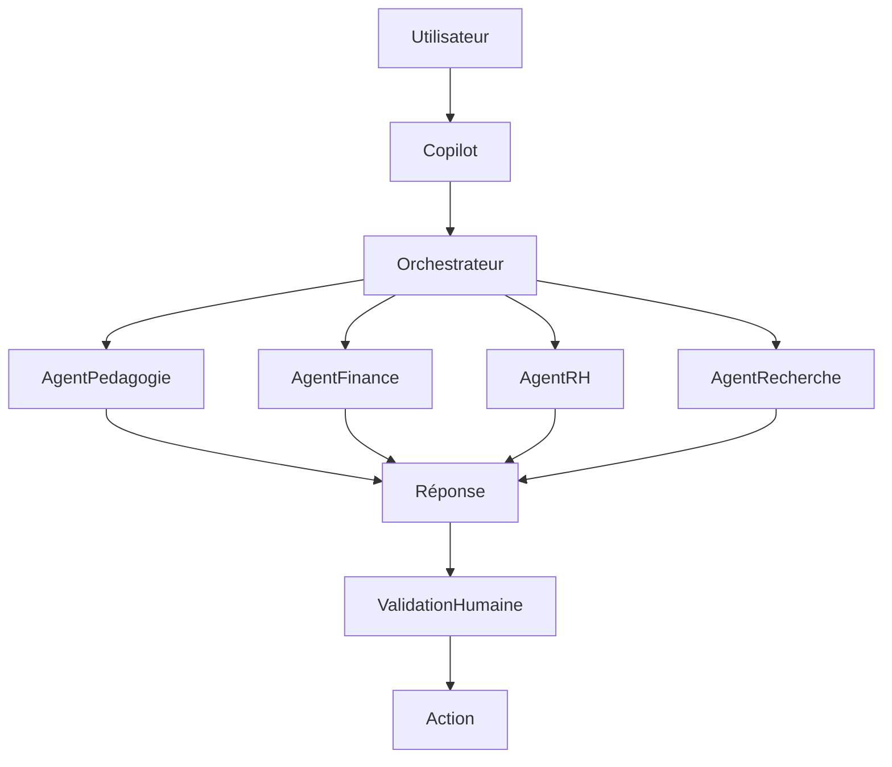

# UX-109 — AI Human Interaction Framework

> Référentiel officiel des interactions entre les utilisateurs et les systèmes d'intelligence artificielle d'EduWeb Planner.

---

# Sommaire

1. Vision
2. Objectifs
3. Principes fondateurs
4. Architecture générale
5. Rôles de l'IA
6. Human-in-the-Loop
7. Copilot EduWeb
8. Agents IA
9. Interactions conversationnelles
10. IA générative
11. IA décisionnelle
12. IA explicable (XAI)
13. Niveaux de confiance
14. Validation humaine
15. Mémoire conversationnelle
16. Multimodalité
17. Personnalisation
18. Confidentialité
19. Sécurité
20. Journalisation
21. Gouvernance
22. API conceptuelle
23. Bonnes pratiques
24. Anti-patterns
25. KPI
26. Règles métier

---

# 1. Vision

L'intelligence artificielle d'EduWeb Planner est conçue comme un **partenaire de travail**.

Elle :

- assiste ;
- explique ;
- suggère ;
- automatise certaines tâches ;
- accélère les traitements.

Elle ne remplace jamais la responsabilité humaine.

---

# 2. Objectifs

Le framework poursuit les objectifs suivants :

- améliorer la productivité ;
- réduire les tâches répétitives ;
- assister la prise de décision ;
- faciliter la recherche d'information ;
- personnaliser l'expérience utilisateur.

---

# 3. Principes fondateurs

Toute interaction IA respecte les principes suivants :

- transparence ;
- explicabilité ;
- supervision humaine ;
- confidentialité ;
- sécurité ;
- équité ;
- traçabilité.

---

# 4. Architecture générale

```text
Utilisateur

↓

Copilot

↓

Orchestrateur IA

↓

Agents spécialisés

↓

Sources métier

↓

Réponse

↓

Validation humaine
```

---

# 5. Rôles de l'IA

L'IA peut :

- rechercher ;
- résumer ;
- expliquer ;
- traduire ;
- classifier ;
- détecter des anomalies ;
- recommander ;
- générer des documents ;
- assister les workflows.

---

# 6. Human-in-the-Loop

Toute décision officielle reste sous contrôle humain.

L'IA :

- prépare ;
- suggère ;
- justifie.

L'utilisateur :

- valide ;
- modifie ;
- refuse.

---

# 7. Copilot EduWeb

Le Copilot est accessible depuis tous les modules.

Fonctions :

- questions/réponses ;
- aide contextuelle ;
- navigation ;
- génération documentaire ;
- analyse de données ;
- assistance réglementaire.

---

# 8. Agents IA

Architecture multi-agents.

Exemples :

- Agent Pédagogie
- Agent Finance
- Agent RH
- Agent Gouvernance
- Agent Juridique
- Agent Recherche
- Agent Qualité
- Agent Statistiques

Chaque agent intervient uniquement sur son domaine de compétence.

---

# 9. Interactions conversationnelles

Le Copilot accepte :

- texte ;
- voix (si disponible) ;
- image ;
- document ;
- QR Code.

Exemple :

> « Génère le projet de décision de nomination du superviseur régional. »

↓

Le Copilot produit un projet conforme aux modèles disponibles, à compléter et valider par l'utilisateur.

---

# 10. IA générative

L'IA peut générer :

- courriers ;
- décisions ;
- rapports ;
- tableaux ;
- synthèses ;
- présentations ;
- plans de formation ;
- emplois du temps (selon les contraintes définies).

Chaque contenu généré est identifiable comme proposition.

---

# 11. IA décisionnelle

Le Copilot peut :

- détecter des tendances ;
- identifier des écarts ;
- produire des simulations ;
- proposer plusieurs scénarios.

Les analyses reposent sur les données disponibles et les hypothèses utilisées sont explicitées lorsque cela est possible.

---

# 12. IA explicable (XAI)

Pour chaque recommandation importante, l'utilisateur peut consulter :

- les données utilisées ;
- les règles appliquées ;
- les hypothèses ;
- le niveau de confiance.

Les mécanismes internes détaillés du modèle ne sont pas exposés ; l'accent est mis sur une explication compréhensible des facteurs ayant conduit à la réponse.

---

# 13. Niveaux de confiance

Chaque réponse possède un indicateur.

Exemple :

```
Très élevé

Élevé

Moyen

Faible
```

Les niveaux de confiance servent à orienter la vigilance de l'utilisateur et ne constituent pas une garantie d'exactitude.

---

# 14. Validation humaine

Certaines opérations exigent obligatoirement une validation humaine.

Exemples :

- décisions administratives ;
- paiements ;
- signatures ;
- nominations ;
- sanctions ;
- publications officielles.

---

# 15. Mémoire conversationnelle

Le Copilot conserve, selon les paramètres de la plateforme :

- le contexte de la conversation ;
- les documents utilisés ;
- les préférences autorisées.

La gestion de cette mémoire respecte les politiques de confidentialité et les paramètres de l'organisation.

---

# 16. Multimodalité

Entrées :

- texte ;
- image ;
- PDF ;
- audio ;
- vidéo (selon les capacités disponibles).

Sorties :

- texte ;
- tableau ;
- graphique ;
- document ;
- présentation ;
- synthèse.

---

# 17. Personnalisation

Le Copilot adapte ses réponses selon :

- le rôle ;
- les droits ;
- le module ;
- la langue ;
- le contexte de travail.

---

# 18. Confidentialité

Le Copilot :

- respecte les autorisations d'accès ;
- n'expose jamais les données non autorisées ;
- applique les politiques de confidentialité de l'organisation.

---

# 19. Sécurité

Contrôles :

- authentification ;
- autorisation ;
- journalisation ;
- protection contre les usages abusifs ;
- détection des anomalies.

---

# 20. Journalisation

Les interactions importantes sont historisées :

- date ;
- utilisateur ;
- agent sollicité ;
- action réalisée ;
- validation.

Les journaux sont conservés selon les politiques de gouvernance.

---

# 21. Gouvernance

Comité IA :

- Architecte IA
- Responsable Métier
- Responsable Sécurité
- DPO
- UX Lead
- Responsable Qualité

Missions :

- validation des usages ;
- revue des risques ;
- suivi des performances ;
- amélioration continue.

---

# 22. API (concept)

```typescript
UiCopilot {

    conversation

    agents

    recommendations

    explanations

    confidence

    documents

    workflows

    approvals

}
```

---

# 23. Bonnes pratiques

✔ Présenter l'IA comme une assistance.

✔ Fournir des explications compréhensibles.

✔ Permettre la correction des propositions.

✔ Indiquer les limites de la réponse lorsque nécessaire.

✔ Journaliser les actions importantes.

✔ Respecter les autorisations d'accès.

---

# 24. Anti-patterns

✘ Présenter une suggestion comme une décision officielle.

✘ Masquer le niveau de confiance.

✘ Utiliser des données hors périmètre d'autorisation.

✘ Générer des documents sans contrôle humain lorsqu'une validation est requise.

✘ Mélanger des données de plusieurs organisations sans autorisation.

---

# Diagramme Mermaid



---

# KPI

| KPI | Objectif |
|------|----------|
|Temps moyen de réponse|< 3 s (hors traitements complexes)|
|Pertinence des réponses|> 90 %|
|Taux de validation des suggestions IA|> 80 %|
|Incidents de confidentialité|0|
|Traçabilité des actions IA|100 %|

---

# Règles métier

## RM-UX109-001

Toute réponse produite par l'IA est associée à son contexte, à sa date de génération et à l'identité de l'utilisateur qui l'a sollicitée.

---

## RM-UX109-002

Les actions à impact juridique, financier ou administratif nécessitent une validation humaine explicite avant exécution.

---

## RM-UX109-003

Le Copilot respecte les autorisations d'accès de l'utilisateur et ne divulgue aucune donnée hors de son périmètre.

---

## RM-UX109-004

Les recommandations importantes sont accompagnées d'une explication compréhensible et d'un indicateur de confiance.

---

## RM-UX109-005

Les interactions avec l'IA sont journalisées conformément aux politiques de sécurité, de confidentialité et de conservation documentaire de l'organisation.

---

# Documents liés

- UX-101 — Design System
- UX-102 — UI Components
- UX-103 — Information Architecture
- UX-104 — Accessibility Framework
- UX-105 — Enterprise Navigation Framework
- UX-106 — Search & Knowledge Architecture
- UX-107 — Enterprise Dashboard Framework
- UX-108 — Enterprise Workflow UX
- AI-001 — Enterprise AI Architecture
- GOV-003 — AI Governance Framework
- SEC-002 — AI Security Standards

---

# Conclusion

Le **AI Human Interaction Framework** établit les règles d'intégration de l'intelligence artificielle dans EduWeb Planner. Il garantit que l'IA reste un outil d'assistance fiable, transparent et sécurisé, tout en maintenant l'humain au centre des décisions stratégiques, administratives, pédagogiques et financières.

# Fin du document
