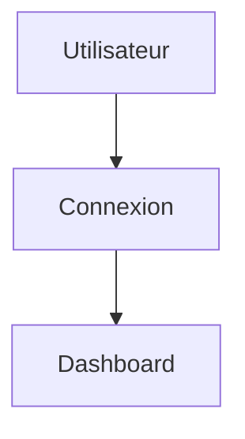

# DOCUMENTATION-STANDARDS.md

> Référentiel officiel de la documentation technique et fonctionnelle de l'écosystème EduWeb.

---

# Sommaire

1. Objectifs
2. Principes
3. Architecture documentaire
4. Catégories de documentation
5. Organisation du dossier `/docs`
6. Standards Markdown
7. Architecture Decision Records (ADR)
8. Documentation du code
9. Documentation des API
10. Documentation des bases de données
11. Documentation des modules
12. Documentation des composants UI
13. Documentation des workflows
14. Diagrammes
15. Captures d'écran et illustrations
16. Versionnement documentaire
17. Revue documentaire
18. Génération automatique
19. Archivage
20. Anti-patterns
21. Checklist

---

# 1. Objectifs

La documentation constitue un actif stratégique de la plateforme EduWeb.

Elle permet de :

- faciliter la compréhension ;
- accélérer l'intégration des nouveaux développeurs ;
- réduire la dette technique ;
- assurer la continuité des projets ;
- préserver les décisions d'architecture.

Toute fonctionnalité importante doit être documentée.

---

# 2. Principes

La documentation respecte les principes suivants :

- Documentation as Code ;
- Documentation First ;
- Single Source of Truth ;
- Versionnée ;
- Revue systématique ;
- Toujours synchronisée avec le code.

Une documentation obsolète est considérée comme un défaut de qualité.

---

# 3. Architecture documentaire

L'organisation documentaire suit une hiérarchie claire.

```
Vision

↓

Architecture

↓

Standards

↓

Modules

↓

API

↓

Guides

↓

Tutoriels

↓

Référence technique
```

Chaque niveau cible un public spécifique.

---

# 4. Catégories de documentation

Les catégories officielles sont :

## Documentation métier

- processus scolaires ;
- gestion administrative ;
- règles fonctionnelles.

---

## Documentation technique

- architecture ;
- sécurité ;
- performances ;
- intégration.

---

## Documentation développeur

- installation ;
- configuration ;
- bonnes pratiques.

---

## Documentation utilisateur

- guides ;
- tutoriels ;
- FAQ ;
- procédures.

---

# 5. Organisation du dossier `/docs`

Structure recommandée :

```text
docs/

├── architecture/
├── adr/
├── api/
├── backend/
├── frontend/
├── database/
├── deployment/
├── security/
├── modules/
├── guides/
├── tutorials/
├── diagrams/
├── standards/
├── releases/
└── glossary/
```

Chaque dossier possède un fichier `README.md`.

---

# 6. Standards Markdown

Tous les documents utilisent Markdown.

Structure minimale :

```markdown
# Titre

## Objectif

## Contexte

## Contenu

## Références
```

Les titres sont hiérarchisés.

Un seul titre H1 par document.

---

# 7. Architecture Decision Records (ADR)

Les décisions d'architecture importantes sont conservées sous forme d'ADR.

Structure :

```
ADR-001

ADR-002

ADR-003
```

Chaque ADR contient :

- contexte ;
- problème ;
- décision ;
- conséquences ;
- alternatives étudiées.

Les ADR sont immuables après validation. Une nouvelle décision donne lieu à un nouvel ADR.

---

# 8. Documentation du code

Les fonctions publiques doivent être documentées.

Exemple TypeScript :

```typescript
/**
 * Génère automatiquement un emploi du temps.
 *
 * @param schoolId Identifiant de l'établissement.
 * @returns Emploi du temps généré.
 */
```

La documentation explique :

- le rôle ;
- les paramètres ;
- les valeurs retournées ;
- les erreurs possibles.

---

# 9. Documentation des API

Chaque API décrit :

- objectif ;
- URL ;
- méthode HTTP ;
- paramètres ;
- corps de requête ;
- réponses ;
- codes d'erreur ;
- exemples.

Exemple :

```http
POST /api/students
```

Les contrats sont versionnés.

---

# 10. Documentation des bases de données

Chaque table documente :

- objectif ;
- colonnes ;
- types ;
- clés ;
- index ;
- relations ;
- contraintes.

Les évolutions suivent les migrations.

---

# 11. Documentation des modules

Chaque module possède un dossier dédié.

Exemple :

```text
modules/

planner/

README.md

architecture.md

workflow.md

api.md

database.md
```

Les modules expliquent :

- responsabilités ;
- dépendances ;
- flux métier.

---

# 12. Documentation des composants UI

Chaque composant réutilisable documente :

- rôle ;
- propriétés ;
- variantes ;
- exemples ;
- accessibilité.

Exemple :

```
Button

Input

DataTable

Card

Dialog
```

---

# 13. Documentation des workflows

Les processus importants sont décrits.

Exemples :

- inscription d'un élève ;
- génération d'un emploi du temps ;
- publication des bulletins ;
- réservation d'une salle ;
- gestion des utilisateurs.

Les workflows sont accompagnés de diagrammes.

---

# 14. Diagrammes

Les diagrammes sont produits avec des formats textuels lorsque possible.

Formats recommandés :

- Mermaid ;
- PlantUML ;
- C4 Model ;
- UML.

Exemple Mermaid :



Les diagrammes sont conservés avec le code.

---

# 15. Captures d'écran et illustrations

Les captures :

- sont à jour ;
- sont de bonne qualité ;
- illustrent les fonctionnalités importantes.

Les images sont optimisées afin de limiter leur taille.

---

# 16. Versionnement documentaire

Toute évolution majeure du code entraîne une mise à jour de la documentation.

Les versions documentaires suivent les versions applicatives.

Chaque document comporte :

- version ;
- auteur ;
- date de mise à jour ;
- statut.

---

# 17. Revue documentaire

La documentation est relue comme le code.

Critères :

- exactitude ;
- lisibilité ;
- cohérence ;
- complétude ;
- mise à jour.

Une Pull Request n'est pas complète si la documentation attendue est absente.

---

# 18. Génération automatique

Lorsque cela est possible, la documentation est générée automatiquement.

Exemples :

- OpenAPI ;
- Typedoc ;
- Prisma ;
- Storybook.

La génération automatique ne remplace pas la documentation explicative.

---

# 19. Archivage

Les anciennes versions sont conservées.

Structure :

```text
docs/

archive/

v1/

v2/
```

Aucune documentation supprimée n'est définitivement perdue sans procédure d'archivage.

---

# 20. Anti-patterns

Interdits :

❌ Documentation absente.

❌ Documentation non versionnée.

❌ Copie de documentation entre modules.

❌ Captures d'écran obsolètes.

❌ Diagrammes non maintenus.

❌ README vide.

❌ API sans exemples.

❌ ADR modifiés après validation.

❌ Documentation stockée hors du dépôt officiel.

❌ Informations contradictoires entre plusieurs documents.

---

# 21. Checklist

Avant chaque mise en production :

- [ ] README mis à jour.
- [ ] Documentation API conforme.
- [ ] Documentation des modules complète.
- [ ] Diagrammes actualisés.
- [ ] ADR créés si nécessaire.
- [ ] Documentation de base de données mise à jour.
- [ ] Exemples vérifiés.
- [ ] Captures d'écran actualisées.
- [ ] Version documentaire incrémentée.
- [ ] Revue documentaire validée.

---

# Documents associés

- ARCHITECTURE-STANDARDS.md
- API-STANDARDS.md
- DATABASE-STANDARDS.md
- FRONTEND-STANDARDS.md
- BACKEND-STANDARDS.md
- ENGINEERING-HANDBOOK.md
- FEATURE-TEMPLATE.md
- MODULE-TEMPLATE.md
- README-TEMPLATE.md

---

# Fin du document
